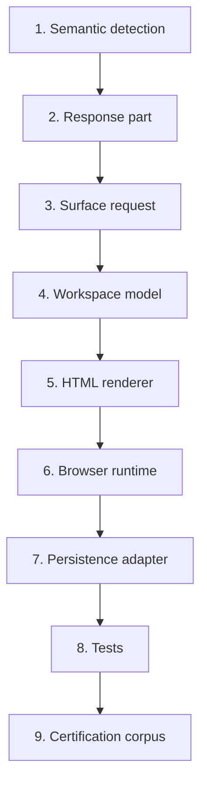

# Adding a new learner surface

**Parent:** [learner-renderer-vnext.md](learner-renderer-vnext.md)  
**Audience:** Engineers implementing Sprint 69+ interaction capabilities

This guide shows how to extend learner-renderer-vNext with a new capability **without** changing PRISM, DLA, or manifestation when educational semantics already exist on the assembled page.

Hypothetical example: **`matching`**.

---

## Preconditions

Confirm that authoritative pages already express the interaction semantically (for example matching pairs, correspondence tables, or structured items with expected links). If semantics are missing, that is an **upstream** educational modelling problem — not a renderer gap.

---

## Required steps

### 1. Semantic detection

- Detect matching structure from the page model / materials / activity interaction metadata.
- Prefer exact, evidenced vocabulary over speculative aliases.
- Emit an explicit diagnostic when detection is ambiguous (do not guess into `text_entry`).

### 2. Response part

- Extend `collectResponseParts()` (or the structured-material path) so each matching task becomes a response part with:
  - stable `responsePartId`
  - `surfaceKind: "matching"`
  - authored label/prompt
  - provenance (`sourceKind`, `sourceId`)
- Respect the existing precedence chain so weaker fallbacks do not duplicate the workspace.

### 3. Learner-surface request

- Ensure `composeLearnerSurfaces()` forwards matching parts to the registry.
- Do **not** hard-code activity ids in composition rules.

### 4. Workspace model

- Implement `buildMatchingWorkspaceModel` (name as appropriate) producing:
  - stable workspace id
  - stable item / pair ids
  - initial learner state that does not expose answers when shuffling is required
- Register in `learner-surface-registry.js` under `SURFACE_KIND.MATCHING`.
- Keep `UNSUPPORTED_LEARNER_SURFACE` for any still-unimplemented kinds.

### 5. HTML renderer

- Render accessible controls (keyboard operable; no colour-only state).
- Never expose expected answers in ordinary learner-facing DOM.
- Preserve Node/browser deterministic initial HTML.

### 6. Browser runtime

- Enhance after initial render (event wiring only).
- Emit workspace-change events compatible with draft persistence.
- Keep workspaces isolated by workspace id.

### 7. Persistence adapter

- Add a versioned state adapter for `matching`.
- Validate on restore; ignore unknown ids safely.
- Never store expected answers.
- Ensure diagnostics never include learner response text.

### 8. Tests

- Unit: detection, model, render, runtime, adapter.
- Integration: multi-capability pages still isolate workspaces.
- Parity: browser bundle rebuild + HTML equality for initial render.
- Negative: unknown surface still fails explicitly.

### 9. Certification

- Add an authoritative or representative fixture only if it uniquely evidences matching.
- Extend the certification runner checks for matching invariants.
- Rebuild artefacts via `node scripts/certify-learner-renderer-vnext.js`.
- Do not weaken exactly-once or a11y gates.

---

## What must not change

- PRISM capture/assembly contracts
- DLA prompt ownership
- Manifestation schema for unrelated fields
- Silent fallback from `matching` → `text_entry`
- Activity-id-specific composition shortcuts

---

## Checklist

- [ ] Semantics evidenced on production-shaped fixtures  
- [ ] Response parts stable and ordered  
- [ ] Registry returns workspace or explicit diagnostic  
- [ ] Renderer deterministic and accessible  
- [ ] Runtime isolated and keyboard operable  
- [ ] Persistence adapter versioned; answers not stored  
- [ ] Browser bundle rebuilt  
- [ ] Package tests green; certification `CERTIFIED`  
