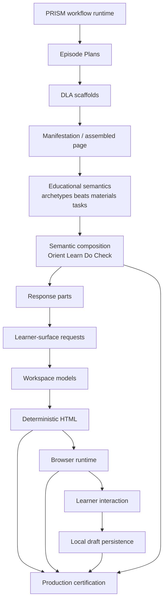
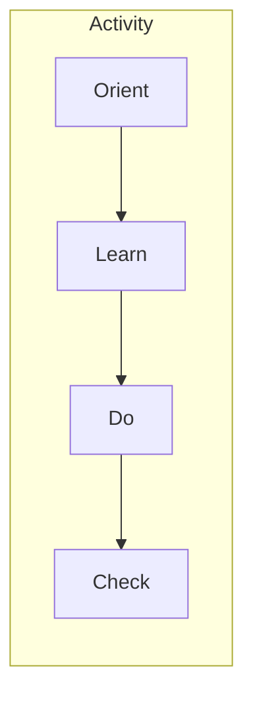
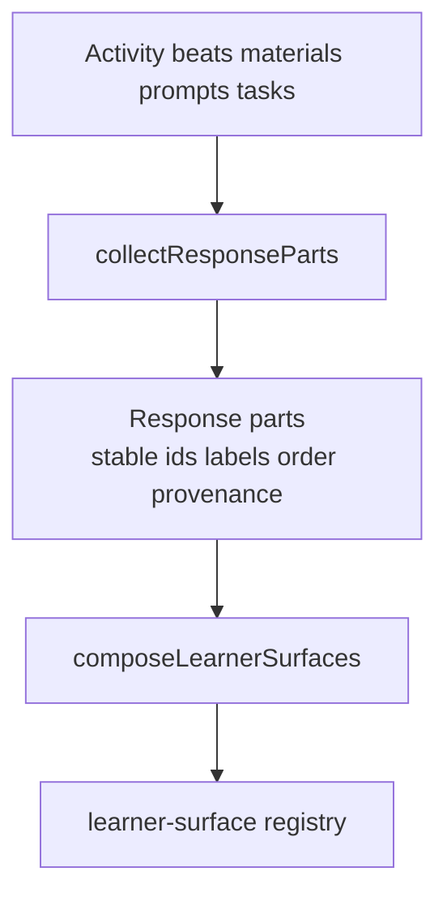
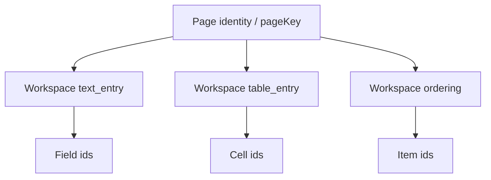

# Learner-renderer-vNext Architecture

**Status:** Production certified (Sprint 68 / IMP-020)  
**Audience:** Engineers extending learner interaction; educators reviewing renderer boundaries  
**Related:** [ADR-012](adr/ADR-012-learner-renderer-interprets-educational-semantics.md) · [Diagnostics](learner-renderer-vnext-diagnostics.md) · [Extension guide](learner-renderer-vnext-extension-guide.md) · [Sprint 68 closeout](../sprints/sprint-68-closeout.md) · [Certification artefacts](../../artifacts/learner-renderer-vnext-certification.md)

---

## 1. Why this architecture exists

PRISM already produces authoritative educational artefacts through a multi-stage pipeline. By Sprint 67, **learner-renderer-vNext** restored fidelity: activities, beats, materials, and scaffolds render from those artefacts without inventing pedagogy.

Sprint 68 proved a second claim: **substantial learner interaction can be added without changing the upstream educational pipeline**, provided the renderer:

1. **interprets** educational semantics that already exist;
2. **composes** them into learner-facing moments;
3. **routes** interaction through capability-based surfaces;
4. **persists** drafts locally without owning submission or grading.

The renderer deliberately does **not** author educational meaning. It does not invent archetypes, rewrite materials, or invent learner tasks. Rendering is **capability-based** (text entry, table entry, ordering) rather than **activity-based** (hard-coded “Activity 3 always gets a table”).

---

## 2. Production pipeline

```text
PRISM
  ↓
Episode Plans
  ↓
DLA
  ↓
Manifestation Model
  ↓
Educational Semantics
  ↓
Semantic Composition
  ↓
Response Parts
  ↓
Learner-Surface Requests
  ↓
Workspace Models
  ↓
HTML Renderer
  ↓
Browser Runtime
  ↓
Learner Interaction
  ↓
Local Draft Persistence
  ↓
Production Certification
```



### Layer responsibilities

| Layer | Owns | Does not own |
| ----- | ---- | ------------ |
| **PRISM** | Workflow orchestration, capture, assembly | Learner UX semantics |
| **Episode Plans** | Archetype + beat sequences | Interaction widgets |
| **DLA** | Activity scaffolds, cognition fields, tasks | DOM / workspaces |
| **Manifestation model** | Assembled page JSON delivered to the renderer | Presentation layout |
| **Educational semantics** | Parsed page model: activities, beats, materials, prompts | HTML |
| **Semantic composition** | Orient / Learn / Do / Check moments; exactly-once assignment | Persistence |
| **Response parts** | Canonical “what the learner must produce” units | Visual chrome |
| **Learner-surface requests** | Capability kind + provenance | Upstream authoring |
| **Workspace models** | Stable IDs, editable structure, guidance | Remote sync |
| **HTML renderer** | Deterministic Node/browser markup | Event handling |
| **Browser runtime** | Ordering moves, draft flush, clear UI | Grading |
| **Local draft persistence** | Versioned envelopes in `localStorage` | Submission / teacher review |
| **Production certification** | Corpus regression and release gates | Feature design |

---

## 3. Architectural principles

### Educational meaning is authoritative

- **Motivation:** Downstream inventiveness erodes trust in authored lessons.
- **Consequence:** Unknown archetype variants fail closed; aliases require production evidence.
- **Example:** `UNKNOWN_ARCHETYPE_VARIANT` is release-blocking; speculative material aliases are rejected.

### Rendering interprets meaning

- **Motivation:** Presentation must map semantics → surfaces, not invent tasks.
- **Consequence:** Composition and surfaces read beats, materials, and tasks; they do not rewrite them.
- **Example:** Ordering appears only when sequencing/ranking semantics normalise successfully.

### Capabilities are extensible

- **Motivation:** New interaction kinds must not fork activity-specific render paths.
- **Consequence:** Registry-driven surfaces; unknown kinds emit `UNSUPPORTED_LEARNER_SURFACE`.
- **Example:** Matching is reserved in `SURFACE_KIND` but fails explicitly until implemented.

### Educational semantics are renderer-independent

- **Motivation:** Semantics must remain valid if presentation changes.
- **Consequence:** Page model and composition are separable from HTML and runtime.
- **Example:** Certification validates composition invariants independently of CSS.

### Composition precedes rendering

- **Motivation:** Exactly-once assignment and moment order must be decided before markup.
- **Consequence:** `buildComposedPageModel` produces moments; renderers consume them.
- **Example:** Orientation materials absorbed into Orient during IMP-020 before HTML emit.

### Rendering is deterministic

- **Motivation:** Parity, persistence identity, and certification require stable output.
- **Consequence:** No time-based IDs; Node and browser initial HTML must match.
- **Example:** Ordering initial order uses a documented deterministic strategy.

### Interaction capabilities are isolated

- **Motivation:** One workspace must not corrupt another.
- **Consequence:** Workspace IDs scope DOM, events, and persisted state.
- **Example:** Multiple ordering workspaces refresh independently.

### Persistence is capability-neutral

- **Motivation:** Draft storage must not hard-code surface kinds in the envelope core.
- **Consequence:** Per-capability state adapters; unknown kinds warn without breaking others.
- **Example:** `UNSUPPORTED_WORKSPACE_STATE_ADAPTER` skips one workspace, keeps the rest.

### Certification validates behaviour rather than implementation

- **Motivation:** Refactors should not require rewriting golden HTML snapshots wholesale.
- **Consequence:** Corpus checks assert invariants (assignment, a11y, parity, persistence).
- **Example:** IMP-020 certifies material roots in HTML without encoding composition algorithms in expectations.

---

## 4. Semantic composition

### Semantic activities and moments

Each activity may compose into up to four **semantic moments**, always in this order when present:

1. **Orient** — activation, framing, entry prompts, residual orientation materials  
2. **Learn** — explanation, modelling, worked examples  
3. **Do** — practice, investigation, judgement, learner production workspaces  
4. **Check** — feedback, synthesis, reflection, transfer, verification



Empty moments are **omitted** (no fabricated headings). Beats still render when composition cannot consume them; fully consumed beats are omitted or content-suppressed via render hints.

### Beat → moment mapping (production vocabulary)

| Beat functions (examples) | Moment |
| ------------------------- | ------ |
| orientation, framing, activation | Orient |
| explanation, worked_example, comparison | Learn |
| practice, investigation, judgement, analysis | Do |
| check, feedback, synthesis, reflection, transfer | Check |

Primary signal: beat `learnerRole`. Secondary: `sourceFunction`. See `compose-moment-classification.js`.

### Material, task, and expected-output routing

- Every material, learner-task step, and expected output must be assigned **exactly once**.
- Interactive table materials enter the table workspace pipeline; static Markdown tables stay static.
- Structured response sources suppress weaker fallbacks (see [Response parts](#5-response-part-architecture)).

### Orientation absorption (IMP-020)

When Orient exists, the orientation beat is omitted from beat rendering. Any orientation **instructions/materials not already claimed** by Learn/Do/Check are absorbed into Orient so framing content is not silently dropped.

**Example:** VideoTranscriptTest Apply activity `A3` framing material `A3-M1` lives on the orientation beat. After absorption it renders once inside Orient. Heteroscedasticity `A5-M1` already claimed by Learn is **not** duplicated into Orient.

---

## 5. Response-part architecture

Response parts exist so multi-source written production (prompt sets, templates, task steps, expected-output fallbacks) collapses into a **single ordered inventory** before surfaces are requested.

```text
authoritative source
  ↓
collectResponseParts()
  ↓
response parts
  ↓
composeLearnerSurfaces()
  ↓
learner-surface registry
```



### Precedence (strongest → weakest)

```text
structured editable material
  ↓
structured prompt item
  ↓
written task step
  ↓
expected-output fallback
```

### Design rules

- **Provenance** is retained (`sourceKind`, `sourceId`, beat function).
- **Authored labels** are preferred; internal IDs never become visible labels.
- **Deduplication** prevents duplicate workspaces (`DUPLICATE_RESPONSE_PART`).
- **Authored order** is preserved within an activity.
- **Extensibility:** new surface kinds attach at the registry, not by forking collection.

This precedence prevents, for example, a planning table workspace *and* a duplicate free-text fallback for the same expected output.

---

## 6. Learner-surface architecture

Registry entry point: `learner-surface-registry.js` / `workspaceFromResponsePart()`.

### Supported capabilities (Sprint 68)

| Capability | Purpose | Primary inputs |
| ---------- | ------- | -------------- |
| `text_entry` | Multiline written production | Response parts (prompts, templates, task steps) |
| `table_entry` | Editable classification/planning/analysis tables | Table materials composed into Do/Check |
| `ordering` | Sequence / ranking without drag requirement | Normalised PRISM ordering schema |

### Per-capability summary

#### text_entry

- **Workspace model:** textarea + label + optional described-by prompt; stable `responsePartId` / workspace id  
- **Renderer:** inline learner workspace group in Do (and Check when required)  
- **Runtime:** native editable control; draft change events  
- **Persistence adapter:** stores text value; empty/multiline/Unicode supported  
- **Validation / a11y:** `<label for>`, no internal IDs as visible text  
- **Diagnostics:** `UNASSIGNED_WRITTEN_RESPONSE`, `UNSUPPORTED_LEARNER_SURFACE`  
- **Evolution:** additional written genres should remain `text_entry` unless interaction truly differs

#### table_entry

- **Workspace model:** editable cell ids; fixed cells non-editable; synthetic row labels not learner-visible  
- **Renderer:** `render-table-workspace.js`  
- **Runtime:** cell input; narrow-screen scroll/stack via existing CSS  
- **Persistence adapter:** cell map; unknown cell ids ignored  
- **Validation / a11y:** accessible names for inputs; row/column naming  
- **Diagnostics:** assignment and surface errors via composition/certification  
- **Evolution:** new table *types* are material vocabulary; interaction stays `table_entry`

#### ordering

- **Workspace model:** item ids, display order, expected order (not exposed in ordinary DOM)  
- **Renderer:** move up/down controls; live status region  
- **Runtime:** `ordering-runtime.js` — keyboard-capable; no drag required  
- **Persistence adapter:** learner item order only; never stores expected answers  
- **Validation:** exact-order compares IDs  
- **Diagnostics:** `AMBIGUOUS_ORDERING_SEMANTICS`, `ORDERING_ITEMS_MISSING`, …  
- **Evolution:** ranking vs sequence share one capability with mode metadata

### Unsupported capabilities

Kinds such as `matching`, `single_select`, and `multi_select` are recognised as **future** surface kinds. Requests fail with `UNSUPPORTED_LEARNER_SURFACE` and **must not** silently fall back to `text_entry`.

---

## 7. Workspace models and identity

Persistence and accessibility depend on **stable identity**, not DOM position.

| Identity | Scope | Why |
| -------- | ----- | --- |
| Workspace ID | Activity + source | Isolates draft state and runtime queries |
| Text / textarea ID | Workspace | Label association and restore |
| Ordering item ID | Workspace | Move/validate/persist by id, not visible text |
| Table cell ID | Workspace | Edit/restore without relying on display labels |



If page identity lacks workflow/page ids, the draft key falls back to schema + activity membership + title and may emit `UNSTABLE_PERSISTENCE_PAGE_IDENTITY`. Keys remain deterministic.

---

## 8. Browser runtime

### Separation of concerns

| Phase | Responsibility |
| ----- | -------------- |
| **Initial rendering** | Deterministic HTML from Node or browser bundle — no storage access in Node |
| **Runtime enhancement** | Wire ordering controls, draft persistence, status UI after DOM exists |
| **Learner interaction** | Edits, moves, clear/confirm; emit workspace-change events |

### Runtime responsibilities

- Ordering: move up/down, disabled ends, position metadata, polite live announcements (not on restore)
- Draft: debounced save (default **400ms**), flush on `pagehide` / visibility change where applicable
- Status UI: polite `aria-live` save status
- Clear responses: accessible control + keyboard-confirmable confirmation; cancelled clear is a no-op
- Idempotent initialisation

Print CSS hides draft controls and ordering move/check chrome while leaving learner values printable.

---

## 9. Local draft persistence

### Implemented

- Versioned envelope (`DRAFT_SCHEMA_VERSION = 1`)
- Deterministic `pageKey` / storage key prefix `learner-renderer-vnext:draft:`
- Capability adapters for `text_entry`, `table_entry`, `ordering`
- Storage abstraction (browser `localStorage` or test doubles)
- Validation, stale workspace warnings, parse/read/write failure diagnostics
- Privacy: diagnostics must not include learner response content

### Intentionally not implemented (Sprint 68)

```text
submission
teacher review
grading
remote persistence
cross-device sync
analytics
collaboration
```

These are roadmap items, not incomplete Sprint 68 features.

---

## 10. Diagnostics

Full catalogue: [learner-renderer-vnext-diagnostics.md](learner-renderer-vnext-diagnostics.md).

Successful authoritative certification runs emit **no unexpected** warning/error diagnostics. Negative tests may trigger expected codes in isolation.

---

## 11. Accessibility philosophy

Accessibility is treated as a **product invariant**, not a post-pass.

- Every editable control has an accessible name (label / contextual naming for ordering moves).
- ARIA `for` / `labelledby` / `describedby` targets must exist; DOM ids must be unique.
- State is not colour-only (`data-ordering-state`, disabled attributes, live text).
- Keyboard completes ordering and clear confirmation without pointer requirement.
- Synthetic table row labels must not leak to learners.
- Save status uses `aria-live="polite"`; ordering announcements are learner-initiated only.

---

## 12. Production vocabulary

Only aliases with authoritative production evidence are supported.

### Archetypes (exact variant match)

| Archetype | Canonical production shapes (examples) |
| --------- | -------------------------------------- |
| Understand | orientation → explanation → check |
| Apply | orientation → practice → feedback |
| Analyse | orientation → investigation → synthesis |
| Evaluate | orientation → judgement → reflection |

Exact beat-sequence match is required; there is no nearest-match placement.

### Material aliases

| Alias | Resolves to |
| ----- | ----------- |
| `scenarios`, `study_scenarios` | `scenario` |

Table types used in production include `classification_table`, `planning_table`, `analysis_table`, `comparison_table`, `decision_table`.

### Ordering aliases

| Input | Normalises toward |
| ----- | ----------------- |
| `activity_interaction_type`: sequencing / ranking | mode `sequence` / `rank` |
| `correct_order`, `canonical_order`, `expected_order` | expected order |
| `sequence_items`, `ranking_items` | candidate items |

**Speculative aliases are excluded** so unknown vocabulary fails visibly rather than mis-routing content.

---

## 13. Extension points

See [Adding a new learner surface](learner-renderer-vnext-extension-guide.md) (worked example: `matching`).

Rule of thumb: if educational semantics already exist in the assembled page, **no PRISM / DLA / manifestation change** should be required to add a surface.

---

## 14. Certification

### Why it exists

Certification proves the full path from authoritative fixtures through composition, HTML, runtime, and local drafts — without encoding the composition algorithm in expectations.

### Command

```bash
node scripts/certify-learner-renderer-vnext.js
node scripts/certify-learner-renderer-vnext.js --no-browser
```

Programmatic API: `runLearnerRendererCertification(options)`.

### Reports

- `artifacts/learner-renderer-vnext-certification.json`
- `artifacts/learner-renderer-vnext-certification.md`

### Corpus philosophy

Six workflows (authoritative + representative): VideoTranscriptTest, Heteroscedasticity, Kitchen Sink, RNA episode-plan-v1, Generic moments, Authoritative PRISM ordering.

### Guarantees checked

Exactly-once assignment, archetype coverage, surface coverage, a11y, persistence restore, browser/Node parity, diagnostic cleanliness, print CSS gates.

### Known unrelated failures

Documented separately (for example `workflow-self-directed-learner-page-formatting.test.js`). They must not be classified as learner-renderer-vNext regressions.

### Release criterion

Exit non-zero on any release-blocking fail. Certified outcome: **`CERTIFIED`**.

Package regression:

```bash
node --test tests/learner-renderer-vnext-*.test.js
```

---

## 15. Sprint 68 achievements (architecture view)

| Milestone | Architectural capability introduced |
| --------- | ----------------------------------- |
| **IMP-013** | Orient/Learn/Do/Check semantic composition |
| **IMP-014A** | Production archetype vocabulary + table aliases |
| **IMP-015** | Table workspace identity and a11y normalisation |
| **IMP-016** | Capability audit of learner surfaces |
| **IMP-017** | Response-part composition and multi-part text |
| **IMP-018** | Ordering surface (sequence/rank) |
| **IMP-019** | Versioned local draft persistence |
| **IMP-020** | Production certification corpus and runner |
| **IMP-021** | Architecture documentation and closeout |

---

## 16. Deferred roadmap

These are **future programme items**, not missing Sprint 68 work.

### Future learner surfaces

```text
matching
single_select
multi_select
```

### Submission lifecycle

```text
submission
teacher review
grading
```

### Persistence

```text
remote persistence
cross-device sync
```

### Other

```text
analytics
collaboration
```

---

## 17. Module map (implementation)

| Concern | Primary modules |
| ------- | --------------- |
| Page model | `build-page-model.js`, `build-activity-model.js`, `build-beat-model.js` |
| Archetypes | `archetype-rules.js`, `archetype-diagnostics.js` |
| Composition | `compose-page-model.js`, `compose-activity-moments.js`, `compose-generic-moments.js` |
| Response parts | `compose-response-parts.js`, `compose-learner-surfaces.js`, `response-part-types.js` |
| Surfaces | `learner-surface-registry.js`, `render-table-workspace.js`, `render-ordering-workspace.js` |
| Render | `render-learner-page.js`, `render-activity.js`, `render-composed-moment.js` |
| Runtime | `ordering-runtime.js`, `learner-draft-persistence.js` |
| Certification | `certification-corpus.js`, `certify-learner-renderer.js`, `scripts/certify-learner-renderer-vnext.js` |
| Browser bundle | `scripts/build-learner-renderer-vnext-browser.js` → `lib/learner-renderer-vnext-browser.js` |

Public boundary: `lib/learner-renderer-vnext/index.js`.

---

## Document history

| Date | Change |
| ---- | ------ |
| 2026-07-22 | Initial Sprint 68 / IMP-021 architecture reference |
