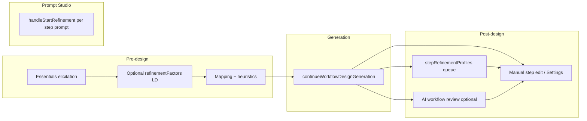

# Existing refinement infrastructure audit

**Date:** 2026-05-15  
**Scope:** Read-only inventory of PRISM refinement-related behaviour in code and domain packs. No implementation recommendations beyond Sprint 18 planning.  
**Audience:** Sprint 18 — Contextual Workflow Refinement bootstrap.

---

## 1. Purpose

Sprint 18 proposes **workflow-aware, recommendation-driven refinement** on top of deterministic planning (Sprint 17). Before adding new machinery, this audit records what already exists: where refinement is declared, how the runtime interprets it, and what is domain-specific versus reusable.

**Out of scope:** Renderer/orchestration redesign, Prompt Studio merge, LD adoption work, new tests.

---

## 2. Executive summary

| Layer | Maturity | Notes |
|-------|----------|-------|
| **Pre-design factor elicitation** | Strong | Required/optional factors, inference, validation, conflict policies, mapping — shared runtime, pack-declared rules |
| **Pre-design “refinement” queue** | LD only | `refinementFactors` + `getWorkflowRefinementQueue`; Research pack has **no** `refinementFactors` |
| **Post-generation step refinement** | LD-focused | `stepRefinementProfiles` (`assessment_pack`, `design_page`, `learner_page_pack`) gated on **generated steps** |
| **AI workflow graph review** | Generic | `callOpenAIForWorkflowReview` — suggests new steps; not factor-aware |
| **Prompt Studio refinement** | Separate product surface | Draft/refined prompt versions; optional workflow-step mode |
| **Planning disclosures (Sprint 17)** | Research-rich | Assistive notices; not yet tied to refinement recommendations |
| **Deep refine opt-in** | Likely dormant | `workflowAwaitingDeepRefineOptIn` / `workflowDeepRefineContext` cleared but never set `true` in `app.js` |

**Implied direction for Sprint 18:** Extend **recommendation + disclosure** patterns and post-design adequacy checks; do **not** grow more `refinementFactors` rows for Research topic-scope gaps. Reuse queues, profiles, `isRecommendIntent`, and mapping-to-`stepParams` where step-level settings remain appropriate.

---

## 3. Refinement phases (mental model)

| Phase | Primary state | Entry |
|-------|---------------|-------|
| Essentials | `workflowBriefElicitation` (default stage) | Design workflow → unresolved required factors |
| Pre-design refinement (LD) | Same elicitation object | After essentials; `getWorkflowRefinementQueue` |
| Post-generation refinement | `workflowBriefElicitation.stage === "post_generation_refinement"` | End of `continueWorkflowDesignGeneration` when profile queue non-empty |
| Post-design AI review | `workflowAwaitingRefineOptIn`, `workflowReviewSuggestions` | `renderWorkflowDesignResult({ promptRefine: true })` or user “yes” to refine |
| Prompt refinement | Prompt Studio draft/refined versions | `handleStartRefinement` |

---

## 4. Pack-driven declarations

### 4.1 Learning Design (`domains/learning-design/domain-learning-design-step-patterns.md`)

| Construct | Role |
|-----------|------|
| `requiredFactors` / `optionalFactors` | Blocking essentials and soft defaults |
| `refinementFactors` | Non-blocking quality factors (coverage, cognitive demand, page tone, etc.) with conditional `askWhen*` predicates |
| `questionPolicy` | `askRefinementByDefault: true`, `maxRefinementQuestions: 8` |
| `intentClasses.elicitation` | e.g. `assessment_pack`: `orderedFactors`, `mustAskFactors`, `optionalFactors` |
| `stepRefinementProfiles` | Post-gen profiles keyed by canonical steps in **generated** design |
| `mappingRules` | Factor → `stepParams` / bindings consumed at generation and Settings |
| `inferenceRules` | Pre-resolve factors before asking |

`stepRefinementProfiles` (approx. lines 1186–1310+) define:

- **`assessment_pack`** — when `generate_assessment_items` (or equivalent) is in the design; required/optional tier queues, `optionalOptInPrompt`, per-factor `questionText` / `parseHints.recommendEnabled`
- **`design_page`** / **`learner_page_pack`** — when `design_page` is present; page profile, learner level, tone, depth, examples, practice tasks, compactness

### 4.2 Research (`domains/research/domain-research-step-patterns.md`)

| Construct | Present? |
|-----------|----------|
| `refinementFactors` | **No** |
| `stepRefinementProfiles` | **No** |
| `questionPolicy` | `maxDefaultQuestions: 4`, `askOptionalByDefault: false` only (no `askRefinementByDefault`) |
| Sprint 17 planning | `validationRules`, `conflictPolicies`, `disclosurePolicy`, `planningGateDisclosures`, `workflowPolicy` proceed gates |

Runtime default: `normalizeWorkflowBriefConfig` sets `askRefinementByDefault` to **true** when omitted (`app.js` ~3232–3235), but an empty `refinementFactors` array yields an empty pre-design refinement queue for Research.

---

## 5. Runtime (`app.js`) — workflow factory

### 5.1 Configuration normalization

- **`normalizeWorkflowBriefConfig`** (~3208): merges `refinementFactors`, `intentClasses`, `questionPolicy`, Sprint 17 validation/conflict/disclosure fields.

### 5.2 Pre-design queues

| Function | Lines (approx.) | Behaviour |
|----------|-----------------|-----------|
| `getWorkflowRefinementQueue` | 4216 | Honors `askRefinementByDefault`; filters by relevance, context-suppression, `mustAsk`, `maxRefinementQuestions`; can suppress “prompt-level” assessment IDs unless `includePromptLevelQuestions` |
| `isWorkflowRefinementFactorRelevant` | (called from queue) | Pack predicates: `askWhenResolvedFactorEquals`, goal/scope mentions, etc. |
| `getPendingHighImpactInferredFactors` | 5372 | LD-centric high-impact ids (`topic`, `workshop_subject`, …); **auto-accepted** after elicitation (no confirmation hop) |

### 5.3 Post-generation profiles

| Function | Lines (approx.) | Behaviour |
|----------|-----------------|-----------|
| `resolveRefinementProfile` | 5520 | Loads profile JSON from pack |
| `filterRefinementFactorsByGeneratedSteps` | 5620 | Restricts factors to steps present in draft design |
| `getAssessmentPostGenerationElicitationQueue` | 5654 | Legacy/parallel path; merges intent-class metadata |
| `resolveActivePostGenerationRefinementProfile` | 5805 | Picks first applicable profile for current design |
| `isGraphAffectingPostGenerationFactorId` | 5819 | Regenerates workflow when answered ids affect graph (`input_strategy`, `design_scope`, …) |

**Activation:** `continueWorkflowDesignGeneration` (~6055–6154) builds `state.workflowBriefElicitation` with `stage: "post_generation_refinement"`, profile-specific queues, optional two-tier assessment opt-in, and custom question/parse hint maps from the profile.

**Completion:** `handleWorkflowAnswer` (~15442–15479) maps answers → `applyWorkflowBriefMappings` → optional single regeneration via `continueWorkflowDesignGeneration({ skipPostGenerationRefinement: true })`.

### 5.4 Recommendation UX (conversational)

| Function | Lines (approx.) | Behaviour |
|----------|-----------------|-----------|
| `buildWorkflowBriefQuestionText` | ~4888+ | Appends “Recommendation: use '…'” when factor has `default` |
| `isRecommendIntent` | 4924 | Parses yes / recommend / use default |
| `isWorkflowOptionHelpIntent` | 4914 | Help / show options |
| `pendingRecommendation` | (state in elicitation flow) | One-shot accept recommended value |

Profiles set `parseHints.recommendEnabled: true` on many post-gen factors.

### 5.5 AI workflow-level review (not pack-driven)

| Function | Lines (approx.) | Behaviour |
|----------|-----------------|-----------|
| `renderWorkflowDesignResult` | 2280 | `promptRefine: true` → asks “refine further? (yes/no)” unless post-gen queue active |
| `handleWorkflowReview` | 14836 | Copies draft → refined, calls reviewer |
| `callOpenAIForWorkflowReview` | 10208 | Fixed system prompt: propose `proposed_changes` (insert steps after index); **no brief/planning context** |
| Suggestion loop | 15526+ | User yes/no per suggestion; mutates `versions.refined.steps` |

**UI:** `index.html` — `wfDesignReviewBtn` “Review & suggest improvements” (enabled when draft exists).

### 5.6 Deterministic “improvement” (not conversational refinement)

These shape the plan before/without user refinement chat:

- `applyWorkflowDesignHeuristics`, trigger rules, dependency ordering
- Sprint 17: `applyWorkflowBriefValidationRules`, `applyWorkflowBriefConflictPolicies`, `workflowBriefHeuristicGateSatisfied`, `buildWorkflowBriefPlanningDisclosures`, `attachWorkflowBriefPlanningToResolvedState`

Distinction: **plan shaping + transparency**, not optional Q&A after design.

### 5.7 Dormant / legacy hooks

| Symbol | Observation |
|--------|-------------|
| `workflowAwaitingDeepRefineOptIn` | Only assigned `false`; `getWorkflowRefinementQueue` supports `includePresetValues` for deep pass but no live path sets opt-in `true` |
| `workflowDeepRefineContext` | Same |

Treat as **candidate cleanup** in a future hygiene sprint, not Sprint 18 feature surface.

---

## 6. Prompt Studio & per-step prompt refinement

| Location | Role |
|----------|------|
| `workflowGenerationContext.js` — `buildPromptRefinementContext` | Loads platform/domain docs for refinement task |
| `app.js` — `handleStartRefinement` (~9252) | User-triggered; respects `promptFactory.configurationMode` on step patterns (`workflow-step` injects workflow context) |
| Draft / refined versions | Separate from workflow design draft/refined; used when authoring prompts for a step |

**Boundary:** Prompt Studio refines **prompt text** for execution; Workflow Factory refines **brief factors** and **workflow graph**. Sprint 18 should keep this boundary (per sprint constraints).

---

## 7. Settings tab & step params

- Generated workflows expose per-step **Settings** (`gatherWorkflowDetailFormData`, `applyWorkflowStepPromptDefaults`).
- Post-gen elicitation answers flow through **`mappingRules`** into `stepParams` / generation bindings — same pipeline as essentials.
- `collectWorkflowStepPromptOptionSelections` ties UI options to prompt factory config when recommendations feature flag is on (`isWorkflowRecommendationsEnabled()` → always `true` today).

---

## 8. Sprint 17 planning disclosure (adjacent, reusable)

| Piece | Location | Reuse for Sprint 18 |
|-------|----------|---------------------|
| `buildWorkflowBriefPlanningDisclosures` | `app.js` ~3300 | Pattern for **assistive, categorized notices** |
| `formatWorkflowBriefPlanningNoticesLines` | (grouped panel) | UX for non-blocking guidance |
| `planningGateDisclosures` | Research pack | Gate-linked messages |
| `disclosurePolicy` / validation / conflict | Research pack | Stay **deterministic**; not replaced by AI refinement |

Not yet: workflow-step-specific or topic-sufficiency recommendations.

---

## 9. Domain comparison

| Capability | Learning Design | Research |
|------------|-----------------|----------|
| Pre-design `refinementFactors` | Many, conditional | None |
| Post-gen profiles | assessment + page packs | None declared (page profile could apply if `design_page` appears) |
| `askRefinementByDefault` | Explicit `true` | Omitted (runtime default true; no factors) |
| Planning disclosures / gates | Present; less exercised in sparse tests | Primary Sprint 17 surface |
| AI workflow review | Available | Available (generic prompt) |

---

## 10. Gaps vs Sprint 18 goals

| Sprint 18 theme | Current gap |
|-----------------|-------------|
| **Topic / scope sufficiency** | No factor or profile asks “what aspect of X?” when brief is sparse; essentials can resolve without scope question |
| **Workflow-aware recommendations** | Post-gen profiles are **step-presence** aware, not **adequacy** aware |
| **Pack-driven recommendation policy** | `callOpenAIForWorkflowReview` is hard-coded; no pack `refinementRecommendations` |
| **Assistive vs blocking** | Pre-design refinement and post-gen **required** tiers can block; Sprint 18 wants more assistive defaults for Research |
| **Unified refinement timing** | Three paths: pre `refinementFactors`, post `stepRefinementProfiles`, optional AI review — not coordinated |

---

## 11. Recommendations for Sprint 18 planning

### Reuse as-is

- Elicitation queue machinery (`workflowBriefElicitation`, `handleWorkflowAnswer`)
- `stepRefinementProfiles` pattern for **step-bound** settings (LD; Research only if parallel step params emerge)
- `resolveRefinementProfile` + `filterRefinementFactorsByGeneratedSteps`
- Recommendation parsing (`isRecommendIntent`, `buildWorkflowBriefQuestionText` defaults)
- Mapping pipeline (`applyWorkflowBriefMappings`, regeneration flag)
- Sprint 17 planning disclosure framework for **non-blocking** notices

### Extend carefully

- New pack section(s): e.g. `planningAdequacyChecks`, `highImpactClarificationRules`, `recommendedRefinementPrompts` (names from `docs/exploration/workflow-aware-refinement-concepts.md`) interpreted by **generic runtime** helpers
- Post-design hook in `continueWorkflowDesignGeneration` **after** deterministic design, **before** or **alongside** post-gen profile queue — assistive first
- Optional bridge from planning disclosures → refinement chat prompts (same categories)

### Avoid

- Duplicating Research essentials as long `refinementFactors` lists
- Replacing validation/conflict/resolve precedence with model judgment
- Merging Prompt Studio refinement into Workflow Factory chat
- Reviving deep-refine opt-in without clear product intent

### Keep deterministic

- `validationRules`, `conflictPolicies`, factor resolution precedence, proceed gates, `mappingRules` targets

---

## 12. Key file index

| Path | Relevance |
|------|-----------|
| `app.js` | Queues, elicitation, review, heuristics, disclosures |
| `workflowGenerationContext.js` | Prompt refinement context loading |
| `domains/learning-design/domain-learning-design-step-patterns.md` | `refinementFactors`, `stepRefinementProfiles`, `questionPolicy` |
| `domains/research/domain-research-step-patterns.md` | Planning policy; no refinement factors |
| `index.html` | Workflow Factory UI, review button, design log |
| `docs/exploration/workflow-aware-refinement-concepts.md` | Future concept names |
| `docs/consolidation/contextual-refinement-architecture-note.md` | Sprint 17→18 transition |
| `tests/workflow-research-sparse-briefs.test.js` | Regression baseline (85 tests total) |

---

## 13. Verification note

Audit based on repository state **2026-05-15**. Test baseline referenced in Sprint 18 pack: `node --test tests/*.test.js` → **85 passed**. This document makes **no code changes**.
