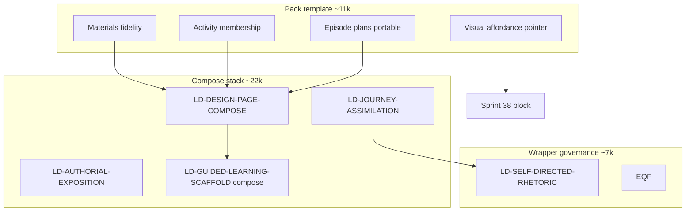

# Design Page Authority Map (Sprint 57 Discovery)

**Status:** Evidence record  
**Date:** 2026-07-01  
**Scope:** All authorities influencing `step_design_page` generation and post-compose processing

---

## 1. Emit-time authorities (prompt path)

| # | Authority | Location | Purpose | Owner (module header / pack) | Invocation path |
|---|-----------|----------|---------|------------------------------|-----------------|
| 1 | Design Page pack `promptTemplate` | `domains/learning-design/domain-learning-design-step-patterns.md` §13 ~3452 | Assembly task, materials fidelity, membership, episode portable schema, output JSON | Domain pack | `buildSeededStepPromptForWorkflowStep` |
| 2 | Pack `defaultPromptNotes` | Same §13 ~3407 | Runtime module index | Domain pack | Seeded with template |
| 3 | Pack `runnerInstructions` | Same §13 ~3408–3410 | Human QA checklist | Domain pack | Workflow UI (not appended to emit) |
| 4 | LD-DESIGN-PAGE-COMPOSE-CONTRACT | `lib/ld-design-page-compose-contract.js` | Page compose SSOT: membership, field preservation, episode plans, materials bridge | Sprint 38-B Wave 3 | `applyLdDesignPageComposeContractToDraft` → `buildLdDesignPageComposePromptBlock` |
| 5 | LD-AUTHORIAL-EXPOSITION-CONTRACT | `lib/ld-authorial-exposition.js` | Wrapper voice; PRESERVATION BOUNDARY | Sprint 42 | Embedded in compose block; `applyLdAuthorialExpositionContractToDraft` fallback |
| 6 | LD-JOURNEY-ASSIMILATION-CONTRACT | `lib/ld-journey-assimilation.js` | Wrapper inquiry arc, transitions, closure | Sprint 42-6 | `applyLdJourneyAssimilationContractToDraft` inside compose chain |
| 7 | LD-GUIDED-LEARNING-SCAFFOLD-CONTRACT | `lib/ld-guided-learning-scaffold.js` | Scaffold field prose quality; compose preservation rider | Sprint 55 | `applyLdGuidedLearningScaffoldContractToDraft` with `includeCompose: true` |
| 8 | LD-SELF-DIRECTED-RHETORIC | `lib/ld-self-directed-rhetoric.js` | Learner wrapper rhetoric; design_page rider | Sprint 41 | `applySelfDirectedLearnerPageStepScaffoldsToDraft` → `applyLdSelfDirectedRhetoricContractToDraft` |
| 9 | EDUCATIONAL-QUALITY-FRAMEWORK | `lib/educational-quality-framework-prompt.js` | Educational quality dimensions for design_page | Sprint 41 | `applyEducationalQualityFrameworkPromptBlockToDraft` |
| 10 | Sprint 38 visual affordance contract | `app.js` ~10302–10341 | `visual_affordances[]` schema 38.4 | Sprint 38 | `applySprint38VisualAffordanceContractToDraft` |
| 11 | Sprint 38 pedagogical added-value | `app.js` ~10280–10299 | Figure cognitive-support QA | Sprint 38 | Appended with visual block |
| 12 | LD-MATH-RENDER | `lib/ld-math-render.js` | TeX delimiter contract | Sprint 38-H | `applyMathSafeOutputContractToDraft` |

**Referenced but not injected on Design Page emit:**

| Authority | Referenced in | Actually invoked? | Gap |
|-----------|---------------|-------------------|-----|
| LD-MATERIALS-COPY | Pack template, compose CORE_LINES | **No** — `applyLdMaterialsCopyContractToDraft` GAM-only | Governance drift |
| LD-TABLE-FIDELITY | Pack template, compose deferral | **No** — `applyLdTableFidelityContractToDraft` returns draft for Design Page (~10226) | Governance drift |
| INSTRUCTIONAL-PATTERN-SP | — | **No** — GAM-only | N/A |
| PEL orientation/reasoning | Pack cross-refs DLA OUTPUT CONTRACT | **No** — DLA-only in `applyPedagogicEnrichmentContractScaffoldToDraft` | Pack stale reference |

---

## 2. Post-emit / compose-time authorities

| # | Authority | Location | Purpose | Invocation path |
|---|-----------|----------|---------|-----------------|
| 13 | PAGE-GAM-MATERIALS-PRESERVE | `lib/page-gam-materials-preserve.js` | Overlay upstream GAM bodies when LLM thins materials | `applyComposedPageGamMaterialsPreserve` in learner-page composition pipeline (~38385) |
| 14 | PAGE-ACTIVITY-FIELD-PRESERVE | `lib/page-activity-field-preserve.js` | Prefer upstream DLA fields when page row thinner | `validatePageActivityFieldClosureFromLib` in capture validation |
| 15 | Page activity closure | `app.js` `validatePageActivityClosure` | (U \ X) ⊆ C membership | `applyPageCompositionValidationForCapturedPage` |
| 16 | Page materials closure | `lib/page-gam-materials-preserve.js` (validator) | Materials body presence vs upstream GAM | Same validation function |
| 17 | Page episode plans closure | `app.js` `validatePageEpisodePlansClosure` | Portable episode_plans alignment | Same |
| 18 | Page beat-material closure | `app.js` + utility classifier | Beat vs material alignment | Same |
| 19 | Sprint 38 compose enforcement | `app.js` `applySprint38VisualAffordancesToComposedPage` | Normalise/validate visual affordance rows | Composition pipeline |
| 20 | Self-directed facilitator row sanitization | `app.js` `sanitizeSelfDirectedLearnerPageActivityRows` | Remove facilitator-only fields from learner page | Capture + composition |
| 21 | Pedagogic cognition semantics | `app.js` `applyPedagogicCognitionSemanticsToComposedPage` | Cognition-aware section merge (conditional) | Validation path when cognition active |
| 22 | Strict JSON capture gate | `app.js` `validateStrictJsonWorkflowRunStepCapture` | JSON parse validity on workflow capture | `syncWorkflowRunCapturedOutput` |

---

## 3. Overlapping responsibilities

| Overlap zone | Authorities involved | Nature |
|--------------|---------------------|--------|
| Materials verbatim copy | Pack template, compose MATERIALS_BRIDGE, journey CORE (never mutate), scaffold COMPOSE_LINES, post-capture GAM preserve | **4× emit + 1× repair** |
| Activity membership (U \ X) ⊆ C | Pack template, compose MEMBERSHIP_LINES, pack pre-return checklist, capture `validatePageActivityClosure` | **3× prompt + 1× validation** |
| Episode plans portable schema | Pack template, compose EPISODE_PLAN_LINES, capture episode closure | **2× prompt + 1× validation** |
| Wrapper transitions / closure | Journey TRANSITION_LINES + CLOSURE_LINES, rhetoric WRAPPER_RHETORIC + design_page rider, EQF journey slice, pack overview rules | **4× wrapper guidance** |
| Scaffold field preservation | Compose FIELD_PRESERVATION, LD-GUIDED-LEARNING-SCAFFOLD FIELD_LINES + EXEMPLAR_LINES, capture field closure | **Generation-oriented scaffold on compose step** |
| Table fidelity | Pack 38H-3 / DP-TABLE-ADJ-01 prose | **Named LD-TABLE-FIDELITY not injected** |
| Visual affordances | Pack pointer, compose additive rule, Sprint 38 full contract + examples, compose-time `applySprint38VisualAffordancesToComposedPage` | Pack + runtime + post-compose |

---

## 4. Authority precedence (documented)

| Layer | Precedence statement | Source |
|-------|---------------------|--------|
| L4 materials | LD-MATERIALS-COPY PREC-02 overrides overview thinning | Journey assimilation CORE_LINES |
| L4 materials bodies | Journey assimilation must not mutate `activity.materials.*` | Journey + compose |
| L5 rhetoric | LD-MATH-RENDER overrides rhetoric for equations | LD-SELF-DIRECTED-RHETORIC (gam path; design_page uses SHARED_LINES) |
| Compose | LD-DESIGN-PAGE-COMPOSE defers to appended modules “bodies not repeated here” | compose CORE_LINES — but materials/table modules not actually appended |

---

## 5. Governance authority count

| Category | Count |
|----------|------:|
| Emit-time prompt authorities (active) | **12** |
| Emit-time referenced-but-absent | **2** (materials-copy, table-fidelity) |
| Post-emit / capture authorities | **10** |
| **Total distinct authorities on Design Page path** | **22** |

---

## 6. Traceability

| Evidence | Path |
|----------|------|
| Compose chain | `app.js` ~10059–10108 |
| Table fidelity skip | `app.js` ~10173–10226 |
| Materials copy GAM gate | `app.js` ~10134–10138 |
| Composition validation | `app.js` ~38993–39093 |
| Module ownership headers | `lib/ld-design-page-compose-contract.js` L1–6, `lib/ld-journey-assimilation.js` L1–6 |
