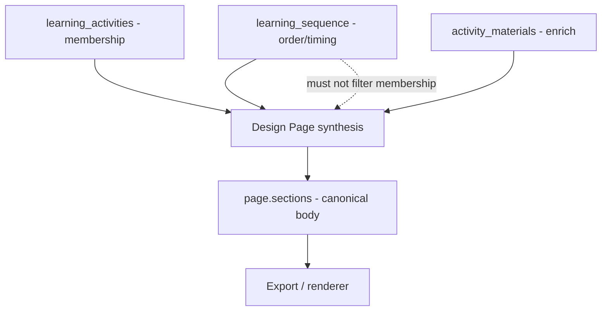

# Design Page composition contract (Sprint 25-2)

**Status:** **Implemented (Slice 25-5)** — pack prompt + runtime closure validation (warn-only)  
**Date:** 2026-05-19  
**Sprint:** 25 — Design Page composition and renderer consolidation  
**Slice:** 25-2

**Related:** [`design-page-composition-pipeline-investigation.md`](design-page-composition-pipeline-investigation.md) (25-1 findings) · [`slice-25-2-charter.md`](slice-25-2-charter.md)

---

## 1. Purpose

This contract defines **how a composed `page` artefact must relate to upstream Learning Design artefacts** when produced by the **Design Page** step (LLM synthesis governed by pack prompt).

It exists because:

- PRISM has **no runtime page assembler** — composition is **prompt + model output only**.
- Renderer and export paths can render activities correctly when `page.sections[]` is complete (25-1 control tests).
- Silent activity omission (e.g. inflation workshop **A2**) is a **composition contract failure**, not a renderer defect, unless live JSON proves otherwise.

**Audience:** pack authors, prompt editors, future validators, export-contract work (Slice 25-3).

---

## 2. Authority hierarchy (normative)

When sources conflict, apply this order:

| Priority | Source | Authority |
|----------|--------|-----------|
| **1** | Explicit workflow hard constraints | Goal, step notes, user exclusions (e.g. “omit activity A2”) override defaults |
| **2** | `learning_activities` (upstream artefact) | **Defines activity membership** — the set of `activity_id` values that MUST appear on the page unless traceably omitted |
| **3** | `page.sections[]` (composed output) | **Canonical rendered structure** for HTML/export — all learner-facing body content lives here |
| **4** | `learning_sequence` (upstream artefact) | **Ordering and timing only** — MUST NOT reduce membership below `learning_activities` |
| **5** | `activity_materials` (upstream artefact) | **Enriches** activities — MUST NOT define which activities exist |
| **6** | Top-level canonical keys on `page` (if present) | **Non-authoritative** — derived or legacy; export MUST NOT prefer over `sections[]` |



---

## 3. Ownership rules

### 3.1 `learning_activities` — membership authority

| Rule | Requirement |
|------|-------------|
| **M1** | The set of `activity_id` values in input `learning_activities` is the **closure set** for the Learning Activities section unless a documented omission applies (§4). |
| **M2** | Each composed activity entry in `sections[]` where `section_id = learning_activities` MUST include a stable `activity_id` matching upstream. |
| **M3** | Design Page MUST NOT invent activities absent from upstream `learning_activities`. |
| **M4** | Design Page MUST NOT merge two upstream activities into one page entry without recording omission of the merged id (§4). |

### 3.2 `learning_sequence` — order and timing only

| Rule | Requirement |
|------|-------------|
| **S1** | `learning_sequence` (timeline, `activities_used`, `activities_omitted`) controls **order**, **start_minute**, **duration_minutes**, and facilitator/learner action phrasing where embedded in page content. |
| **S2** | `activities_omitted` in **sequence** documents facilitation-time omissions; it does **NOT** authorise dropping those `activity_id` values from `page.sections[].learning_activities.content` unless the composition contract records an explicit page-level omission (§4). |
| **S3** | If sequence timeline lists fewer activities than `learning_activities`, the page MUST still include all membership-authority activities, ordered consistently with sequence where possible, with non-timeline activities placed in a defensible order (e.g. after last sequenced block or grouped at end). |

### 3.3 `activity_materials` — enrichment only

| Rule | Requirement |
|------|-------------|
| **A1** | Materials are keyed by `activity_id` / `material_id`; they supply content for activities already in the membership set. |
| **A2** | Presence of materials for an `activity_id` MUST NOT create a page activity if that id is absent from `learning_activities`. |
| **A3** | Absence of materials for an `activity_id` MUST NOT remove that activity from the page — include activity scaffold with empty or minimal `materials: {}` and note in `generation_notes` if required. |

### 3.4 `page.sections[]` — canonical structure

| Rule | Requirement |
|------|-------------|
| **P1** | All learner-facing page body content MUST live in `sections[]` as `{ section_id, heading, content }`. |
| **P2** | `defaultOutputStructure` keys are authoritative: `artifact_type`, `title`, `audience`, `page_profile`, `sections`, `source_artefacts`, `constraints_applied`, `generation_notes`. |
| **P3** | `learning_activities` section `content` MUST be an **array** of activity objects (not a map, not prose-only). |
| **P4** | Optional canonical `section_id` values: `overview`, `learning_purpose`, `knowledge_summary`, `learning_activities`, `learning_sequence` (if surfaced), `assessment_check`, `support_notes`. |

---

## 4. Activity preservation semantics

### 4.1 Closure rule (default)

Let **U** = set of `activity_id` values from input `learning_activities`.  
Let **C** = set of `activity_id` values in `page.sections[learning_activities].content`.

**Default:** **U ⊆ C** (every upstream activity appears on the page).

### 4.2 Permitted omissions

An activity id **u ∈ U** may be absent from **C** only when **all** of the following hold:

| Condition | Detail |
|-----------|--------|
| **O1 — Explicit authority** | User hard constraint or step note explicitly excludes **u**, OR workflow goal names exclusion |
| **O2 — Traceability** | Omission recorded in at least one trace structure (§5) |
| **O3 — No silent drop** | Omission is NOT inferred solely from `learning_sequence.activities_omitted` or timeline absence |

### 4.3 Prohibited omission patterns

| Pattern | Verdict |
|---------|---------|
| Drop activity because sequence omitted it for time | **Prohibited** without O1–O3 |
| Drop activity because materials are thin | **Prohibited** — include scaffold |
| Drop activity because “representative sample” of workshop | **Prohibited** unless O1 |
| Drop activity to reduce page length without limitation entry | **Prohibited** |
| Include only `activities_used` from sequence | **Prohibited** as membership rule |

---

## 5. Omission and traceability

When any **u ∈ U** is not in **C**, the composed `page` MUST include trace data.

### 5.1 Primary trace: `generation_notes`

```json
{
  "generation_notes": {
    "limitations": [
      "Activity A2 (Measuring Inflation: Indicator Comparison) omitted from Learning Activities section: <reason>."
    ],
    "activities_omitted": [
      {
        "activity_id": "A2",
        "title": "Measuring Inflation: Indicator Comparison",
        "reason": "Explicit workflow exclusion | Time constraint (documented) | …",
        "authority": "workflow_goal | step_notes | learning_sequence_facilitation_only"
      }
    ]
  }
}
```

| Field | Required when |
|-------|----------------|
| `limitations[]` | Any hard constraint unmet OR any activity omitted |
| `activities_omitted[]` | **Recommended normative shape** when any activity id omitted (future pack alignment) |
| Per-entry `activity_id`, `reason` | Always for each omission |

### 5.2 Secondary trace: align with sequence artefact

If sequence already lists `activities_omitted`, page-level `generation_notes.activities_omitted` MUST still record the same ids when those ids are omitted from **page** content, with `authority` clarifying whether omission is page-level or facilitation-only.

### 5.3 Facilitation-only sequence omissions

If an activity is in `learning_sequence.activities_omitted` but **included** on the page (recommended default per **S3**), no page omission trace is required for that id.

---

## 6. Canonical page authority (export-facing)

These rules govern **Slice 25-3** export contract; stated here so composition and export stay aligned.

| Rule | Requirement |
|------|-------------|
| **E1** | `sections[]` is the **sole authoritative body** for page content at export time. |
| **E2** | Top-level keys such as `learning_activities`, `overview`, `learning_purpose` on a `page` object, if present, are **derived or stale** — export MUST NOT render them instead of or before `sections[]`. |
| **E3** | Export MUST pass `pageSections: parsed.sections` (or equivalent) whenever rendering partial sections. |
| **E4** | Catalog `renderConfig.sectionOrder` lists canonical section ids; **`sections` is not a key in sectionOrder** — body lives in `sections[]` array entries. |
| **E5** | Renderer probe context may recover display rows from full `pageSections` when a slice is partial; probe does **not** fix missing composition membership. |

---

## 7. Prompt wording audit (Design Page §13)

Current source: `domains/learning-design/domain-learning-design-step-patterns.md` — Design Page `defaultPromptNotes`, `what_to_check`, `promptTemplate`.

### 7.1 Ambiguous phrases — current risk

| Phrase (current) | Location | Risk | Contract replacement (proposed) |
|------------------|----------|------|--------------------------------|
| **“one self-contained entry per activity **where available**”** | `promptTemplate` | Model may treat sequence/materials as availability gate | **“one entry for every `activity_id` in input `learning_activities`”** |
| **“use it to **drive activity order and timing** where possible”** | `promptTemplate` | “Drive” read as membership filter | **“use `learning_sequence` only for order, start_minute, and duration_minutes; do not omit activities present in `learning_activities` because sequence omitted them”** |
| **“copy full **selected** learner-facing material content”** | `promptTemplate` | “Selected” implies subset without rules | **“copy all learner-facing material content mapped to each `activity_id` from `activity_materials`”** |
| **“**where available**”** (timing, purpose, expected_output) | `promptTemplate` | Softens required fields | **“include when present in upstream; use empty string or omit field only if absent upstream”** |
| **“learning_sequence contributes timing/order **when present**”** | `what_to_check` | OK if paired with membership rule | Add: **“must not reduce activity set below `learning_activities`”** |
| **“representative”** | Not in Design Page prompt | N/A at pack text | Forbid in Design Page: **“do not emit a representative subset of activities”** |
| **“Before returning JSON, validate: learning_activities.content is an array…”** | `promptTemplate` | No activity-id closure check | Add: **“every input `activity_id` appears in `sections[].learning_activities.content` OR is listed in `generation_notes.activities_omitted`”** |

### 7.2 Proposed additive block (pack — for Slice 25-5)

Insert into `defaultPromptNotes` and `promptTemplate` (paraphrase consistently):

```text
Activity membership authority:
- Input learning_activities defines the complete set of activity_id values that must appear in sections[].learning_activities.content.
- learning_sequence must not reduce that set; use sequence only for order and timing.
- activity_materials enriches activities; do not create or remove activities based on materials alone.
- If any activity_id from learning_activities is omitted from the page, record it in generation_notes.limitations and generation_notes.activities_omitted with activity_id, title, and reason.
- Do not emit a representative subset of activities.
```

### 7.3 Proposed `what_to_check` additions

- Every `activity_id` from input `learning_activities` appears in `sections[].learning_activities.content` OR in `generation_notes.activities_omitted`.
- `learning_sequence` does not reduce activity membership below `learning_activities`.
- No top-level duplicate bodies (e.g. root `learning_activities`) that contradict `sections[]`.

---

## 8. Closure validation model (documentation only)

**Not implemented in 25-2.** This model defines how future runtime or CI validation SHOULD work.

### 8.1 Inputs

| Input | Extraction |
|-------|------------|
| **Upstream membership** `U` | All `activity_id` from captured input `learning_activities` at Design Page run (or last producer step) |
| **Composed membership** `C` | All `activity_id` from `page.sections` where `section_id === "learning_activities"` and `content` is array |
| **Trace omissions** `T` | `generation_notes.activities_omitted[].activity_id` ∪ ids parsed from `limitations` (fallback) |
| **Explicit exclusions** `X` | Parsed from workflow goal / step notes (manual or rules-based) |

### 8.2 Validation rules

| Check | Pass condition |
|-------|----------------|
| **V1 — Closure** | `(U \ X) ⊆ C` |
| **V2 — Trace completeness** | For every `u ∈ (U \ C)`: `u ∈ T` and `limitations` mentions `u` |
| **V3 — No phantom activities** | `C ⊆ U` (no invented ids) |
| **V4 — Sections authority** | `sections[]` present, array, each entry has `section_id`, `heading`, `content` |
| **V5 — No silent sequence filter** | If `learning_sequence.activities_omitted` contains `u` and `u ∉ C`, then `u ∈ T` with reason |

### 8.3 Validation outcome object (future)

```json
{
  "validation": "page_activity_closure",
  "outcome": "pass | fail | warn",
  "upstream_activity_ids": ["A1", "A2", "A3", "A4", "A5"],
  "composed_activity_ids": ["A1", "A3", "A4", "A5"],
  "omitted_ids": ["A2"],
  "traced_omission_ids": [],
  "untraced_omission_ids": ["A2"],
  "phantom_ids": [],
  "messages": [
    "A2 in upstream learning_activities but missing from page.sections and not in generation_notes.activities_omitted."
  ]
}
```

### 8.4 Future test requirements (document only — not implemented)

| Test type | Intent |
|-----------|--------|
| **Fixture composition contract** | Given upstream fixture bundle + golden `page`, assert V1–V3 |
| **Negative fixture** | Page missing A2 without trace → validation **fail** |
| **Export contract** (25-3) | Given page with full `sections[]`, catalog `sectionOrder` HTML contains all titles |
| **Live capture hook** (25-5+) | Optional validator on Design Page step complete in run mode |

---

## 9. Testability matrix

| Contract rule | How to test (future) |
|---------------|----------------------|
| M1 / §4.1 Closure | Compare `U` vs `C` on fixture or live JSON |
| S2 / S3 Sequence ≠ membership | Upstream sequence omits A2, `learning_activities` includes A2 → page must include A2 or trace |
| A2 Materials ≠ membership | Materials-only id not in `learning_activities` → must not appear in `C` |
| §5 Trace | Omit A2 with `activities_omitted` → export may hide; validator pass |
| E1–E2 Export authority | Partial top-level `learning_activities` + full `sections[]` → HTML shows `sections[]` set (25-3) |

---

## 10. Slice 25-3 recommendation

**Yes — charter Slice 25-3 as export-contract focused**, now that composition contract is explicit:

| Track | Focus |
|-------|--------|
| **25-2 (this slice)** | Composition contract, prompt wording proposals, closure validation model |
| **25-3 (next)** | **Page export contract**: `sections[]` authority, `pageSections` probe, catalog `sectionOrder` parity, architecture doc updates — **no renderer feature work** unless contract tests require fixtures |
| **25-5** | Pack prompt apply + optional closure validator implementation |

25-3 should **not** duplicate membership rules; it should **assume** composed `page` satisfies §4–§5 and ensure **export never masks composition gaps** by preferring stale top-level bodies.

---

## 11. Implementation boundary (25-2)

| In scope (25-2) | Out of scope |
|-----------------|--------------|
| This contract document | Pack file edits |
| Investigation + review-log updates | Runtime validators |
| Prompt wording proposals | Renderer changes |
| Validation model spec | New tests/fixtures |

**Slice 25-5 (proposed):** apply §7.2–7.3 to pack; add `activities_omitted` to `defaultOutputStructure`; optional `validatePageActivityClosure()` in run complete path.
