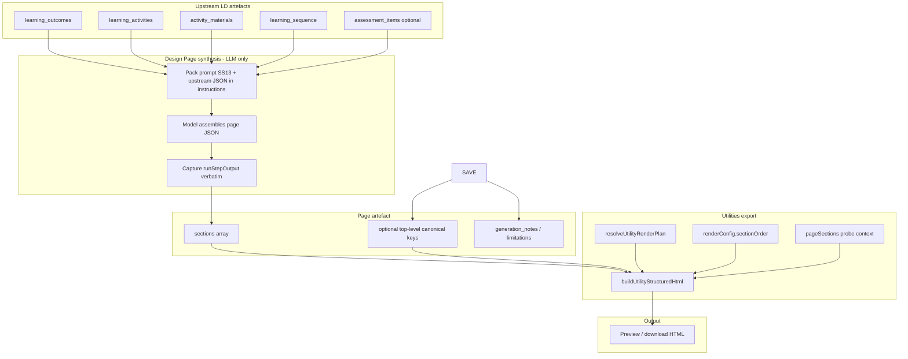

# Design Page composition pipeline — investigation scaffold (Sprint 25-1)

**Sprint:** 25 — Design Page composition and renderer consolidation  
**Slices:** 25-1 (investigation) · 25-2 (composition) · **25-3 (export contract)**  
**Date opened:** 2026-05-19  
**Status:** **25-1–25-3 complete (documentation)** — live workshop JSON still recommended before **25-5** remediation

**Charters:** [`slice-25-1-charter.md`](slice-25-1-charter.md) · [`slice-25-2-charter.md`](slice-25-2-charter.md) · [`slice-25-3-charter.md`](slice-25-3-charter.md)  
**Contracts:** [`design-page-composition-contract.md`](design-page-composition-contract.md) · [`design-page-export-contract.md`](design-page-export-contract.md)

---

## 1. Executive summary

| Field | Value |
|-------|--------|
| **Problem** | Activity A2 disappears between upstream LD artefacts and Design Page / exported HTML in the live inflation workshop flow |
| **Composition finding** | There is **no deterministic runtime assembler** for `page` — Design Page **composition is LLM-mediated** via pack prompt only |
| **Verdict (composition slice)** | **Inconclusive for live A2 loss** without captured Design Page `page` JSON; **architectural gap** identified in pack contract (sequence omission vs full activity inclusion) |
| **Primary suspected stage** | **S2 — Design Page model synthesis** (`page.sections[]` emission), not runtime post-processing |
| **Recommended next slice** | **25-5** remediation (pack + parity tests); **25-4** governance doc only until 25-5 lands |

---

## 2. Case study — inflation workshop A2

### 2.1 Expected upstream presence

| Artefact | Expected signal |
|----------|-----------------|
| `learning_activities` | Row `activity_id: "A2"`, title **Measuring Inflation: Indicator Comparison** |
| `activity_materials` | Materials keyed to A2 (comparison table, prompt set, checklist, etc.) |
| `learning_sequence` | Timeline block referencing A2 |

### 2.2 Expected downstream presence

| Stage | Expected signal |
|-------|-----------------|
| `page.sections[]` → `learning_activities` | A2 row in section `content` **or** recoverable via sequence + materials probe |
| Utilities HTML | Visible title text **Measuring Inflation: Indicator Comparison** in Learning activities |
| Live export (reported) | A1, A3, A4, A5 visible — **A2 absent** |

### 2.3 Control: test fixture path

The reduced/full fixtures under `tests/fixtures/page-render/` include A2 in `sections[].content`. Tests in `tests/utility-ld-inflation-page-render.test.js` assert:

- all five activity titles in HTML when fixture is rendered;
- A2 recovery when removed from `learning_activities` but retained in sequence/materials (probe context);
- catalog `sectionOrder` with **partial top-level** `learning_activities` still renders A2 from `sections[]`.

**Implication:** renderer + probe path can be correct while **live composed `page` JSON** is not.

### 2.4 Evidence log

| Stage | Source | A2 present? | Notes |
|-------|--------|-------------|-------|
| `learning_activities` (fixture) | `tests/fixtures/page-render/ld-inflation-workshop-page-full.json` (upstream shape in full fixture) | **Yes** | `activity_id: "A2"`, title **Measuring Inflation: Indicator Comparison** in `sections[].learning_activities.content` |
| `activity_materials` (fixture) | Same fixture, `activity_materials` section | **Yes** | Multiple rows keyed `activity_id: "A2"` |
| `learning_sequence` (fixture) | Same fixture, `learning_sequence` section | **Yes** | Timeline block `activity_id: "A2"`, minutes 15–35 |
| Design Page raw output (live) | _Not in repo_ | **Unknown** | **Required:** run capture from live workshop Design Page step |
| Saved `page` → `sections[].learning_activities` (live) | _Not in repo_ | **Unknown** | **Disambiguates composition vs export** |
| Saved `page` → top-level `learning_activities` (live) | _Not in repo_ | **Unknown** | Pack `defaultOutputStructure` does **not** authorise top-level `learning_activities`; model may still emit |
| `generation_notes.limitations` (live) | _Not in repo_ | **Unknown** | Should record omission if model drops A2 under hard constraints |
| Utilities HTML export (live) | Reported symptom | **No** (A2 title absent) | A1, A3, A4, A5 visible |
| Composed `page` via fixture (control) | `ld-inflation-workshop-page-full.json` | **Yes** | Canonical shape includes all five activities — proves valid composition **is possible** |
| Runtime post-capture | `app.js` → `sanitizePrismRunCapturedOutput` | N/A | Strips `STEP N OUTPUT` footer and orphan fences only — **does not parse or filter activities** |

---

## 3. Pipeline map

### 3.1 End-to-end flow



### 3.2 Composition path locations (code + pack)

| Layer | Location | Role in composition |
|-------|----------|---------------------|
| **Pack — step definition** | `domains/learning-design/domain-learning-design-step-patterns.md` §**13. Design Page** | `promptTemplate`, `defaultPromptNotes`, `what_to_check`, `defaultOutputStructure` — **authoritative composition contract** |
| **Pack — artefact spec** | `domains/learning-design/domain-learning-design-artefacts.md` §**18. page** | Requires assembly from `learning_activities` + `activity_materials`; `sections[]` canonical; `generation_notes.limitations` on unmet constraints |
| **Pack — sequence (upstream)** | Same file, §**10. Construct Learning Sequence** | May **omit** activities in `activities_omitted` while `learning_activities` artefact remains complete |
| **Runtime — instruction build** | `app.js` → `buildWorkflowStepInstructions` | Injects **verbatim** captured upstream JSON per `inputBindings` (`workflowRunCapturedOutputs`) |
| **Runtime — capture sanitise** | `app.js` → `sanitizePrismRunCapturedOutput` | Footer/fence strip only — **no page JSON normalisation** |
| **Runtime — NOT present** | _(none found)_ | No `assemblePage`, `normalizePage`, or activity-merge function in `app.js` |

**Implication:** Activity preservation into `page.sections[]` is **entirely governed by the Design Page prompt + model behaviour** at run time, not by deterministic PRISM composition code.

### 3.3 Stage questions

| # | Stage | Key question | 25-1 answer |
|---|--------|--------------|-------------|
| S0 | Upstream capture | Is full `learning_activities` JSON passed into Design Page instructions? | **Mechanism yes** (verbatim binding); **live content unverified** |
| S1 | Construct Learning Sequence | Did sequence mark A2 in `activities_omitted`? | **Unknown (live)**; fixture includes A2 in timeline |
| S2 | Design Page model synthesis | Does `sections[].learning_activities.content` include A2? | **Unknown (live)** — **primary suspect** |
| S3 | Post-capture sanitise | Does runtime strip activities? | **No** (code review) |
| S4 | Artefact shape | Duplicate top-level `learning_activities` vs `sections[]`? | **Possible model drift**; pack forbids alternate wrappers; **live unverified** |
| S5 | Export (out of composition scope) | Renderer drops A2 when `sections[]` is faithful? | **No** (fixture + tests) — investigate only if S2 shows A2 present |

---

## 4. Layer boundaries and ownership

### 4.1 Ownership table (draft — confirm in 25-1)

| Concern | Owner | Examples |
|---------|--------|----------|
| **Pedagogic completeness** | Design Page composition (pack prompt + model) | All activities from `learning_activities` appear in `page` |
| **Material linkage** | Composition + `activity_materials` contract | Each activity’s materials referenced by `activity_id` |
| **Sequence fidelity** | Composition + `learning_sequence` | Timeline blocks reference valid activity IDs |
| **Section structure** | `page` artefact spec | `sections[]` with canonical `section_id` |
| **HTML structure** | Utility renderer | `util-task-block`, cards, scenarios |
| **Export fidelity** | Renderer + `renderConfig` + `pageSections` | Catalog order must not mask `sections[]` body |
| **Visual presentation** | Renderer CSS (embedded) | Tables, icons, spacing — **no semantic changes** |

### 4.2 Anti-patterns (renderer must not)

| Anti-pattern | Why |
|--------------|-----|
| Invent activities not in upstream JSON | Pedagogy belongs to composition |
| Silently drop activities with materials | Export should surface `generation_notes` instead |
| Merge unrelated activities | Composition owns grouping |
| Replace section semantics with generic headings only | Breaks profile-aware pages |

### 4.3 Acceptable renderer responsibilities

| Responsibility | Notes |
|----------------|--------|
| Recover display rows from `pageSections` probe when section slice is partial | **Integration** concern — must be explicit in export contract |
| Render typed materials (cards, scenarios, tables) | Established v1 patterns |
| Collapse internal metadata | UX only |
| Apply accessible icons and contrast-safe accents | Presentation only |

---

## 5. Design Page composition audit

### 5.1 Pack requirements (reference)

From `domain-learning-design-artefacts.md` §18 (`page`):

- Assembled from `learning_activities`, `activity_materials`, and related upstream artefacts.
- Must not invent unsupported pedagogy or activities.
- Must record gaps in `generation_notes.limitations` when constraints cannot be met.
- `sections[]` is the canonical structural carrier.

From `domain-learning-design-step-patterns.md`:

- **Design Page** step: `requiresAnyOf` knowledge / materials / sequence / content; produces `page`.
- Workshop paths include **Construct Learning Sequence** before **Design Page**.

### 5.2 Composition failure modes (checklist)

| Mode | Description | A2 symptom if true |
|------|-------------|-------------------|
| **C1 — Selective omission** | Model drops one activity from `learning_activities` section | A2 missing in `sections[]` |
| **C2 — Partial merge** | Only first N activities copied | A2 missing if ordered late |
| **C3 — ID drift** | Materials use `A2` but activities re-keyed | Renderer cannot link materials |
| **C4 — Profile filter** | Learner profile excludes “comparison” activity type | A2 omitted by prompt interpretation |
| **C5 — Limitation silent** | Constraint failure without `generation_notes` | A2 gone, no audit trail |
| **C6 — Duplicate bodies** | Top-level `learning_activities` stale vs `sections[]` | Export shows wrong body |

### 5.3 Findings (composition — 25-1)

#### What the Design Page contract requires

From §13 `defaultPromptNotes` / `promptTemplate` (abridged):

- `sections` **must** be an array of `{ section_id, heading, content }` — no alternate wrappers.
- `learning_activities.content` **must** be an array of activity objects with predictable keys.
- **One self-contained entry per activity where available**, including materials copied from `activity_materials`.
- If `learning_sequence` is present, use it to **drive activity order and timing**.
- Unmet hard constraints → `generation_notes.limitations[]`.

From §18 `page` artefact spec:

- Must be assembled from `learning_activities` and `activity_materials`.
- Must not invent activities; must record limitations when constraints cannot be met.

#### Contract gaps relevant to A2

| Gap | Detail | Risk for A2 |
|-----|--------|-------------|
| **G1 — No explicit activity-id closure** | Prompt says “per activity **where available**” but does **not** require every `activity_id` from input `learning_activities` to appear in output | Model may drop A2 without recording a limitation |
| **G2 — Sequence authority ambiguity** | Sequence step **allows omission** (`activities_omitted`, merge under time pressure); Design Page says “use sequence to drive order” | Model may treat sequence timeline as the **authoritative activity set** and omit A2 if omitted from sequence in live run |
| **G3 — `learning_activities` not in `requiresAnyOf`** | Design Page graph gate: `requiresAnyOf` includes `activity_materials`, `learning_sequence`, etc., but **`learning_activities` is only `optionalRequires`** | Edge-case workflows could bind materials + sequence without a fresh `learning_activities` capture (unlikely in standard workshop chain, worth verifying bindings) |
| **G4 — No runtime validation** | PRISM does not validate composed `page` JSON against upstream activity ids before save/export | Omissions surface only at HTML export or manual inspection |

#### Ruled out at composition layer (code review)

| Hypothesis | Result |
|------------|--------|
| Runtime merges A2 into another activity | **No code path** — no assembler |
| Runtime renames `activity_id` | **No code path** |
| Runtime drops A2 during capture sanitise | **No** — `sanitizePrismRunCapturedOutput` is non-structural |
| Renderer drops A2 when `sections[]` is complete | **No** — `ld-inflation-workshop-page-full.json` renders all five titles (export layer; see §7) |

#### Most likely composition failure modes (pending live confirmation)

| Mode | Description | How to confirm |
|------|-------------|----------------|
| **C1 — Selective omission** | Model omits A2 from `sections[].learning_activities.content` | Live Design Page JSON: A2 absent from content array |
| **C6 — Sequence-filtered assembly** | Model includes only `activities_used` from sequence, not full `learning_activities` | Compare live `learning_sequence.activities_omitted` vs page activity list |
| **C5 — Silent limitation** | A2 dropped without `generation_notes.limitations` | Inspect live `generation_notes` |
| **C-input — Upstream already partial** | Design Page receives `learning_activities` missing A2 before synthesis | Compare Design Page instruction payload to prior step captures |

---

## 6. Export and `pageSections` integration audit

### 6.1 Catalog render config

Live `page` artefact (`domain-learning-design-artefacts.md`):

```json
"sectionOrder": [
  "overview",
  "learning_purpose",
  "knowledge_summary",
  "learning_activities",
  "assessment_check",
  "support_notes"
]
```

Note: **`"sections"` is not in `sectionOrder`.** Body lives in `sections[]` array entries.

### 6.2 Known integration behaviours (code reference)

| Behaviour | Location | Investigation note |
|-----------|----------|-------------------|
| `utilityRenderPageSections` array path | `app.js` | Uses `buildPageSectionProbeContext(pageSections)` for activity recovery |
| `buildUtilityStructuredHtml` | `app.js` | Should prefer single `sections[]` render when array present (verify live path) |
| `handleUtilitiesGenerate` | `app.js` | Should pass `pageSections: parsed.sections` (verify in 25-1) |
| Test helper default | `buildUtilityStructuredHtmlForTest` | Uses `sectionOrder: ["sections"]` — **differs from catalog** |

### 6.3 Export failure modes (checklist)

| Mode | Description |
|------|-------------|
| **E1 — Top-level wins** | Partial `parsed.learning_activities` rendered before / instead of `sections[]` |
| **E2 — Missing probe** | `pageSections` not passed on live generate |
| **E3 — Wrong sectionOrder** | Canonical keys rendered via generic `utilityRenderArray` without activity pipeline |
| **E4 — Test / live divergence** | Fixtures pass; production JSON shape differs |

### 6.4 Findings

<!-- Fill during investigation -->

---

## 7. Renderer state and control tests

### 7.1 Current visual direction (capture — do not redesign in 25-1)

| Element | Direction |
|---------|-----------|
| Activity container | White `util-task-block` with light border / shadow |
| Nested materials | Grey cards (`util-task-card`, `util-scenario-card`, etc.) |
| Section headings | Icon + label; flex-aligned; restrained colour accents |
| Study Tips | `fa-graduation-cap`; distinct from assessment icon |
| Materials headings | Typed headings (Task cards, Scenarios, …); **no** generic “Materials” per group |
| Support notes | Secondary callout; labelled; not primary content |
| Output blocks | Green left accent; “What you will produce” |
| Metadata | Collapsed Production Metadata |
| Accessibility | Decorative icons `aria-hidden`; no colour-only meaning |
| Tables | Soft borders; readable padding; print-tolerant |

### 7.2 Renderer control matrix

| Input | Render path | A2 expected | Result |
|-------|-------------|-------------|--------|
| Full fixture + `["sections"]` | Test API | Yes | _run / confirm_ |
| Full fixture + catalog `sectionOrder` | Test API | Yes | _run / confirm_ |
| Live saved `page` JSON | Utilities UI | Yes | _capture in 25-1_ |
| `learning_activities` section only + `pageSections` | `utilityRenderPageSectionsForTest` | Yes (probe) | _confirm_ |

### 7.3 Findings

<!-- Fill during investigation -->

---

## 8. Renderer governance principles (draft)

### 8.1 Principles

1. **Composition owns completeness** — renderer displays what `page` JSON contains; it does not fix missing activities.
2. **Probe context is export contract** — when rendering partial sections, `pageSections` must supply upstream activity/material/sequence context.
3. **Single authoritative body** — prefer one `sections[]`-driven render path for page artefacts; avoid duplicate canonical top-level bodies.
4. **Typed materials over generic dumps** — extend patterns (cards, scenarios, tables) before adding new generic object walkers.
5. **Presentation-only changes are safe** — spacing, borders, icons, collapsed metadata without semantic keys changing.
6. **Regression fixtures required** — workshop-scale fixtures (inflation) for any renderer or export change after 25-1.
7. **Catalog parity tests** — export tests must use production `sectionOrder`, not only `["sections"]`.

### 8.2 Safe vs unsafe renderer changes

| Safe | Unsafe without composition fix |
|------|-------------------------------|
| CSS spacing, borders, contrast | Injecting activities from materials alone |
| New material subtype HTML | Reordering activities against sequence |
| Icon / heading polish | Dropping materials when title missing |
| `pageSections` merge rules (documented) | Hiding `generation_notes` failures |

---

## 9. Root-cause classification (composition focus)

| Class | Selected? | Evidence summary |
|-------|-----------|------------------|
| **Composition — model synthesis (C1/C6)** | **Primary suspect** | No runtime assembler; pack contract allows sequence-filtered omission; live `page` JSON not yet captured |
| **Composition — upstream input already partial** | **Secondary suspect** | Verify Design Page instruction payload includes full `learning_activities` |
| **Artefact shape (duplicate bodies)** | **Possible** | Pack forbids; live top-level keys unverified |
| **Export integration (E\*)** | **Deferred** | Fixture + 220 tests show renderer can render A2; pursue only if live `sections[]` contains A2 |
| **Renderer** | **Unlikely** | Ruled out for faithful JSON |

**Exact stage where A2 is preserved or lost (composition slice):**

| Stage | Preserved / lost |
|-------|------------------|
| **S2 — Design Page model synthesis** | **Lost (suspected)** in live flow — **not proven** without live JSON |
| **S3 — Runtime post-capture** | **Preserved** (no structural mutation) |
| **Fixture reference composition** | **Preserved** — all five activities in `ld-inflation-workshop-page-full.json` |

---

## 10. Recommendations and proposed slices

### 10.1 Missing evidence (complete before remediation)

1. **Live `learning_activities` capture** at Design Page run (confirm A2 row present in injected payload).
2. **Live `learning_sequence` capture** — `activities_used`, `activities_omitted`, timeline `activity_id` list.
3. **Live Design Page `page` JSON** — list `activity_id` values in `sections[learning_activities].content`; check `generation_notes.limitations`.
4. **Optional:** save redacted snapshots under `context-files/` (see Appendix B).

### 10.2 Immediate recommendations

1. **Charter Slice 25-2 (composition contract)** as next step — do **not** start renderer/export remediation until live JSON disambiguates S2 vs S5.
2. **25-2 draft content** should address gaps **G1–G2**: mandatory activity-id closure from input `learning_activities`; clarify that `learning_sequence` controls **order/timing only**, not membership; require `generation_notes` when any upstream activity is omitted.
3. **Investigation continuation (25-1):** one live workshop run with evidence log §2.4 completed — can close 25-1 composition track after that.
4. **25-3 (export)** only if live `page` JSON **includes** A2 in `sections[]` but HTML export does not.

### 10.3 Proposed charter sketches

| Slice | Charter when | Draft objective |
|-------|--------------|-----------------|
| **25-2** | **Now (recommended)** | Activity preservation contract; sequence vs activities authority; prompt `what_to_check` additions |
| **25-3** | Live page has A2 but export lacks it | Export shape + `pageSections`; architecture doc update |
| **25-4** | After contracts stable | Renderer governance + bounded visual backlog |
| **25-5** | After 25-2 + evidence | Pack prompt and/or optional validation — separately approved |

### 10.4 Out of scope for programme

- LD semantics rationalisation (Sprint 23)
- Research pack conformance (Sprint 24)
- Unified Settings redesign

---

## 11. Design Page composition contract (Slice 25-2)

**Normative draft:** [`design-page-composition-contract.md`](design-page-composition-contract.md)

### 11.1 Authority hierarchy (summary)

| Source | Role |
|--------|------|
| `learning_activities` | **Membership** — complete `activity_id` closure set |
| `learning_sequence` | **Order/timing only** — must not filter membership |
| `activity_materials` | **Enrichment** — must not define membership |
| `page.sections[]` | **Canonical body** for render/export |
| Top-level canonical keys on `page` | **Non-authoritative** if duplicated |

### 11.2 Preservation rule (summary)

**Default:** every upstream `activity_id` ∈ `page.sections[learning_activities].content`.

**Omission allowed only with:** explicit user constraint + `generation_notes.limitations` + `generation_notes.activities_omitted` (proposed shape).

### 11.3 Prompt gaps addressed in 25-2 (proposals only)

Replace ambiguous “where available”, “selected upstream materials”, and sequence “drive” language — see contract §7.

### 11.4 Closure validation (future)

Documented model: upstream ids **U**, composed ids **C**, traced omissions **T** — pass when `(U \ X) ⊆ C` and all omissions traced. See contract §8.

### 11.5 Slice 25-3 direction

**Delivered:** [`design-page-export-contract.md`](design-page-export-contract.md).

---

## 12. Export / pageSections integration (Slice 25-3)

**Normative draft:** [`design-page-export-contract.md`](design-page-export-contract.md)

### 12.1 Production export audit summary

| Check | Current `app.js` behaviour |
|-------|---------------------------|
| `sections[]` authoritative when non-empty | **Yes** — `pageBodyFromSectionsArray` renders once; skips duplicate top-level body keys |
| `pageSections` on live generate | **Yes** — `handleUtilitiesGenerate` passes `parsed.sections` |
| Catalog `sectionOrder` | Lists canonical ids only — **no `"sections"` key**; does not reorder array body |
| Stale top-level `learning_activities` | **Suppressed** when `sections[]` present (test T2) |
| Historical duplicate-body risk | **Mitigated** when `sections[]` non-empty; regressed if guard removed |

### 12.2 Export vs composition for A2

| If live `page` JSON… | Likely layer |
|----------------------|--------------|
| `sections[]` missing A2 | **Composition (S2)** — export cannot fix |
| `sections[]` includes A2; HTML missing A2 | **Export/renderer** — investigate regression |
| No `sections[]`; top-level partial only | **Export fallback risk** — stale top-level wins |

### 12.3 Probe recovery caveat

`resolveLearningActivityRowsForRender` may add activities from sequence/materials probes — can **mask** composition gaps on full-page export. **25-5:** consider strict mode (export contract §6).

### 12.4 Future tests (documented §7 export contract)

T1–T4 catalog parity; T7 strict closure warn. Fixtures listed in export contract — not created in 25-3.

### 12.5 25-4 vs 25-5

**25-5 remediation first** (pack + export tests + optional validator). **25-4** renderer governance documentation may proceed in parallel; visual polish after closure fixes.

---

## Appendix A — File index for investigators

| Path | Role |
|------|------|
| `domains/learning-design/domain-learning-design-artefacts.md` | `page` artefact + renderHints |
| `domains/learning-design/domain-learning-design-step-patterns.md` | Design Page step |
| `app.js` | `utilityRenderPageSections`, `buildUtilityStructuredHtml`, `buildPageSectionProbeContext` |
| `docs/architecture/renderer-export-behavior.md` | Export behaviour documentation |
| `tests/fixtures/page-render/ld-inflation-workshop-page-full.json` | Full workshop fixture |
| `tests/utility-ld-inflation-page-render.test.js` | Renderer regression tests |
| [`design-page-composition-contract.md`](design-page-composition-contract.md) | **25-2** composition contract (normative draft) |
| [`design-page-export-contract.md`](design-page-export-contract.md) | **25-3** export / pageSections contract (normative draft) |

---

## Appendix B — `context-files/` (optional)

Create `context-files/` under this sprint pack when capturing **redacted** live JSON snapshots:

```
context-files/
  README.md
  a2-upstream-learning_activities.json
  a2-page-artefact-sections.json
  a2-utilities-export-snippet.html
```

**Not required for 25-1 open** — add as evidence is collected.

---

## 13. Slice 25-5 closeout (implementation)

**Date:** 2026-05-19  
**Status:** **Closed (bounded remediation)**

### 13.1 Confirmed finding (unchanged)

Live canonical `page.sections[]` omitted **A2** before export. Primary fault: **Design Page synthesis / composition**, not renderer when `sections[]` is complete.

### 13.2 Delivered

| Area | Change |
|------|--------|
| **Pack prompt** | `domain-learning-design-step-patterns.md` §13 Design Page — membership closure, sequence/materials roles, `activities_omitted[]` |
| **Artefact spec** | `domain-learning-design-artefacts.md` §18 `page` — omission trace fields |
| **Runtime validation** | `validatePageActivityClosure`, `appendPageCompositionClosureWarnings` in `app.js` — warn-only on workflow capture + Utilities generate |
| **Export strict mode** | `strictCompositionClosure: true` when `pageBodyFromSectionsArray` — no sequence/material stub rows in `resolveLearningActivityRowsForRender` |
| **Tests** | `tests/utility-page-composition-closure.test.js`; inflation render tests updated for strict behaviour |

### 13.3 Verification

```bash
node --test tests/*.test.js
```

**Exit floor (25-5):** **229 passed**, 0 failed.

### 13.4 Residual risk

LLM composition may still omit activities until prompts are exercised in live runs; runtime validation **records** silent omissions in `generation_notes` but does **not** auto-repair page content. Re-run Design Page after pack deploy and confirm A2 in live `page.sections[]`.
