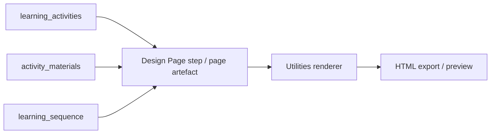

# Sprint 25 index — Design Page composition and renderer consolidation

**Pack path:** `docs/development/sprints/2026-05-19-sprint-25-design-page-composition-renderer-consolidation/`  
**Date:** 2026-05-19  
**Status:** **CLOSED** — see [`sprint-25-closeout.md`](sprint-25-closeout.md). Successor: [Sprint 26 — renderer presentation](../2026-05-20-sprint-26-renderer-presentation-consolidation/sprint-26-index.md).

**Predecessors:**

- [Sprint 23 — Learning Design pack rationalisation](../2026-05-18-sprint-23-learning-design-pack-rationalisation/sprint-23-closeout.md) — **complete**
- [Sprint 24 — Research pack conformance](../2026-05-19-sprint-24-research-pack-conformance/sprint-24-index.md) — **complete**

**Verification floor (entry):** **220 passed**, 0 failed (`node --test tests/*.test.js`)

---

## Purpose

Shift PRISM delivery focus from **ad hoc renderer fixes in chat** to a **governed sprint programme** for:

1. **Design Page composition** — how upstream LD artefacts become the `page` artefact
2. **Export / render integration** — how `page` JSON reaches Utilities HTML reliably
3. **Renderer consolidation** — safe, bounded refinement of the existing utility renderer v1 direction

**Programme thesis:** Upstream semantics and orchestration are now stable (Sprints 23–24). Remaining learner-facing quality issues are increasingly **composition and integration** problems, not pack-semantics gaps.

---

## Headline problem (chartered investigation)

**Activity A2** (“Measuring Inflation: Indicator Comparison”) is present in upstream artefacts:

- `learning_activities`
- `activity_materials`
- `learning_sequence`

…but **disappears by the Design Page artefact / export stage** in live workshop flows.

**Working hypothesis (25-1):** loss occurs in **page composition** and/or **`pageSections` / export path integration**, not primarily in utility renderer material typing.

Recent utility renderer work (task cards, scenarios, probe context, catalog `sectionOrder`) improved HTML when `sections[]` is authoritative — **that does not close the composition pipeline question.**

---

## Portable pack (this folder)

| File | Purpose |
|------|---------|
| [`sprint-25-index.md`](sprint-25-index.md) | This index |
| [`CURRENT-STATE.md`](CURRENT-STATE.md) | Live status + boundaries |
| [`review-log.md`](review-log.md) | Decisions R25-001+ |
| [`slice-25-1-charter.md`](slice-25-1-charter.md) | Slice 25-1 charter (open) |
| [`design-page-composition-pipeline-investigation.md`](design-page-composition-pipeline-investigation.md) | 25-1 investigation + 25-2 summary (§11) |
| [`design-page-composition-contract.md`](design-page-composition-contract.md) | **25-2 normative composition contract (draft)** |
| [`slice-25-2-charter.md`](slice-25-2-charter.md) | Slice 25-2 charter (closed, documentation) |
| [`design-page-export-contract.md`](design-page-export-contract.md) | **25-3** export / pageSections contract (normative draft) |
| [`slice-25-3-charter.md`](slice-25-3-charter.md) | Slice 25-3 charter (closed, documentation) |

---

## Slice sequence (proposed)

| Slice | Focus | Status |
|-------|--------|--------|
| **25-1** | Pipeline trace, A2 loss diagnosis, boundary map, governance framing | **Closed** — investigation doc |
| **25-2** | Composition contract + activity preservation rules | **Closed** — [`design-page-composition-contract.md`](design-page-composition-contract.md) |
| **25-3** | Export / `pageSections` integration contract | **Closed** — [`design-page-export-contract.md`](design-page-export-contract.md) |
| **25-4** | Renderer governance + visual direction charter (bounded refinements) | **Proposed** |
| **25-5** | Remediation (pack prompt, closure validation, strict export, regression tests) | **Closed** — see [`sprint-25-closeout.md`](sprint-25-closeout.md) |
| **25-4** | Renderer governance + visual direction charter | **Proposed** (optional) |

---

## System boundaries (sprint scope)



| Layer | Owns | Does not own |
|-------|------|----------------|
| **LD pack / prompts** | Artefact semantics, Design Page assembly instructions | HTML layout |
| **Page composition** | `page.sections[]` fidelity, activity inclusion, profile sections | Font Awesome styling |
| **Utility renderer** | HTML structure, material patterns, export `renderConfig` | Upstream synthesis |
| **Workflow runtime** | Step outputs, capture, save shape | Renderer CSS themes |

---

## Programme constraints (all slices until rescoped)

| Constraint | Notes |
|------------|--------|
| **No fixes in 25-1** | Investigation, audit scaffolding, governance only |
| **No pack rewrite** | LD semantics settled in Sprint 23 |
| **No Settings / PF redesign** | Out of scope |
| **No broad renderer redesign** | Consolidate v1 direction; bounded refinements only |
| **Evidence before remediation** | 25-5 (or hotfix slice) requires 25-1 trace artefact |
| **Test floor must not regress** | `node --test tests/*.test.js` |

---

## Key references (live codebase)

| Topic | Path |
|-------|------|
| `page` artefact contract | `domains/learning-design/domain-learning-design-artefacts.md` §18 |
| Design Page step | `domains/learning-design/domain-learning-design-step-patterns.md` |
| Utility renderer | `app.js` (`utilityRenderPageSections`, `buildUtilityStructuredHtml`) |
| Renderer export behaviour | `docs/architecture/renderer-export-behavior.md` |
| Inflation workshop fixtures | `tests/fixtures/page-render/ld-inflation-workshop-page-full.json` |
| Page render tests | `tests/utility-ld-inflation-page-render.test.js` |

---

## Verification

```bash
node --test tests/*.test.js
```

**Entry floor:** **220 passed**, 0 failed.  
**Exit floor (25-5):** **229 passed**, 0 failed.
