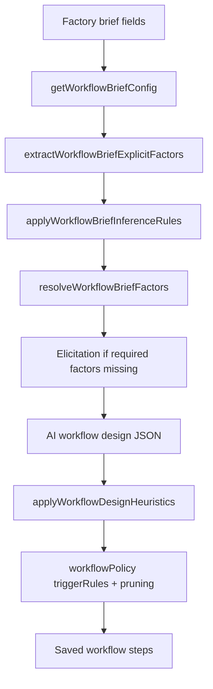

# Sprint 26 review log — Pedagogical intent & workflow topology

**Pack:** `docs/development/sprints/2026-05-20-sprint-26-pedagogical-intent-elicitation-orchestration/`  
**Decisions:** R26-PI-001+

---

## 2026-05-20 — Sprint pack open (investigation programme)

### Decisions

| ID | Decision | Rationale |
|----|----------|-----------|
| R26-PI-001 | **Separate pack** from renderer Sprint 26 (`2026-05-20-sprint-26-renderer-presentation-consolidation`) | Same sprint number, different programme; renderer paused at 248 tests |
| R26-PI-002 | **26-1 is doc-only** — no runtime, pack, renderer, or Settings changes | Evidence before topology rule changes |
| R26-PI-003 | **Primary case** = sparse RNA/HCV self-study brief with explicit learning activities | Reproduces assessment-heavy topology omission |
| R26-PI-004 | **Live repo authoritative**; `context-files/` are bounded investigation snapshots | Avoid stale giant dumps |
| R26-PI-005 | **Track B** (assessment on page) is a **separate investigation thread** from Track A (topology) | Same RNA case may have two failure loci; do not conflate |
| R26-PI-006 | **`source_artefacts` ≠ learner body** — assessment visibility requires `page.sections[]` / `assessment_check` per Sprint 25 export authority | Metadata citation alone is insufficient for MCQ display |
| R26-PI-007 | **Track B renderer hotfix** — `isAssessmentCheckSection` + `renderAssessmentCheckSectionBlock` in `app.js`; bounded to export/render path | Root cause: array renderer path ignored canonical `section_id: assessment_check` when heading heuristics did not match; valid composed page JSON produced no MCQ HTML |
| R26-PI-008 | **Track B follow-up** — section binding + catalogue `sectionOrder` alignment | `orderedKey` at array index matched `assessment_check` while `section_id` was `support_notes` → false-positive assessment wrapper with wrong heading and placeholder; fix: trust `section_id` over index slot, explicit `support_notes` deny, `collectAssessmentQuestionRows` |
| R26-PI-009 | **Track B closed** — assessment visibility on export is **not** an open sprint item | Renderer/export hotfix complete; composition/orchestration not implicated for valid `assessment_check` + `items[]`; **Track A** remains sole open investigation |
| R26-PI-010 | **D5 resolved** — for reported RNA case, `sections[]` contained assessment; gap was renderer | Not a `source_artefacts`-only metadata issue |
| R26-PI-011 | **D6 resolved** — inflation + RNA fixtures prove renderer path | See `utility-ld-rna-assessment-page-render.test.js` |

### Artefacts

| Artefact | Path |
|----------|------|
| Index | [`sprint-26-index.md`](sprint-26-index.md) |
| 26-1 charter | [`slice-26-1-charter.md`](slice-26-1-charter.md) |
| Handover | [`HANDOVER.md`](HANDOVER.md) |
| Context files | [`context-files/`](context-files/) — incl. Track B: `assessment-items-output-trace.md`, `design-page-assessment-inclusion-notes.md`, `page-assessment-renderer-notes.md` |

**Pack/runtime delta:** Documentation only at open. **248** tests passing.

### 2026-05-20 — Track B renderer hotfix (out of 26-1 doc-only scope; same programme)

| Item | Detail |
|------|--------|
| **Root cause (R26-PI-007)** | Array path ignored `section_id: assessment_check` when heading heuristics did not match. |
| **Root cause (R26-PI-008)** | Pack `sectionOrder` is indexed by position; when `sections[]` is shorter or missing slots (e.g. no `learning_activities`), `orderedKeys[idx]` became `assessment_check` for a `support_notes` row. `isAssessmentCheckSection` treated `looksAssessmentItemsSection(orderedKey)` as true → wrong heading + string content → placeholder. Real `assessment_check` row could still fail item extraction when mis-bound. |
| **Fix** | `isAssessmentCheckSection`: deny `support_notes` / explicit `section_id`; never use catalogue `orderedKey` when `section_id` is set and not assessment. `orderedKey = sectionId \|\| orderedKeys[idx]`. `resolvePageSectionHeadingFromEntry`, `collectAssessmentQuestionRows`, dedicated `support_notes` render branch. |
| **Files** | `app.js`; `tests/fixtures/page-render/ld-rna-hcv-assessment-page.json`; `tests/utility-ld-rna-assessment-page-render.test.js` |
| **Tests** | **252** passed (`node --test tests/*.test.js`) |
| **Track A** | Unchanged — missing learning activities / topology remains **orchestration** investigation (26-1) |

### 2026-05-20 — Track B closed (assessment visibility)

| Item | Detail |
|------|--------|
| **Status** | **Closed / fixed** — no further renderer work in Sprint 26 unless regression |
| **Issue class** | Renderer/export (`A-RENDER`) — **not** Generate Assessment Items, **not** Design Page composition for reported JSON shape |
| **Symptom timeline** | (1) No assessment HTML → (2) placeholder + wrong heading → (3) correct MCQs + separate `support_notes` |
| **Root cause** | `section_id` detection; catalogue `sectionOrder[idx]` mis-bound heading/content to wrong section |
| **Files changed** | `app.js` |
| **Fixture** | `tests/fixtures/page-render/ld-rna-hcv-assessment-page.json` |
| **Tests** | `tests/utility-ld-rna-assessment-page-render.test.js`; inflation assessment regression in same file |
| **Verification** | `node --test tests/*.test.js` → **252 passed**, 0 failed |
| **Limitations** | Non-canonical section_ids; live browser re-export not archived; empty `sections[]` still composition |

---

## Pipeline map (26-1 working draft)

| Stage | Primary location | Outputs |
|-------|------------------|---------|
| Explicit extract | `app.js` `extractWorkflowBriefExplicitFactors` | `assessment_required`, `page_profile`, duration, etc. |
| Text interpret | `app.js` `interpretWorkflowBriefText` | `session_materials`, `learning_environments` |
| Inference | LD pack `workflowBriefConfig.inferenceRules` | Pack-specific factor defaults |
| Resolution | `app.js` `resolveWorkflowBriefFactors` | Resolved factors + source map |
| Elicitation | `app.js` workflow brief elicitation state | User-answered refinement factors |
| Model draft | `callOpenAIForWorkflowDesign` | Initial `steps[]` |
| Heuristics | `app.js` `applyWorkflowDesignHeuristics` | Canonical titles, triggerRules, **pruning** |
| Pack policy | `domain-learning-design-step-patterns.md` `workflowPolicy` | include/exclude by factors + goal terms |

---

## RNA case — preliminary evidence table (26-1 to complete)

| Signal / outcome | Expected if honoured | Observed | Preliminary failure locus |
|------------------|----------------------|----------|---------------------------|
| Topic: RNA/HCV from transcript | Normalize + Model Knowledge | Present | OK |
| Self-study / independent study | Self-directed activity style, not drop activities | Acceptable interpretation | TBD — may interact with page-only paths |
| Explicit **learning activities** | Include Design Learning Activities + Generate Activity Materials | **Absent** | **Topology** — investigate H4–H6 |
| Formative assessment mention | May include Generate Assessment Items | Present | OK — but may trigger H1/H2 pruning |
| Design Page | Present | Present | Downstream empty `learning_activities` |

**26-1 action:** Replace “TBD” with confirmed line references and trace logs.

---

## Track B — Assessment on rendered page — **CLOSED**

| Signal / outcome | Expected | Final status | Locus |
|------------------|----------|--------------|-------|
| Generate Assessment Items in workflow | Present | Present | — |
| `page.sections[]` `assessment_check` + items | Q1–Q10 in export | **Fixed** (renderer) | **A-RENDER** |
| Export heading | Formative Assessment Check | **Fixed** | Binding |
| Adjacent `support_notes` | Separate section | **Fixed** | R26-PI-008 |
| Placeholder when items exist | Must not show | **Fixed** | — |
| Answer key | Only if in artefact | **OK** — not invented | — |
| Tests | Pass | **252** suite pass | See below |

**Decisions:** R26-PI-007, R26-PI-008, R26-PI-009. **No further Track B work** in 26-1 unless regression.

**Docs:** [`context-files/assessment-items-output-trace.md`](context-files/assessment-items-output-trace.md), [`page-assessment-renderer-notes.md`](context-files/page-assessment-renderer-notes.md).

---

## Proposed follow-on charters (stubs — not approved)

### Slice 26-2 (design)

- Pedagogical signal taxonomy: `activities_required`, `materials_required`, `assessment_required`, delivery context
- Topology trigger rules: explicit beats inferred; assessment lean path must not override explicit activity phrases
- Pack vs runtime ownership matrix

### Slice 26-3 (fixtures)

- `tests/fixtures/workflow-brief-ld-sparse/` — RNA case + 4–6 variants
- Golden: brief text → resolved factors → expected step titles post-heuristic
- See `context-files/regression-fixture-candidates.md`

---

## Status

**26-1 active** — **Track A only**. Track B **closed** (R26-PI-009). Test floor **252**.
