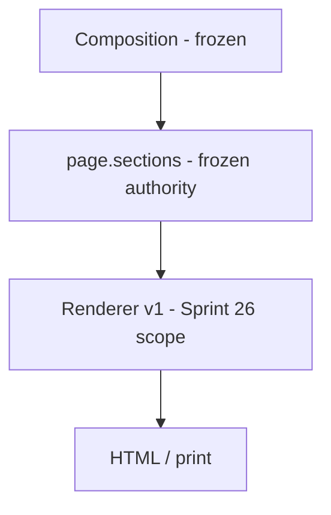

# Utility renderer governance (Sprint 26)

**Status:** **Normative for Sprint 26+** presentation work  
**Date:** 2026-05-20  
**Supersedes:** Sprint 25 investigation [§8 draft](../2026-05-19-sprint-25-design-page-composition-renderer-consolidation/design-page-composition-pipeline-investigation.md) (composition-era draft)

**Frozen upstream contracts (do not edit in renderer sprints):**

- [Design Page composition contract](../2026-05-19-sprint-25-design-page-composition-renderer-consolidation/design-page-composition-contract.md)
- [Design Page export contract](../2026-05-19-sprint-25-design-page-composition-renderer-consolidation/design-page-export-contract.md)

---

## 1. Purpose

Define what the **Utilities page renderer** (`app.js` utility renderer v1) **may** and **must not** do, so presentation improvements do not reintroduce composition drift or semantic invention.

---

## 2. Responsibility boundaries

| Responsibility | Owner | Renderer role |
|----------------|-------|----------------|
| Which activities exist on the page | Design Page composition (`learning_activities` membership) | **Display only** rows present in `sections[]` |
| Activity order / timing authority | Composition + `learning_sequence` in JSON | **Render order** of provided rows; do not insert missing ids |
| Material payload content | Upstream artefacts + composition | **Render structure**; do not rewrite pedagogy |
| Canonical page body | `page.sections[]` | **Single authoritative** render path when array non-empty |
| Omission traceability | `generation_notes` | **Show** metadata; do not hide validation failures |
| HTML/CSS presentation | **Renderer (Sprint 26)** | Spacing, typography, patterns, print, a11y |

---

## 3. Core principles

1. **Composition owns completeness** — the renderer displays what `page.sections[]` contains; it does not fix missing activities.
2. **No pedagogy invention** — no new activities, tasks, stems, scenarios, or facilitator scripts not in JSON.
3. **Typed materials over generic dumps** — extend named patterns (`task_cards`, `scenarios`, `prompt_set`, tables) before adding generic object walkers.
4. **Strict closure is normative for full-page export** — when `strictCompositionClosure` is active, do not inject activities from sequence/materials probes.
5. **Presentation-only changes are safe** — CSS, spacing, icons, heading polish, print rules, without changing which JSON fields are read.
6. **Regression fixtures required** — inflation workshop full page (minimum) for any renderer change.
7. **Catalog parity** — export tests that simulate production should use catalog `sectionOrder`, not only `["sections"]` (see export contract).

---

## 4. Safe vs prohibited changes

### 4.1 Safe (Sprint 26 in scope)

| Category | Examples |
|----------|----------|
| **Layout / CSS** | Margins, padding, max-width, card borders, grid gaps, print `@media` rules |
| **Typography** | Font sizes, line-height, list spacing, heading visual weight |
| **Headings (presentation)** | Consistent `h2`–`h4` classes; icon + text alignment |
| **Material patterns** | Improved HTML for existing keys (task card, scenario, prompt set, table) |
| **Accessibility** | `aria-hidden` on decorative icons; skip links only if product-approved |
| **Sanitizer narrow fixes** | Placeholder line removal; checkbox list normalization (existing pass) |
| **Metadata UI** | `util-meta` collapse styling, summary line clarity |
| **Tests** | New assertions on HTML structure/classes; fixture extensions |

### 4.2 Prohibited without new composition/export sprint

| Category | Examples |
|----------|----------|
| **Membership repair** | Adding activities from `activity_materials` or `learning_sequence` when absent from LA section |
| **Disabling strict closure** | Defaulting `strictCompositionClosure: false` for full-page export |
| **Authority inversion** | Preferring top-level `learning_activities` over `sections[]` when both exist |
| **Silent drops** | Omitting activities/materials because title missing |
| **Semantic merge** | Combining two activities into one block |
| **Content rewrite** | Summarising scenario text, paraphrasing prompts |
| **Pack/prompt changes** | Design Page assembly instructions |
| **Closure validator changes** | `validatePageActivityClosure` rules or auto-repair |
| **Generic walkers** | Replacing typed material renderers with catch-all object dumps |

### 4.3 Probe context (legacy / partial render only)

`buildPageSectionProbeContext` and non-strict `resolveLearningActivityRowsForRender` exist for **isolated section preview** scenarios. Sprint 26 must **not** expand probe recovery to mask incomplete composed pages on full export.

---

## 5. Extension patterns (new material subtypes)

When adding support for a new material shape:

1. **Identify JSON key** in composed `materials` object (pack-aligned).
2. **Add dedicated renderer** (function + CSS class) — not a generic recursive dump.
3. **Add fixture fragment** under `tests/fixtures/page-render/` or extend inflation full page.
4. **Add test** asserting stable class/structure (not only string contains).
5. **Document** in [`docs/architecture/renderer-export-behavior.md`](../../../architecture/renderer-export-behavior.md).
6. **Log** decision in [`review-log.md`](review-log.md).

---

## 6. Accessibility minimum bar

| Check | Requirement |
|-------|-------------|
| Heading order | No skipped levels within a section where avoidable |
| Decorative icons | `aria-hidden="true"` on FA icons already used |
| Tables | `<thead>` / `<tbody>`; readable borders in print |
| Checkbox lists | Visible text; not only glyph |
| Colour | WCAG AA target for body text on white/grey surfaces |
| Print | Readable without horizontal scroll for standard A4 width |

---

## 7. Verification checklist (every renderer PR)

- [ ] `node --test tests/*.test.js` — pass count ≥ entry floor
- [ ] Inflation full fixture: A1–A5 activity titles still in Learning activities HTML
- [ ] No edits to composition/export contracts or closure validator semantics
- [ ] Change classified **safe** in §4.1 or chartered as optional backlog item
- [ ] [`renderer-refinement-backlog.md`](renderer-refinement-backlog.md) item updated if applicable

---

## 8. References

| Path | Role |
|------|------|
| `app.js` | `utilityRenderPageSections`, `buildUtilityStructuredHtml` |
| `tests/utility-ld-inflation-page-render.test.js` | Primary regression |
| `tests/utility-page-composition-closure.test.js` | Frozen guardrails |
| [`renderer-export-behavior.md`](../../../architecture/renderer-export-behavior.md) | Runtime behaviour notes |
