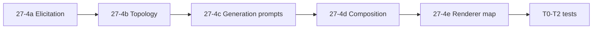

# Slice 27-4 — Implementation charter (bounded)

**Pack:** `docs/development/sprints/2026-05-21-sprint-27-assessment-feedback-elicitation-semantics/`  
**Date:** 2026-05-21  
**Status:** **Implementation complete** (tracks 27-4a–4f, 2026-05-21). Optional 27-4g deferred.  
**Gate:** User approval of this document before any `app.js` / LD pack / test changes

**Inputs:** R27-001–024, [`assessment-semantics-notes.md`](assessment-semantics-notes.md), [`elicitation-evidence-matrix.md`](elicitation-evidence-matrix.md), [`workflow-probe-catalogue.md`](workflow-probe-catalogue.md), 27-3 probe captures, [`CURRENT-STATE.md`](CURRENT-STATE.md)

---

## Executive answer — smallest end-to-end change set

To preserve **discussion-oriented** and **delayed-feedback** pedagogy without rewriting the assessment system:

1. **E — Additive brief factors** (5 required for MVP, 2 optional): extract + `workflowBriefConfig` optionalFactors + post-gen queue entries, with a **negation-safe** hide-answers path (fix R27-007).
2. **O — Topology triggers only**: broaden Design Feedback inclusion; enforce **DLA → GAM → GAI → DP** when `feedback_timing` is not immediate; map derived `design_feedback_required` from timing + interaction mode (no new canonical steps).
3. **G — Contract clarification, not schema replacement**: keep generating `correct_answer` / `true_false_answer` in `assessment_items` for tutor/marking use; add prompt instructions keyed off `assessment_interaction_mode` and `misconception_assessment_link`.
4. **C — Page metadata bridge**: new `learner_answer_visibility` drives `page.feedback_display` + Design Page `include_answers` **independently** of generation artefacts.
5. **R — Minimal renderer mapping**: map `learner_answer_visibility` / `feedback_timing` to existing modes (`none`, `answer_grid_end`, `answers_explanations`) and implement **`reflection_then_answers`** (R27-016) as a thin alias — not a new assessment engine.

**Explicit split (architectural invariant):**

| Channel | Owns | Does not own |
|---------|------|----------------|
| **Generation-time answer semantics** | Whether items are **authored** with keys, rationales, misconception tags | Whether the **learner HTML** shows them |
| **Render-time visibility policy** | Learner export presentation | Whether tutors have an answer key upstream |

---

## A. Problem statement

PRISM can generate rich learning activities and assessment items, but **pedagogical assessment intent** (discuss → check → tutor debrief; hidden answers on learner handouts; diagnostic misconception checks) is **not carried** reliably from brief to export.

Symptoms (confirmed 27-1 → 27-3):

- Briefs that hide answers can set `include_answers: true` at extract (R27-007).
- `feedback_required` is confused with **when** feedback/answers appear (R27-013).
- **Design Feedback** is dropped from topology for formative + discussion briefs (R27-008, R27-015, 27-3 probes).
- Learner export hides answers via `feedback_display: none` or omitted fields while JSON still contains answers — **policy without elicitation fidelity** (R27-009, P27-04 proxy).
- Discussion pedagogy lives in **activity** prompts; assessment steps default to **retrieval** shape (H5, P27-03).

**Programme question for 27-4:** What is the smallest change set that preserves discussion-oriented and delayed-feedback pedagogy **end-to-end**?

**Answer:** Additive semantics at **E**, trigger/policy at **O**, prompt hints at **G**, metadata mapping at **C**, mode mapping at **R** — **not** a new assessment subsystem.

---

## B. Confirmed evidence (27-1 → 27-3)

| ID | Finding | Layers | Source |
|----|---------|--------|--------|
| R27-007 | Negated “correct answers” → `include_answers: true` | E | P27-02, P27-04 extract |
| R27-008 / R27-015 | Design Feedback pruned unless “feedback pack” phrases | O | All 27-3 probes |
| R27-009 / R27-012 | Answers in G JSON; learner export via C/R policy | G; C, R | Cases B–C; P27-04 proxy |
| R27-010 | `task cards` not in `activities_required` regex | E | Climate / P27-04 |
| R27-011 | Facilitator notes → `page_profile: facilitator` | E | Inflation; P27-02 |
| R27-016 | `reflection_then_answers` in pack, not in renderer | R | assessment-semantics-notes |
| R27-020 | Candidate factors name loss points at E, O | E, O | 27-3 probes |
| H1–H6 | Supported (27-1) | All | elicitation-evidence-matrix |

**Live generation gap:** P27-02 and P27-03 have **no** captured `assessment_items` / composed page (R27-024). Charter regression plan must add fixtures after implementation.

---

## C. Semantic factor model

### C.1 Principles

- **Additive** optional/refinement factors in `workflowBriefConfig`; no replacement of `assessment_type`, `assessment_total_items`, `feedback_required`.
- Factors are **stable IDs** stored in resolved brief JSON and passed via `stepParamPatch` / mapsTo.
- **Do not overload** `include_answers` for learner visibility; introduce `learner_answer_visibility` (R27-012).

### C.2 MVP factor set (27-4 implementation scope)

| Factor ID | Type | Values (MVP) | Primary owner |
|-----------|------|--------------|---------------|
| `feedback_timing` | select | `immediate_self_check`, `after_peer_discussion`, `end_of_session_reveal`, `tutor_led_reveal_only` | E → O, C, R |
| `assessment_interaction_mode` | select | `retrieval_practice`, `discussion_oriented`, `diagnostic_misconception` | E → G, C |
| `learner_answer_visibility` | select | `hidden_until_reveal`, `show_after_activity_block`, `show_answer_grid_end`, `show_with_explanations` | E → C → R |
| `tutor_answer_artefact` | select | `generate_internal_only`, `include_in_facilitator_page`, `omit_from_learner_page` | E → G, C |
| `design_feedback_required` | boolean | true / false (derived default from timing + mode) | E → O |
| `misconception_assessment_link` | boolean | true / false | E → G |
| `peer_instruction_phase` | select | `none`, `think_pair_share`, `small_group_discussion_then_check` | E → O, G (activities) |

### C.3 Deferred (documented, not MVP)

| Factor | Reason |
|--------|--------|
| `confidence_rating_required` | No pack/item schema; P27-05 only |
| Full `assessment_strategy` / cadence rework | Out of scope |
| Dual-page automatic facilitator pack | Needs product decision; use `tutor_answer_artefact` + `page_profile` carefully |

### C.4 Derivation rules (documentation — implement in E/O)

```
IF brief mentions hide answers / do not reveal / tutor debrief / handout without answers
  → learner_answer_visibility = hidden_until_reveal
  → include_answers_extract MUST NOT be true (negation-first)

IF feedback_timing IN (after_peer_discussion, tutor_led_reveal_only, end_of_session_reveal)
  → design_feedback_required = true (default)
  → learner_answer_visibility default hidden_until_reveal

IF assessment_interaction_mode = diagnostic_misconception
  → misconception_assessment_link = true (default)
  → prefer true_false / proposition items in GAI params when not overridden

IF peer_instruction_phase != none
  → activities_required = true (explicit extract cue)
  → O: enforce DLA before GAI; CLS encouraged
```

### C.5 Mapping: factors → existing knobs (compatibility)

| New factor | Maps to (existing) | Notes |
|------------|-------------------|--------|
| `learner_answer_visibility: hidden_until_reveal` | `page.feedback_display: none`, Design Page `include_answers: false` | Learner only |
| `learner_answer_visibility: show_answer_grid_end` | `feedback_display: answer_grid_end` | Renderer already supports |
| `learner_answer_visibility: show_with_explanations` | `feedback_display: answers_explanations` | Renderer already supports |
| `feedback_timing: tutor_led_reveal_only` | `feedback_display: none` on learner page; tutor artefact | Split profiles later |
| `feedback_timing: after_peer_discussion` | `reflection_then_answers` or ordered sections | R27-016 |
| `design_feedback_required: true` | Include **Design Feedback** step | O trigger expansion |
| `tutor_answer_artefact: generate_internal_only` | GAI still emits `answer_key`; C omits from learner `assessment_check` | **Generation ≠ render** |

---

## D. Proposed layer ownership

Five policy layers — **do not collapse**:

| Layer | Responsibility | 27-4 touch surfaces |
|-------|----------------|---------------------|
| **1. Elicitation semantics** | Brief → resolved factors; Factory questions; extract regex; post-gen queue | `workflowBriefConfig`, `extractWorkflowBriefExplicitFactors`, `getAssessmentPostGenerationElicitationQueue` |
| **2. Workflow topology policy** | Which steps exist and order | `workflowPolicy.triggerRules`, `applyWorkflowDesignHeuristics` prune/inclusion, `explicitFeedbackRequested` |
| **3. Generation contracts** | Shape of `assessment_items`, `feedback_pack`, activities | LD pack prompts: GAI, Design Feedback, DLA; `stepParamPatch` |
| **4. Composition metadata** | `page` JSON: sections, flags | Design Page prompt + `include_answers` / `feedback_display` on page root |
| **5. Renderer policy** | HTML visibility of answers/feedback | `renderQuestionBlocks`, `resolveSectionFeedbackDisplay` |

### Layer ownership map (gaps → owner)

| Gap (P#) | Primary | Secondary | 27-4 action |
|----------|---------|-----------|-------------|
| P1 interaction mode | E | G | New factor + GAI prompt lines |
| P2 feedback timing | E | O, C, R | New factor + topology + metadata map |
| P3 visibility = policy | C, R | E | `learner_answer_visibility`; fix extract |
| P4 include_answers bug | E | C | Negation-first extract |
| P5 Design Feedback prune | O | E | Triggers + `design_feedback_required` |
| P6 feedback_display not from brief | E, C | R | Map from `learner_answer_visibility` |
| P7 reflection_then_answers unwired | R | C | Renderer branch |
| P8 Design Assessment pruned | O | — | Optional: include when `diagnostic_misconception` + count (slice 27-4c) |
| P9 task cards regex | E | — | Extend `activityCueRe` |
| P10 collateral page_profile | E | — | Prefer `desiredOutputs` for learner page |
| P11 post-gen queue scope | E | — | Add new factors to `assessment_pack` class |
| P12 diagnostic in activities only | G | E | `misconception_assessment_link` |
| P14 peer sequence | O | E | `peer_instruction_phase` + step order guard |

---

## E. Minimal bounded changes

### E.1 Track 27-4a — Elicitation & extract (smallest vertical slice)

**Goal:** Correct factors on brief; no topology change yet.

| Change | File(s) | Bounded detail |
|--------|---------|----------------|
| Add 5 MVP optionalFactors | `domain-learning-design-step-patterns.md` `workflowBriefConfig` | IDs in §C.2 |
| Extract regex | `app.js` `extractWorkflowBriefExplicitFactors` | Negation-first hide-answers; cues for discussion, debrief, peer, misconception, “formative check” → `assessment_required` |
| Extend `activityCueRe` | `app.js` | `task cards`, `misconception` workshop |
| Derive `design_feedback_required` | `app.js` resolve pass | From `feedback_timing` + `assessment_interaction_mode` |
| Post-gen queue | `app.js` + pack `intentClasses.assessment_pack` | Add `feedback_timing`, `learner_answer_visibility`, `assessment_interaction_mode` to orderedFactors |
| Deprecate conflation | docs + mapsTo | `include_answers` → prefer `learner_answer_visibility` for new briefs; keep `include_answers` pass-through for legacy |

**Acceptance:** P27-02 and P27-04 probe briefs resolve with `learner_answer_visibility: hidden_until_reveal`, `include_answers` not true; P27-03 sets `peer_instruction_phase`.

### E.2 Track 27-4b — Topology policy

**Goal:** Steps match pedagogy sequence.

| Change | Bounded detail |
|--------|----------------|
| Expand `explicitFeedbackRequested` | Add: `debrief`, `delayed feedback`, `after discussion`, `do not reveal`, `tutor will`, OR honour `design_feedback_required === true` |
| Design Feedback inclusion | Pack `triggerRules` + heuristic: include when `design_feedback_required` or `feedback_timing !== immediate_self_check` |
| Step order guard | When `feedback_timing` in `after_peer_discussion`, `tutor_led_reveal_only`: ensure **DLA → GAM → GAI** (fix P27-02 GAI-before-DLA) |
| Do not force Design Assessment for MVP | Unless `assessment_total_items` + `diagnostic_misconception` (optional 27-4c) |

**Acceptance:** 27-3 probe topologies include Design Feedback when timing delayed; GAI after DLA for P27-02.

### E.3 Track 27-4c — Generation contracts (prompt-only)

**Goal:** Items authored correctly; answers available for tutor channel.

| Change | Bounded detail |
|--------|----------------|
| GAI `promptTemplate` | If `assessment_interaction_mode = diagnostic_misconception`, require proposition/T.F linked to misconception themes; if `misconception_assessment_link`, reference activity materials |
| GAI default | **Still emit** `answer_key` / `true_false_answer` when `tutor_answer_artefact` ≠ omit |
| Design Feedback | Include when step present; input `assessment_items` |
| DLA | If `peer_instruction_phase` set, require `grouping` + learner_task reflecting pair/small-group |

**Acceptance:** Live run (post-implementation): `assessment_items` has answers; stems reflect misconceptions for P27-04-shaped brief.

### E.4 Track 27-4d — Composition metadata

**Goal:** Page JSON encodes learner policy explicitly.

| Change | Bounded detail |
|--------|----------------|
| `applyWorkflowBriefMapsTo` / Design Page patch | Set `include_answers` from `learner_answer_visibility`, not from MCQ type alone (~7986–8012 guard) |
| Design Page prompt | Copy `feedback_timing` into `generation_notes.constraints_applied`; set root `feedback_display` from visibility + timing table (§C.5) |
| Learner `assessment_check` | When `hidden_until_reveal`: may retain answer fields for tutor export profile only — document: learner page omits or strips per `include_answers: false` instruction |

**Acceptance:** Composed learner page has `feedback_display: none` when hidden; metadata lists applied semantics.

### E.5 Track 27-4e — Renderer policy (minimal)

**Goal:** HTML matches page metadata; close R27-016.

| Change | Bounded detail |
|--------|----------------|
| `renderQuestionBlocks` | Parse `reflection_then_answers`; map `show_after_activity_block` → inline hidden until end of section (or `none` per-item + grid) |
| No new widgets | Reuse `hideAnswers`, `gridAtEnd`, `includeRationalesInGrid` |

**Acceptance:** Climate proxy + P27-02-shaped page fixture: no “Correct answer” when `learner_answer_visibility: hidden_until_reveal`; grid when `show_answer_grid_end`.

---

## F. Regression fixtures / tests

### F.1 Strategy

| Tier | Purpose | When |
|------|---------|------|
| **T0 Heuristic** | Extract + topology without LLM | Each 27-4a/4b PR |
| **T1 Page JSON** | Composition shape | 27-4d |
| **T2 Render** | HTML visibility | 27-4e |
| **T3 Live smoke** | Manual Factory (optional) | Release |

**Do not delete** existing 259 tests; add focused files.

### F.2 Proposed fixtures (paths — create in implementation)

| Fixture | Probe / case | Asserts |
|---------|--------------|---------|
| `tests/fixtures/workflow-brief-ld-sparse/p27-02-tutor-delayed-feedback.json` | P27-02 | factors + steps include Design Feedback; GAI after DLA |
| `tests/fixtures/workflow-brief-ld-sparse/p27-03-peer-instruction.json` | P27-03 | `peer_instruction_phase`, 6 items, no `page_profile: assessment` override |
| `tests/fixtures/workflow-brief-ld-sparse/p27-04-diagnostic-misconception.json` | P27-04 | `assessment_interaction_mode`, hidden visibility |
| `tests/fixtures/page-render/p27-04-learner-page-hidden-answers.json` | Composed page | `feedback_display: none`, items may include TF answers |
| `tests/fixtures/page-render/p27-06-self-check-grid-end.json` | P27-06 control | `answer_grid_end` render |

### F.3 Proposed tests

| Test file | Coverage |
|-----------|----------|
| `tests/workflow-ld-assessment-semantics-extract.test.js` | Extract negation, new factors, P27-02/03/04 briefs |
| `tests/workflow-ld-assessment-semantics-topology.test.js` | Design Feedback inclusion, step order |
| `tests/utility-ld-assessment-visibility-render.test.js` | `learner_answer_visibility` × HTML |
| Extend `workflow-ld-rna-sparse-brief-topology.test.js` | Regression: Sprint 26 behaviour unchanged when factors unset |

### F.4 Probe re-run checklist (post-implementation)

Re-run [`27-3-probe-runner.js`](context-files/27-3-probe-runner.js) + fill **PENDING** rows in probe notes with live `assessment_items` excerpt (optional).

---

## G. Rollout order



| Order | Track | Rationale | Risk if skipped |
|-------|-------|-----------|-----------------|
| 1 | **27-4a** | Fixes false-positive extract; factors for all downstream | Wrong metadata propagates |
| 2 | **27-4b** | Feedback pack step + step order | Pedagogy chain still broken |
| 3 | **27-4d** | Page flags before renderer | HTML without metadata source |
| 4 | **27-4e** | Close reflection/grid modes | Residual R27-016 |
| 5 | **27-4c** | Prompt quality (can parallel 4d after 4a) | Items generic but structure OK |
| 6 | **27-4c optional** | Design Assessment for diagnostic | Low priority |

**Suggested PR sizing:** 4a+4b (one PR), 4d+4e (one PR), 4c (pack-heavy PR).

---

## H. Explicit non-goals

| Non-goal | Rationale |
|----------|-----------|
| Full assessment engine rewrite | Charter constraint |
| New item types (confidence/CARS) | P27-05; no schema |
| Replacing `assessment_type` / `feedback_required` | Compatibility |
| Automatic dual facilitator + learner pages | Product scope; use flags only |
| Live OpenAI in CI | Cost/flake; use fixtures |
| Re-opening Sprint 26 renderer materials work | R27-004 closed |
| Mandatory Design Assessment for all workshops | Lean paths stay for item-bank-only briefs |
| LLM-judged “pedagogy quality” scoring | Out of scope |
| Changing MCQ checkbox CSS / kitchen-sink | Presentation closed |

---

## Candidate implementation slices (summary)

| Slice | Scope | Est. touch | Depends |
|-------|--------|------------|---------|
| **27-4a** | E: factors + extract + queue + negation fix | `app.js`, LD `workflowBriefConfig` | — |
| **27-4b** | O: Feedback step + order guard | `app.js`, pack `triggerRules` | 4a |
| **27-4c** | G: prompt instructions | LD step patterns | 4a |
| **27-4d** | C: Design Page patch + page metadata | `app.js`, Design Page prompt | 4a |
| **27-4e** | R: `reflection_then_answers` + visibility map | `app.js` | 4d |
| **27-4f** | Tests + fixtures | `tests/` | 4a–4e |
| **27-4g** (optional) | Design Assessment when diagnostic + count | O, pack | 4a |

---

## Risk analysis

| Risk | Likelihood | Impact | Mitigation |
|------|------------|--------|------------|
| Legacy briefs rely on `include_answers` alone | High | Wrong export | Pass-through; map old → `learner_answer_visibility` |
| `page_profile: facilitator` collateral | Medium | Wrong page type | 4a: rank `desiredOutputs` learner cues over inputs |
| Design Feedback step increases cost/latency | Medium | UX | Only when `design_feedback_required` or delayed timing |
| GAI still “leaks” answers into learner sections | Medium | Pedagogy fail | 4d prompt + 4d validation; tests on page JSON |
| Renderer modes proliferate | Low | Maintenance | Map to 3 existing modes + one alias |
| Over-broad Feedback inclusion | Medium | Noise | Derived `design_feedback_required`, not all formative |
| Sprint 26 topology regression | Medium | Broken RNA path | T0 tests with factors unset = prior behaviour |
| Probe PENDING never filled | Low | Weak G proof | 27-4f optional manual capture |

---

## Migration / compatibility notes

1. **Resolved brief JSON:** New keys are optional; missing keys → current behaviour (retrieval + `feedback_required` defaults).
2. **`include_answers`:** Keep reading for older workflows; new briefs should set `learner_answer_visibility`. Document in HANDOVER.
3. **`feedback_display` on page:** Continue to honour explicit page root; composition sets from visibility when absent.
4. **`assessment_items` schema:** No breaking field removal; tutor keys remain for marking.
5. **Pack version:** Bump `workflowBriefConfig.version` to `"1.1"` (or changelog entry) when optionalFactors added.
6. **intentClasses.assessment_pack:** Append factors; do not remove `assessment_type` / `assessment_total_items` mustAsk.
7. **Exports:** Existing climate fixture remains valid; new fixtures document semantic flags at root.

---

## Success criteria (27-4 implementation complete)

| Criterion | Verification |
|-----------|--------------|
| P27-02 brief: hidden answers, delayed timing, Design Feedback in topology | T0 + probe note |
| P27-04 brief: diagnostic mode, hidden learner export | T0 + T1 + T2 |
| P27-03 brief: peer phase captured; learner page profile not `assessment` | T0 |
| `include_answers` false positive fixed | Unit test on negation strings |
| Generation still produces answer keys when tutor artefact requested | T1 excerpt or live smoke |
| 284 tests pass (259 baseline + Sprint 27 suites) | CI |

---

## References

| Doc | Role |
|-----|------|
| [`review-log.md`](review-log.md) | R27-001–024 |
| [`assessment-semantics-notes.md`](assessment-semantics-notes.md) | P1–P14, candidate catalogue |
| [`elicitation-evidence-matrix.md`](elicitation-evidence-matrix.md) | Cases + 27-3 table |
| [`context-files/27-3-probe-capture.json`](context-files/27-3-probe-capture.json) | Baseline captures |
| [`sprint-27-charter.md`](sprint-27-charter.md) | Original programme |

---

## Review log entry (pending approval)

**R27-025 (draft):** Adopt `slice-27-4-charter.md` as bounded implementation programme; implement in tracks 27-4a → 4f; defer confidence-based assessment.
