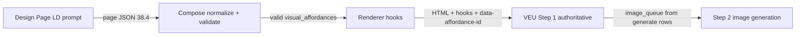

# Sprint 38 — Pedagogical visual affordance architecture

**Status:** **COMPLETE** — validated end-to-end (Design Page → Compose → Renderer → VEU v1.2.1 → Image Generation)  
**Schema version:** `38.4`  
**Test floor:** **697 pass / 0 fail** (`node --test tests/*.test.js`)

---

## Outcome

Visual generation is driven by **pedagogical intent** (authored affordance records), not by **placement opportunities** (hooks alone). Sprint 36 placement remains the spatial contract; Sprint 38 supplies semantic authority.

---

## Pipeline



| Stage | Responsibility | Key artefact |
|-------|----------------|--------------|
| **Design Page** | Author `activities_visual_review[]`, `visual_affordances[]`, schema `38.4` | `domains/learning-design/domain-learning-design-step-patterns.md` §13; runtime blocks in `app.js` |
| **Compose** | Strict validation; drop invalid rows; preserve root keys | `lib/sprint38-visual-affordances.js` → `applyToComposedPage` via `applyPedagogicCognitionSemanticsToComposedPage` |
| **Renderer** | Emit hooks only for `visual_decision: generate` + matching `visual_slot` | `utilityMaybeRenderVisualAffordanceHook`, `buildVisualAffordanceRenderPlan` |
| **VEU v1.2.1** | Authoritative / hybrid / legacy handover | `utilities/visual-enhancement-utility/visual-enhancement-utility-v1.2.1.json` |
| **Images** | Queue prompts from Sprint 38 fields, not topic inference | Step 2 `step_generate_image` |

---

## Page root schema (38.4)

```json
{
  "visual_affordance_schema_version": "38.4",
  "activities_visual_review": [],
  "visual_affordances": []
}
```

All three keys are **mandatory** on compose output (empty arrays valid).

---

## Visual decisions

| `visual_decision` | Meaning | Renderer | VEU |
|-------------------|---------|----------|-----|
| **generate** | Authorised figure with full 38-4 field set | Hook when `activity_id` + `visual_slot` match | Figure + `image_queue` entry |
| **defer** | Pedagogically postponed | No hook | `deferred_affordances[]` |
| **reject** | Intentional no-visual | No hook | `rejected_affordances[]` |

Envelope (all rows): `affordance_id`, `activity_id`, `visual_decision`, `rationale`.

---

## Activity-level gate

`activities_visual_review[]` — one row per upstream `activity_id`:

```json
{
  "activity_id": "A3",
  "activity_visual_value": {
    "decision": "high",
    "rationale": "..."
  }
}
```

`decision`: `high` | `medium` | `low` | `none`. When `none`, no `generate` for that activity.

---

## Generate contract (summary)

Required for validation (see `lib/sprint38-visual-affordances.js`):

- Purpose allow-list (38-2): `distinction`, `comparison`, `classification`, `mechanism`, `evidence_structure`, `data_pattern_reading`
- Representation allow-list (38-3): seven tokens
- `representation_avoid[]`: allow-listed tokens (≥1)
- `visual_slot`: Sprint 36 slot enum (required on generate)
- Fidelity: `must_show`, `must_not_show`, `allowed_claims`, `disallowed_claims`, `source_basis`, `anti_spoiler`, `requires_exact_data_match`, etc.

**Recommended (38-6):** `pedagogical_added_value` — incremental cognitive support vs materials (not enforced by validator to preserve strictness floor).

---

## Pedagogical added value (38-6)

`preferred_representation` names **layout family only**. Per-token `must_add` / `must_not_duplicate` guidance prevents representation-correct but pedagogically empty figures (e.g. blank worksheet duplicate for `classification_matrix`).

| Module | Path |
|--------|------|
| Catalog | `lib/sprint38-representation-pedagogical-value.js` |
| Design | `observations/38-6-pedagogical-added-value-contract.md` |
| Representation tables | `observations/38-3-representation-guidance.md` §1 |
| LD prompt | `buildSprint38PedagogicalAddedValuePromptLines()` in `app.js` |

---

## Renderer handover modes

| Mode | Condition | Hook behaviour |
|------|-----------|----------------|
| **Legacy** | No / empty `visual_affordances[]` | Sprint 36 warrant heuristics unchanged |
| **Authoritative** | Full 38.4 handover + valid records | Only `generate` + slot match |
| **Hybrid** | Partial handover | JSON wins on match; legacy for unmatched (38-5) |

Detection: `detectVisualAffordanceHandoverMode(page)` in `lib/sprint38-visual-affordances.js`.

Passthrough on figures/hooks: `data-affordance-id`, `data-activity-id`, `data-visual-slot`, `data-visual-activity-id`.

---

## VEU v1.2.1 authoritative consumption

- **Legacy:** v1.2 inference unchanged when JSON absent
- **Authoritative:** HTML = slots only; JSON controls generate / defer / reject
- **Prompt:** `scripts/build-veu-v121-json.js` → `visual-enhancement-utility-v1.2.1.json`
- **38-6 block:** Generate pedagogical support, not structure-only shells

Frozen reference: `visual-enhancement-utility-v1.2.json` (byte-stable).

---

## Validation and QA

| Layer | Behaviour |
|-------|-----------|
| **Runtime compose** | Invalid affordance rows dropped; `generation_notes.limitations` + `visual_affordance_validation` trace |
| **Human-designer QA** | Draw figure from record; explain cognitive support beyond materials (38-4, 38-6) |
| **Generic QA** | No duplicate worksheet/table/answer structure; no topic poster / generic infographic |

---

## Code map

| Concern | Primary path |
|---------|----------------|
| Validation + compose | `lib/sprint38-visual-affordances.js` |
| Pedagogical value catalog | `lib/sprint38-representation-pedagogical-value.js` |
| Compose integration | `app.js` — `applyPedagogicCognitionSemanticsToComposedPage` |
| Design Page prompts | `domain-learning-design-step-patterns.md` §13 + `applySprint38VisualAffordanceContractToDraft` |
| Renderer gating | `app.js` — `utilityMaybeRenderVisualAffordanceHook` |
| Browser load | `index.html` — sprint38 scripts before `app.js` |

---

## Tests

| File | Coverage |
|------|----------|
| `tests/sprint-38-visual-affordances.test.js` | Schema, validation, compose, Design Page prompts |
| `tests/sprint-38-renderer-visual-affordances.test.js` | Legacy vs authoritative hooks |
| `tests/sprint-38-veu-v121.test.js` | VEU prompt patch, handover modes |
| `tests/sprint-38-pedagogical-added-value.test.js` | 38-6 catalog and guidance |
| `tests/utility-visual-affordance-hooks.test.js` | Sprint 36 placement regression |

Fixtures: `tests/fixtures/sprint-38/affordance-records.json`, page-render inflation/climate/CI anchors.

---

## Observation index

| Slice | Document |
|-------|----------|
| 38-1 Audit | `observations/38-1-visual-affordance-audit.md` |
| 38-2 Purpose taxonomy | `observations/38-2-visual-purpose-taxonomy.md` |
| 38-3 Representation | `observations/38-3-representation-guidance.md` |
| 38-4 Schema | `observations/38-4-affordance-enrichment-design.md` |
| 38-5 VEU alignment | `observations/38-5-workflow-alignment.md` |
| 38-6 Added value | `observations/38-6-pedagogical-added-value-contract.md` |

Implementation slices: LD emission (compose), renderer (38-7), VEU patch (38-8) — see [NOTES.md](NOTES.md).

---

## Boundaries (unchanged)

No image model changes · No renderer placement/CSS redesign · No VEU workflow topology change · Legacy fallback preserved when handover absent.
