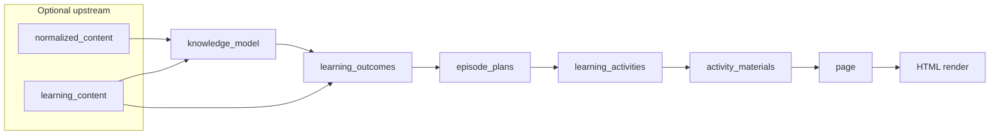

# Sprint 39 — Artefact Pathway Inventory

**Date:** 2026-06-09  
**Status:** **COMPLETE — documentation only (Workstream C)**  
**Type:** Current-state architecture inventory  
**Sprint:** [Sprint 39 — Architecture optimisation and prompt debt reduction](README.md)  
**Authority:** [38S-architecture-closure-note.md](../2026-06-06-sprint-38s-episode-plan-v1-implementation/phase-3/38S-architecture-closure-note.md) · [sprint-39-handover-pack.md](sprint-39-handover-pack.md) · [sprint-39-plan.md](sprint-39-plan.md)  
**Sources:** `domains/learning-design/domain-learning-design-step-patterns.md` · `domains/learning-design/domain-learning-design-artefacts.md`

---

## Purpose

This document records the **current-state** Prism learning-design artefact landscape after Sprint 38S architecture closure and Sprint 39 Workstreams A–B (GAM Wave B, Design Page hygiene). It is an **inventory only** — no redesign, removal, prioritisation, or roadmap commitments.

**Scope boundary:** Describes what exists and how steps relate. Does not propose changes to workflows, prompts, contracts, or ownership.

---

## 1. Primary learning-materials pathway

### Frozen chain (38S authority)

Sprint 38S closed with this pedagogical data-flow as the **authoritative learning-materials pipeline**:

```text
KM → LO → Episode Plan → DLA → GAM → Design Page → Render
```

Where:

| Abbrev | Canonical step | `canonical_step_id` | Output artefact |
|--------|----------------|---------------------|-----------------|
| **KM** | Model Knowledge | `step_model_knowledge` | `knowledge_model` |
| **LO** | Define Learning Outcomes | `step_define_learning_outcomes` | `learning_outcomes` |
| **Episode Plan** | Design Episode Plan | `step_design_episode_plan` | `episode_plans` |
| **DLA** | Design Learning Activities | `step_design_learning_activities` | `learning_activities` |
| **GAM** | Generate Activity Materials | `step_generate_activity_materials` | `activity_materials` (+ optional `session_materials`) |
| **Design Page** | Design Page | `step_design_page` | `page` |
| **Render** | *(downstream presentation)* | — | HTML (learner-facing page body) |

### Pathway diagram



### Stage-by-stage record

| Stage | Ownership (38S) | Primary artefact(s) | Typical inputs | Outputs | Purpose |
|-------|-----------------|----------------------|----------------|---------|---------|
| **Optional content prep** | Content normalisation / generation steps | `normalized_content`, `learning_content` | Raw source, topic brief | Clean or generated teaching content | Prepare source material for modelling or direct LO derivation |
| **KM** | Knowledge modelling step | `knowledge_model` | `normalized_content` and/or `learning_content` | Concepts, relationships, processes, misconceptions | Explicit conceptual structure faithful to source |
| **LO** | Outcomes definition step | `learning_outcomes` | `knowledge_model` (and optionally `learning_content`) | Observable, assessable outcome statements | Translate concepts into performance targets that drive downstream design |
| **Episode Plan** | **Plans only** — archetype + beat order | `episode_plans` | `learning_outcomes` | V1 container: `activity_id`, `episode_plan { archetype, beats[{ function }] }` | Authoritative instructional choreography **before** obligation population; must not author material types or bodies |
| **DLA** | **Populates only** — no replanning | `learning_activities` | `learning_outcomes`, `episode_plans` | Activities with `required_materials`, learner tasks, cognition fields | Map plan beats → obligation specifications; merge/tag via population contract; **must not** replan archetype or `function_sequence` |
| **GAM** | **Realises only** — GAM-PRES canonical | `activity_materials`, `session_materials` | `learning_activities` | Delivery-ready material bodies per `material_id` | Realise every `required_materials` entry as usable content; preserve order/membership; anti-collapse (GAM-PRES-07/08/09/10) |
| **Design Page** | **Compose/preserve only** | `page` | `learning_activities`, `activity_materials`, optional `learning_outcomes`, `learning_sequence`, `assessment_items`, `knowledge_model`, etc. | Profile-aware `page` JSON (`page_profile`: learner \| facilitator \| assessment) | Read-only assembly: sections, membership, merge GAM bodies verbatim; VA metadata at page root only |
| **Render** | **Renderer** (`app.js` + libs) | HTML transport | Composed `page` JSON | Learner-facing (or profile-selected) HTML | Presentation layer; does not replan, populate, realise, or compose pedagogy |

### Ownership validation (38S closure — unchanged)

| Step | Must | Must not |
|------|------|----------|
| Episode Plan | Select archetype; order instructional-function beats | Author material types, obligations, or bodies |
| DLA | Populate obligations from `episode_plans`; tag `instructional_function`, `plan_beat_index` | Replan beats, archetype, or session arc |
| GAM | Realise `required_materials` as `activity_materials` bodies | Redesign activities, replan beats, collapse obligations |
| Design Page | Compose sections; preserve upstream material bodies | Plan beats, populate obligations, author GAM bodies |
| Renderer | Render composed page structure and materials | Alter pedagogic ownership or artefact semantics |

### Supporting code contracts (primary path — reference only)

| Asset | Role |
|-------|------|
| `lib/episode-plan-v1-templates.js` | Deterministic derive from LO |
| `lib/episode-plan-v1-validation.js` | V1 taxonomy gate |
| `lib/episode-plan-population-contract.js` | Beat → obligation specs |
| `lib/episode-plan-dla-integration.js` | Merge, PF-11 upstream injection |
| `lib/gam-output-format.js` | Post-capture GAM validation |
| `lib/ld-design-page-compose-contract.js` | Page compose + L4 preserve embed |
| `lib/page-gam-materials-preserve.js` | Post-capture materials merge backstop |
| `lib/page-role-render-sequencing.js` | Renderer role/ordering (38S Phase A) |

### Sprint 39 optimisation context (facts only)

Workstreams A–B reduced prompt sediment on GAM and Design Page **without** changing the ownership model above:

- **GAM Wave B:** merged self-study runtime markers; removed duplicate PEL reasoning on GAM path ([39S-1-gam-wave-b-implementation.md](observations/39S-1-gam-wave-b-implementation.md)).
- **Design Page hygiene:** pack dedupe; compose contract precedes VA runtime block ([39S-2-design-page-hygiene.md](observations/39S-2-design-page-hygiene.md)).

---

## 2. Secondary artefact pathways

### Canonical workflow step catalogue

`workflowPolicy.canonicalSteps` in `domain-learning-design-step-patterns.md` registers **18** canonical learning-design steps (INV-1). Step pattern document sections use mixed numbering (§11 Episode Plan, §13 Design Page — no §12); workflow policy is the authoritative step list.

| # | Canonical step | Section | `outputName` / primary output | Typical workflow position |
|---|----------------|---------|------------------------------|---------------------------|
| 1 | Normalize Content | §1 | `normalized_content` | Upstream of KM (source-ingest workflows) |
| 2 | Generate Learning Content | §2 | `learning_content` | Upstream of KM or LO (content-first workflows) |
| 3 | Model Knowledge | §3 | `knowledge_model` | **Primary path** — after content prep |
| 4 | Define Learning Outcomes | §4 | `learning_outcomes` | **Primary path** — after KM |
| 5 | Design Episode Plan | §11 | `episode_plans` | **Primary path** — after LO |
| 6 | Design Learning Activities | §5 | `learning_activities` | **Primary path** — after Episode Plan |
| 7 | Generate Activity Materials | §6 | `activity_materials`, `session_materials` | **Primary path** — after DLA |
| 8 | Design Page | §13 | `page` | **Primary path** — terminal assembly for page delivery |
| 9 | Generate Slide Deck | §14 | `slide_deck` | Parallel / post-materials; often after `learning_sequence` |
| 10 | Generate VLE Structure | §15 | `vle_structure` | Parallel / post-materials; often after `learning_sequence` |
| 11 | Generate Learning Object Set | §16 | `learning_object_set` | Parallel / post-materials |
| 12 | Generate Assessment Items | §9 | `assessment_items` | Assessment branch — after blueprint or LO |
| 13 | Construct Learning Sequence | §10 | `learning_sequence` (+ optional `module_map`) | Workshop/session branch — after activities + materials |
| 14 | Design Assessment | §7 | `assessment_blueprint` | Assessment branch — early planning |
| 15 | Design Feedback | §8 | `feedback_pack` | After `assessment_items` |
| 16 | Validate Learning Design | §18 | `qa` | QA branch — evaluative only |
| 17 | Revise Assessment Based on QA | §19 | `revised_assessment_items` | After `qa` |
| 18 | Design Marking Rubric | §20 | `marking_rubric` | After assessment items + blueprint |

### Secondary pathway detail

| Pathway | Producer step(s) | Output artefact(s) | Relationship to primary path | Current status |
|---------|------------------|-------------------|------------------------------|----------------|
| **Content normalisation** | Normalize Content | `normalized_content` | Upstream optional input to KM | **Active** — source-ingest workflows |
| **Content generation** | Generate Learning Content | `learning_content` | Upstream to KM or LO; sparse-brief / topic-first paths | **Active** — alternate entry |
| **Assessment design** | Design Assessment | `assessment_blueprint` | Parallel planning; may feed Design Page `assessment_check` | **Present** — assessment workflows |
| **Assessment item generation** | Generate Assessment Items | `assessment_items` | Optional input to Design Page; independent MCQ pack | **Present** — triggered when `assessment_required` |
| **Feedback packs** | Design Feedback | `feedback_pack` | Optional Design Page input; QA evaluation input | **Present** — post-assessment branch |
| **Marking rubrics** | Design Marking Rubric | `marking_rubric` | Optional Design Page input; tutor-facing | **Present** — HE/assessment contexts |
| **Learning sequences** | Construct Learning Sequence | `learning_sequence` | Order/timing for Page, slides, VLE — **does not define activity membership** on Page | **Active** — workshop/session triggers |
| **Module maps** | Construct Learning Sequence *(module context)* | `module_map` (embedded in sequence output per pack guidance) | Multi-week HE planning; not default session path | **Present** — module/course triggers only |
| **Slide decks** | Generate Slide Deck | `slide_deck` | Presentation support alongside materials; does not replace GAM bodies | **Present** — workshop/slide brief triggers |
| **VLE structures** | Generate VLE Structure | `vle_structure` | Platform-neutral course shell; stable source for later export prompts | **Present** — VLE environment triggers |
| **Learning object sets** | Generate Learning Object Set | `learning_object_set` | Interactive LO source artefact (e.g. Xerte-style); not final package | **Present** — digital-object workflows |
| **QA / validation** | Validate Learning Design | `qa` | Evaluative only — no item generation | **Present** — assessment QA loops |
| **Assessment revision** | Revise Assessment Based on QA | `revised_assessment_items` | Revision driven by `qa`; feeds rubric step | **Present** — post-QA branch |
| **Visual affordance metadata** | Design Page (compose) + runtime Sprint 38 contract | `visual_affordances[]`, `activities_visual_review[]`, `visual_affordance_schema_version` on **`page` root** | Additive metadata **on composed page**; does not replace `activity.materials` | **Active** — schema 38.4; validation in `lib/sprint38-visual-affordances.js`; **not** an image-generation pipeline |
| **Session materials** | Generate Activity Materials | `session_materials` | Lightweight cross-activity support; distinct from `activity_materials` | **Active** — legacy-compatible session resources |

### Assessment → Page integration

When assessment steps run, Design Page may incorporate:

- `assessment_items` or `revised_assessment_items` → `assessment_check.content.items`
- `feedback_pack`, `marking_rubric`, `assessment_blueprint` → profile-dependent sections

Assessment pathways are **parallel** to the KM→GAM materials chain; they converge at Design Page assembly, not at GAM realisation.

### Workshop vs self-study branching

`workflowPolicy.triggerRules` and `workflowBriefConfig` resolve which steps appear. Typical patterns:

| Delivery context | Common step inclusion | Terminal artefact |
|------------------|----------------------|-------------------|
| **Self-directed learner page** | KM → LO → EP → DLA → GAM → Design Page | `page` (`page_profile: learner`) |
| **Facilitated workshop** | Above + Construct Learning Sequence; may add Slide Deck | `page` and/or `slide_deck`; sequence for timing |
| **Assessment-focused** | Design Assessment → Generate Assessment Items → (optional QA loop) → Design Page | `page` (`page_profile: assessment`) or items-only workflows |
| **Sparse source → page** | Model Knowledge → Design Page (excludes DLA/GAM per trigger) | `page` from content/KM only — **alternate shortcut, not primary materials path** |

### Research workflow note

Research-domain workflows (Sprint 14–15) append Design Page as a **terminal** step under `workflowPolicy` gates (`objective_type`, delivery cues). This is a **separate entry pattern** documented in research step tests; it shares the Design Page compose/render surface but may omit the full KM→GAM chain depending on brief resolution.

---

## 3. Render surfaces

Render behaviour is defined by artefact `renderHints` (where documented) and `app.js` utility renderers for composed pages.

| Render surface | Source artefact | `page_profile` / variant | Renderer / transport | Implementation status |
|--------------|-----------------|------------------------|----------------------|------------------------|
| **Learner page (HTML)** | `page` | `learner` | `rendererType: document`, `rendererVariant: page` → `app.js` page renderer | **Implemented** — primary production surface; 38S Phase A sequencing fixes |
| **Facilitator page (HTML)** | `page` | `facilitator` | Same page renderer; profile-selected sections | **Implemented** — run guidance / logistics emphasis in pack |
| **Assessment profile page (HTML)** | `page` | `assessment` | Same page renderer; preserves item schema | **Implemented** — structured items section |
| **Slide deck (HTML cards)** | `slide_deck` | — | `rendererType: slides`, `rendererVariant: slide_deck` | **Partial** — render hints defined; slide HTML transport available; not primary chase surface |
| **VLE structure** | `vle_structure` | — | Conceptual JSON → future platform transform prompts | **Source artefact only** — no Moodle/SCORM export in-step |
| **Learning object set** | `learning_object_set` | — | Stable JSON for interactive LO tooling | **Source artefact only** — not final Xerte/SCORM package |
| **Assessment items (standalone)** | `assessment_items` / `revised_assessment_items` | — | Often consumed via Page `assessment_check` or external use | **Artefact complete** — standalone render not primary |
| **Activity materials (standalone)** | `activity_materials` | — | Workshop handouts; may bypass Page in facilitator workflows | **Artefact complete** — GAM output; Page merge is fidelity path |
| **Visual affordance hooks (HTML)** | `page.visual_affordances[]` | Metadata on `page` | Renderer passthrough / hook placement (`lib/sprint38-visual-affordances.js`, renderer tests) | **Metadata + hook transport implemented** — figure **generation** not in scope |
| **Marking rubric / feedback** | `marking_rubric`, `feedback_pack` | Often embedded in assessment-profile Page | Via Page sections when included | **Composable** — depends on workflow inclusion |

### Page render pipeline (conceptual)

```text
page JSON  →  compose validation / VA apply  →  utility markdown/table render  →  HTML
                     ↑
        page-gam-materials-preserve (post-capture backstop, when synced)
```

Renderer owns **presentation** only. Material fidelity authority remains with Design Page compose + L4 contracts (38S closure).

---

## 4. Strategic position

### Platform capability

Prism's learning-design domain supports **multiple artefact types** across a composable step catalogue (18 canonical steps, 20+ artefact kinds in `domain-learning-design-artefacts.md`). Workflows are assembled from steps via `workflowPolicy` dependencies, precedence rules, and brief-resolution triggers — not a single fixed pipeline.

### Current development priority (documented fact — not a roadmap)

Following Sprint 38S closure and Sprint 39 optimisation, engineering proof and harness investment concentrate on:

1. **High-quality self-study learning materials** — self-directed briefs, learner `page_profile`, obligation population → GAM realisation → verbatim Page compose (Inflation / EV-38S proof replay).
2. **High-quality workshop learning materials** — facilitated delivery, `learning_sequence`, slide-deck adjacency, facilitator-facing surfaces where brief resolves workshop context.

### Explicitly not current roadmap priorities

The following remain **valid platform capabilities** but are **not** the active proof or optimisation focus after 38S/39 (see [sprint-39-deferred-items.md](sprint-39-deferred-items.md)):

- Standalone VLE export / Moodle package generation
- Learning object package export (Xerte/SCORM)
- Full slide-deck renderer productisation
- Assessment QA loop automation as primary delivery path
- Visual affordance **image** generation pipeline
- Educational quality programme (North Star depth beyond contract floors)
- Module-map-first course design as default chase scenario

**This inventory does not recommend removing, deprioritising, or elevating any pathway** — it records what exists.

---

## 5. Historical context

### Two lenses on the same platform

| Lens | Description |
|------|-------------|
| **Primary current pathway** | The frozen 38S chain: KM → LO → Episode Plan → DLA → GAM → Design Page → Render. This is the **authoritative ownership model** for learning-material fidelity and the EV-38S production chase. |
| **Broader platform capability** | The full step catalogue (assessment, sequence, slides, VLE, LO sets, QA, rubrics, content shortcuts, research terminals). Steps are **composable** via workflow policy; many workflows use subsets or parallel branches. |

### Architecture timeline (reference)

| Milestone | Effect on inventory |
|-----------|---------------------|
| **Sprint 38S** | Episode Plan V1 first-class; DLA population-only; GAM-PRES; Page compose/render split frozen; harness `EV-38S-AFTER-4` |
| **Sprint 39 WS-A** | GAM runtime dedupe — ownership unchanged |
| **Sprint 39 WS-B** | Design Page pack/runtime hygiene — compose authority clarified — ownership unchanged |
| **Sprint 39 WS-C** | This document |

### Distinction without redesign

- **Frozen ownership** (Episode Plan / DLA / GAM / Page) applies to the **primary materials pathway** regardless of which optional steps a workflow includes.
- **Secondary pathways** may skip or reorder upstream steps (e.g. sparse source → Page) but do not override 38S ownership when the full chain is present.
- Deferred items ([sprint-39-deferred-items.md](sprint-39-deferred-items.md)) catalogue future **optimisation and quality** work — not inventory gaps to be closed in Sprint 39.

---

## 6. Artefact relationship summary

| Artefact | Produced by | Consumed by (typical) | Role class |
|----------|-------------|----------------------|------------|
| `knowledge_model` | Model Knowledge | Define LO, Design Page (optional) | Upstream structure |
| `learning_outcomes` | Define LO | Episode Plan, DLA, assessment steps, Design Page | Intent anchor |
| `episode_plans` | Design Episode Plan | DLA (authoritative beats) | Planning |
| `learning_activities` | DLA | GAM, Design Page, sequence, slides, VLE, LO set | Obligation specs |
| `activity_materials` | GAM | Design Page, sequence, slides, VLE, LO set | Realised bodies |
| `page` | Design Page | Renderer | Composed delivery surface |
| `learning_sequence` | Construct Learning Sequence | Design Page, slides, VLE, LO set | Order/timing only |
| `assessment_blueprint` | Design Assessment | Generate Assessment Items, rubric, QA | Assessment planning |
| `assessment_items` | Generate Assessment Items | Design Page, Feedback, QA, rubric | Assessment content |
| `slide_deck` | Generate Slide Deck | Slide render hints | Presentation support |
| `vle_structure` | Generate VLE Structure | Future export transforms | Organisation shell |
| `learning_object_set` | Generate Learning Object Set | Interactive LO tooling | Digital object source |
| `qa` | Validate Learning Design | Revise Assessment | Evaluation |
| `visual_affordances[]` *(on page)* | Design Page compose | Renderer hooks | Additive metadata |

---

## 7. Inventory validation checklist

| Check | Result |
|-------|:------:|
| Primary pathway matches 38S closure note | ✓ |
| Episode Plan ownership: plans beats only | ✓ — unchanged |
| DLA ownership: populates only | ✓ — unchanged |
| GAM ownership: realises only | ✓ — unchanged |
| Page ownership: compose/preserve; renderer presents | ✓ — unchanged |
| Step list cross-checked against `workflowPolicy.canonicalSteps` | ✓ — 18 steps |
| Secondary pathways marked as platform capability, not roadmap priority | ✓ |
| No code, prompt, or contract modifications in Workstream C | ✓ |

---

## 8. Related documents

| Document | Role |
|----------|------|
| [38S-architecture-closure-note.md](../2026-06-06-sprint-38s-episode-plan-v1-implementation/phase-3/38S-architecture-closure-note.md) | Ownership authority |
| [domain-learning-design-step-patterns.md](../../../domains/learning-design/domain-learning-design-step-patterns.md) | Step definitions + workflowPolicy |
| [domain-learning-design-artefacts.md](../../../domains/learning-design/domain-learning-design-artefacts.md) | Artefact schemas + render hints |
| [sprint-39-deferred-items.md](sprint-39-deferred-items.md) | Deferred optimisation and quality items |
| [39S-1-gam-wave-b-implementation.md](observations/39S-1-gam-wave-b-implementation.md) | GAM runtime state post-WS-A |
| [39S-2-design-page-hygiene.md](observations/39S-2-design-page-hygiene.md) | Design Page state post-WS-B |
| [EV-39S-DESIGN-PAGE-BASELINE.json](artefacts/EV-39S-DESIGN-PAGE-BASELINE.json) | Pre-hygiene metrics |
| [EV-39S-DESIGN-PAGE-HYGIENE-metrics.json](artefacts/EV-39S-DESIGN-PAGE-HYGIENE-metrics.json) | Post-hygiene metrics |

---

## Workstream C completion

| Criterion | Met? |
|-----------|:----:|
| `sprint-39-artefact-pathway-inventory.md` published | ✓ |
| INV-1–INV-8 sections present | ✓ |
| Primary pathway documented with ownership | ✓ |
| Secondary pathways documented | ✓ |
| Render surfaces documented | ✓ |
| Strategic position documented | ✓ |
| Historical context captured | ✓ |
| No code / prompt / contract changes | ✓ |

**Workstream C — CLOSED.**
