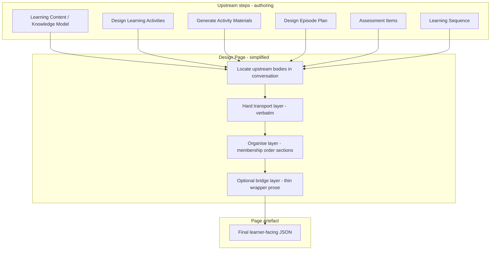

# Design Page Architecture Audit

**Purpose:**  
This document captures the architectural review conducted after repeated Design Page fidelity failures involving summarisation, metadata substitution, placeholder substitution, material omission, and page-composition conflicts.

**Status:**  
Accepted working diagnosis for future Design Page simplification work.

---

## Executive summary

**Key conclusion:**  
Design Page currently combines transport, assembly, authoring, pedagogical framing, visual-affordance specification, and workflow concerns within a single step.

The recommended future direction is to treat Design Page primarily as a transport-and-organisation layer whose core responsibility is:

> "Produce the final learner-facing page by preserving and organising upstream learner content."

---

# Design Page architectural audit

Design Page (`step_design_page`, §13) is typed **Assembly** and positioned as the workflow’s terminal delivery step. In practice it is doing at least five jobs at once: **payload transport**, **page schema assembly**, **wrapper narrative authoring**, **renderer metadata specification**, and **cross-cutting quality enforcement**. The recent materials-fidelity patches correctly identify the failure mode, but they sit on top of an architecture that still invites condensation elsewhere.

This audit maps every responsibility found in the pack (`domain-learning-design-step-patterns.md` §13), `LD-DESIGN-PAGE-COMPOSE-CONTRACT`, embedded L4 modules, learner-page wrapper modules, Sprint 38 visual affordances, EQF, and `app.js` runtime augmentation.

---

## 1. Responsibility inventory and classification

Legend: **E** = Essential for learner-facing page · **O** = Useful but optional · **B** = Better handled elsewhere · **C** = Conflicts with learner-content preservation

### A. Page assembly (schema, sections, profile)

| Responsibility | Where defined | Classification | Notes |
|---|---|---|---|
| Emit `artifact_type=page` JSON with canonical `sections[]` | §13 `promptTemplate`, `defaultOutputStructure` | **E** | Core deliverable shape |
| Section ordering: overview → purpose → knowledge → activities → assessment → support | §13 `promptTemplate` | **E** | Organisation, not re-authoring |
| `page_profile` (learner / facilitator / assessment) | §13 `userOptions` | **O** | Learner profile is **E** for self-study workflows; others are variants |
| Meaningful headings; no schema-style labels in learner text | §13 | **E** | Presentation quality |
| `title`, `audience`, `source_artefacts`, `constraints_applied`, `generation_notes` | §13 output contract | **O** / **E** | Provenance is useful; `generation_notes` is **C** when used to excuse material loss |
| Workflow constraint preservation (component types, quantities, exclusions) | §13, compose membership | **E** | Must not drop bound components |
| Strict JSON output | §13 `preferredOutputFormat`, `app.js` | **E** | Mechanical |
| Math notation preservation (`LD-MATH-RENDER`) | §13, compose references | **E** | Transport fidelity for STEM content |
| Step params: `tone_style`, `depth_level`, `output_density`, `include_examples`, etc. | Domain brief mappings | **C** | Brevity/density knobs compete with “preserve full bodies” |
| Intent-class refinement elicitation (`design_page`) | Domain `intentClasses` | **B** | Brief design, not page compose |

**Conflict pattern:** “Readable, profile-aware page” plus `output_density` implicitly licenses shortening even when L4 says otherwise. The model must reconcile contradictory signals.

---

### B. Upstream consumption and context access

| Responsibility | Where defined | Classification | Notes |
|---|---|---|---|
| Consume prior `STEP N OUTPUT:` bodies from Copilot conversation | Compose `UPSTREAM_CONSUMPTION`, `app.js` upstream section | **E** | Primary transfer path in Copilot workflows |
| Context access rule: chat history is context; search before claiming unavailability | Compose `CONTEXT_ACCESS_RULE_LINES` | **E** | Fixes false “not attached” failures |
| Do not reconstruct from brief / `required_materials` alone | Compose, §13, L4 | **E** | Anti-specification |
| Per-binding consumption notes (GAM, DLA, episode_plans, etc.) | `app.js` `buildDesignPageUpstreamArtefactsConversationalPromptSection` | **E** | Routing hints |
| Read-only compose: no replan, respecify, summarise away upstream | Compose upstream tail | **E** | Correct north star |

---

### C. Activity material transport (GAM → `activity.materials.*`)

| Responsibility | Where defined | Classification | Notes |
|---|---|---|---|
| Merge every GAM `Material:` block per activity | L4 preserve, compose | **E** | Core payload |
| Opaque payload transport (Content: only) | `OPAQUE_PAYLOAD_LINES` | **E** | |
| Authoritative GAM content binding | `GAM_CONTENT_BINDING_LINES` | **E** | |
| Multi-material enumeration invariant | `MULTI_MATERIAL_ENUMERATION_LINES` | **E** | |
| Full content body preservation | `FULL_CONTENT_BODY_PRESERVATION_LINES` | **E** | |
| Material preservation overrides page optimisation | `MATERIAL_PRESERVATION_OVERRIDES_PAGE_OPTIMISATION_LINES` | **E** | |
| Page artefact is final learner output (no references) | `PAGE_ARTEFACT_FINAL_LEARNER_OUTPUT_LINES` | **E** | |
| Authorable vs archival split (materials = archival) | L4 + compose `FIELD_AUTHORIZING` | **E** | Architecturally correct |
| Table fidelity preserve role | `LD-TABLE-FIDELITY` via compose embed | **E** | Tables are high-loss surfaces |
| Post-capture validation / repair | `design-page-materials-fidelity.js`, `app.js` repair | **O** | Runtime safety net, not primary path in Copilot |

**Verdict:** This cluster is the **clearest expression of what Design Page should be**. It is essential and well-aligned with the proposed primary responsibility.

---

### D. Learning activity transport (DLA → activity rows)

| Responsibility | Where defined | Classification | Notes |
|---|---|---|---|
| Activity membership: every upstream `activity_id` unless authorised omission | Compose `MEMBERSHIP_LINES` | **E** | Journey integrity |
| Verbatim copy of 15+ cognition/scaffold fields | Compose `FIELD_PRESERVATION_LINES` | **E** | Learner-facing task framing |
| `learner_task`, `expected_output`, `support_note(s)` verbatim | Compose | **E** | |
| Anti-compression of scaffolds to labels/arrows | Compose, guided scaffold `COMPOSE_LINES` | **E** | |
| `learning_sequence` for order/timing only | §13, compose | **E** | Organisation, not replanning |
| Sequencing/ranking metadata (`ordering.*`, `render_hints.*`) | Domain pack semantics | **O** | Renderer policy |
| `activities_omitted[]` with authority | §13 output, compose | **O** / **C** | Legitimate for user-requested subset; **C** when used for size |
| Post-capture activity closure repair | `app.js`, closure tests | **O** | PRISM-run safety net |

**Conflict pattern:** Membership allows omission with authority; size pressure makes this a leak path for “manage page length by dropping activities.”

---

### E. Journey assimilation (`LD-JOURNEY-ASSIMILATION`)

| Responsibility | Where defined | Classification | Notes |
|---|---|---|---|
| Assimilate upstream signals into wrapper prose | `ld-journey-assimilation.js` | **O** | Valuable for salience, not for payload |
| Express Question → Investigation → Evidence → Judgement arc | Journey core | **O** | Editorial framing |
| Overview / learning_purpose authoring | `OVERVIEW_PURPOSE_LINES` | **O** | |
| **Knowledge summary** from KM/LC | `KNOWLEDGE_SUMMARY_LINES` | **C** | Re-authors upstream content as preview; risks second summarisation layer |
| Wrapper transitions from `learning_sequence` | `TRANSITION_LINES` | **O** | |
| Study tips / closure synthesis | `CLOSURE_LINES` | **O** / **C** | Synthesis is allowed in wrapper, but can paraphrase GAM closure instead of transporting it |
| Reference GAM materials in study_tips while copying bodies in L4 | `UPSTREAM_SIGNAL_LINES` | **C** | Dual treatment of same content encourages “mention in wrapper, shorten in materials” |

Applied only on learner-page profiles via `app.js` gating.

---

### F. Authorial exposition (`LD-AUTHORIAL-EXPOSITION`)

| Responsibility | Where defined | Classification | Notes |
|---|---|---|---|
| Compose coherent authored experience on wrapper sections | `ld-authorial-exposition.js` | **O** | Sprint 42 quality goal |
| Rhetorical role separation (overview vs purpose vs summary vs tips) | `ROLE_SEPARATION_LINES` | **O** | |
| Transition quality across page arc | `TRANSITION_LINES` | **O** | |
| Preservation boundary (does not touch materials/activity rows) | `PRESERVATION_BOUNDARY_LINES` | **E** | Critical guardrail |
| Anti-redundancy editing | `ANTI_REDUNDANCY_LINES` | **O** | Editorial |
| Voice variants (self-study vs workshop handout) | Voice lines | **O** | |

**Conflict pattern:** “Compose a coherent experience” and “Explanation before task” can push the model to **rewrite or front-load** content that already exists in DLA/GAM, especially when wrapper fields are empty or thin upstream.

---

### G. Self-directed rhetoric (`LD-SELF-DIRECTED-RHETORIC`, `design_page` role)

| Responsibility | Where defined | Classification | Notes |
|---|---|---|---|
| Shape overview/purpose/knowledge_summary/study_tips from journey substance | `app.js` role rider | **O** / **C** | Third wrapper layer overlapping journey + authorial |
| Preservation boundary: L4 overrides rhetoric | Shared lines | **E** | Good guardrail |
| Wrapper rhetoric substance (progression vocabulary, epistemic closure) | `WRAPPER_RHETORIC_LINES` | **O** / **C** | More composition surface area |

**Verdict:** Functionally duplicates journey assimilation + authorial exposition. Three modules telling the model how to write wrapper prose increases abstraction pressure.

---

### H. Guided learning scaffold (compose slice)

| Responsibility | Where defined | Classification | Notes |
|---|---|---|---|
| Compose preservation: no scaffold compression | `COMPOSE_LINES` | **E** | Aligns with DLA transport |
| Transition rules (duplicate of journey assimilation) | `TRANSITION_LINES` in scaffold | **B** | Already in journey assimilation |
| Full DLA pre-emit gates (word ranges, mandatory fields) | DLA-only lines in same module | **B** on Design Page | Authoring gates belong on DLA step, not page compose |

---

### I. Visual affordances (Sprint 38)

| Responsibility | Where defined | Classification | Notes |
|---|---|---|---|
| Emit `visual_affordances[]`, `activities_visual_review[]`, schema 38.4 | `app.js` Sprint 38 block, §13 output keys | **O** | Renderer metadata |
| Per-activity `visual_decision` generate/defer/reject with large enum schema | Sprint 38 prompt block | **B** / **C** | Heavy **specification-writing** during page compose |
| `source_basis` citing upstream paths | Sprint 38 examples | **C** | Can satisfy “I referenced the material” without embedding body |
| Pedagogical added-value contract | Sprint 38 + added-value lines | **O** | Good intent; still competes for tokens/attention |
| Post-capture validation/normalization | `sprint38-visual-affordances.js` | **B** | Runtime concern |

**Verdict:** Largest non-transport responsibility on Design Page. It turns the step into a **renderer instruction generator**, not a learner-content preserver. Explicitly marked additive, but in practice competes with full GAM paste.

---

### J. Episode plan transport

| Responsibility | Where defined | Classification | Notes |
|---|---|---|---|
| Portable `episode_plans[]` on page when upstream exists | Compose `EPISODE_PLAN_LINES` | **O** | Useful for self-describing pages |
| Per-activity `episode_plan` attachment | Compose | **O** | |
| Copy beats verbatim; no replan | Compose | **E** (as transport) | |
| Structural metadata only — not in section prose | Compose | **E** | |
| Auto-bind `episode_plans` input when DEP exists | `app.js` | **O** | Wiring |

**Verdict:** **Transport is appropriate**; **design** belongs on Design Episode Plan. Current rules are mostly correct; risk is low if treated as verbatim copy.

---

### K. Assessment transport

| Responsibility | Where defined | Classification | Notes |
|---|---|---|---|
| `assessment_check.content.items[]` when `assessment_items` bound | §13, compose membership | **E** | Learner-facing when profile requires it |
| MCQ stems/options; respect include_answers / marking / feedback options | §13 `userOptions` | **E** / **O** | Visibility toggles are optional |
| Assessment `page_profile` preserves structured schema | §13 | **O** | Specialised deliverable |
| Runtime param patching for assessment presentation | `app.js` | **O** | Wiring |

**Conflict pattern:** Low for materials, but assessment profile can bias the step toward **items-only pages** with thinner activity payloads.

---

### L. Knowledge summaries

| Responsibility | Where defined | Classification | Notes |
|---|---|---|---|
| Include `knowledge_summary` section when LC/KM bound | §13 `promptTemplate` | **O** | Section slot |
| **Author** orienting summary from KM/LC captures | Journey assimilation `KNOWLEDGE_SUMMARY_LINES` | **C** | Not transport — new prose derived from upstream |
| “Preview concepts; avoid glossary dump” | Authorial exposition | **O** / **C** | Editorial constraint on a summarisation task |
| “Do not restate full activity materials” | Journey | **E** as guardrail | Acknowledges duplication risk |

**Verdict:** Knowledge summary on Design Page is the **clearest structural conflict**: upstream already has `learning_content` / `knowledge_model`. Design Page re-synthesises rather than embeds.

---

### M. Cross-cutting / orchestration

| Responsibility | Where defined | Classification | Notes |
|---|---|---|---|
| `LD-DESIGN-PAGE-COMPOSE-CONTRACT` orchestration | Compose core | **E** | SSOT for compose rules |
| Educational Quality Framework block | `app.js` bootstrap | **B** | Design principles for DLA/GAM/LC, not page assembly |
| Runtime augmentation ordering (compose → VA) | `app.js`, tests | **E** as plumbing | Order matters: VA after L4 helps, but VA still adds load |
| Material closure validation on PRISM run | `app.js` | **O** | Copilot path bypasses |
| Learner vs facilitator gating of wrapper modules | `app.js` `shouldApplyLearnerPagePedagogicFramingScaffold` | **O** | Sensible |

---

## 2. Responsibilities that encourage summarisation, abstraction, or omission

These are the highest-risk instructions **even when materials rules say “don’t”**:

| Mechanism | How it encourages loss | Severity |
|---|---|---|
| **Triple wrapper stack** (journey + authorial + rhetoric) | Large composed surface in overview/purpose/summary/tips; model optimises globally for “coherent page” | High |
| **Knowledge summary authoring** from KM/LC | Explicit second-layer summarisation of upstream learner content | High |
| **`output_density` / `depth_level` step params** | Direct brevity preference | High |
| **Visual affordance specification** | Token budget + `source_basis` path citations substitute for embedded bodies | High |
| **“Readable page assembly”** (without strict scope) | Historically blurred wrapper vs materials | Medium (partially fixed by archival split) |
| **Study tips / closure synthesis** | Paraphrase GAM consolidation/transfer instead of transporting | Medium |
| **`activities_omitted[]` for size** | Explicit activity drop valve | Medium |
| **`generation_notes.limitations`** | Excuse non-compliance (now partially forbidden) | Medium |
| **EQF “cognitive over interface activity”** | Abstract design pressure unrelated to verbatim transport | Low–medium |
| **Assessment-only profile emphasis** | Page may under-weight activity materials | Low–medium |
| **Episode plans as “renderer metadata”** | Low direct risk; indirect if beats leak into section prose | Low |

---

## 3. What Design Page **should** be

### Primary responsibility (proposed)

> **Produce the final learner-facing page by preserving and organising upstream learner content.**

Concretely, Design Page should be a **read-only transport and layout step**:

1. **Locate** upstream artefacts in conversation history (or PRISM captures when run in-app).
2. **Embed** full learner payloads into the page JSON.
3. **Order** activities and sections.
4. **Optionally bridge** with thin connective wrapper prose that does not duplicate or replace payloads.

It should **not** be:

- a GAM recovery or regeneration step
- a knowledge re-modelling step
- a visual design specification step
- a pedagogy replanning step
- a renderer contract completion step

---

## 4. Proposed simplified architecture

### Layer 1 — Hard transport (non-negotiable, fail before emit)

| Payload | Source | Destination |
|---|---|---|
| Material bodies | GAM `Content:` | `learning_activities.content[].materials.*` |
| Activity scaffolds | DLA | Same row fields (preamble, tasks, cognition fields) |
| Assessment items | `assessment_items` | `assessment_check.content.items[]` |
| Episode choreography | `episode_plans` | `episode_plans[]` + per-row `episode_plan` (verbatim) |
| Sequence timing | `learning_sequence` | Order/timing metadata only |

**Single invariant:** if it is learner-facing and exists upstream, it must appear **in full** inside the page artefact.

### Layer 2 — Organise (essential, non-authoring)

- Activity membership closure
- Section shell: `sections[]` with canonical ids and headings
- `page_profile`, `title`, `audience`
- `source_artefacts` provenance
- No content transformation

### Layer 3 — Bridge (optional, strictly bounded)

Allowed only in: `overview`, `learning_purpose`, `study_tips`, section framing.

Rules:

- Max one thin module (merge journey + authorial + rhetoric into a single “page bridge” contract, or demote to zero for v1 simplification)
- Must not introduce concepts absent from upstream
- Must not preview or replace KM/LC/GAM bodies
- **No `knowledge_summary` re-authoring** — either transport an upstream summary field verbatim or omit the section

### Demoted / relocated

| Current responsibility | Proposed home |
|---|---|
| Visual affordance authoring (generate/defer/reject records) | Dedicated post-page step, or renderer inference from materials |
| EQF principles | DLA, GAM, LC steps only |
| Knowledge summary synthesis | LC/KM step output section, transported verbatim |
| DLA scaffold pre-emit gates | DLA step only |
| Pedagogical added-value reasoning | VA step or renderer |
| Brief refinement (`tone`, `density`) | Workflow brief / upstream steps; remove from page compose |

---

## 5. Area-by-area recommendation

| Area | Keep on Design Page? | Simplified role |
|---|---|---|
| **Page assembly** | Yes | Schema + section ordering only |
| **Journey assimilation** | Thin optional bridge only | One module, wrapper-only, no KM re-summary |
| **Visual affordances** | No (default) | Optional separate metadata pass; never on critical path for materials |
| **Episode plan transport** | Yes | Verbatim portable copy; no replan |
| **Assessment transport** | Yes | Verbatim items; visibility flags only |
| **Knowledge summaries** | Transport only, or drop | Do not author from KM/LC at page step |
| **Learning activity transport** | Yes | Full row preservation |
| **Activity material transport** | Yes — **core job** | Entire GAM `Content:` bodies embedded |

---

## 6. Architectural tension summary

Design Page currently reads as:

> “Transport everything verbatim **and also** write an excellent educational narrative **and also** specify visual pedagogy **and also** satisfy brevity/profile knobs.”

The materials-fidelity patches correctly assert L4 precedence, but the step still carries **multiple authoring mandates** that pull the model toward global page optimisation — exactly the failure mode you have been fixing (condensed materials, reference placeholders, `generation_notes` excuses).

A simplified Design Page should be judged on one question only:

**Can a learner complete the journey using only this JSON, with no dereferencing and no upstream recovery?**

Everything that does not serve that question is optional at best, and at worst conflicts with preservation.

---

## 7. Suggested simplification sequence (architecture only — no prompts yet)

1. **Freeze a transport-only core** — materials, activity rows, assessment, episode plans, membership.
2. **Collapse wrapper modules** — journey + authorial + rhetoric → one bounded bridge or none.
3. **Remove knowledge_summary authoring** — transport or omit.
4. **Move visual affordances off the critical path** — separate step or renderer.
5. **Remove brevity step params from Design Page** — `output_density`, `depth_level` should not apply at compose.
6. **Treat EQF as upstream-only** on Design Page.
7. **Keep context access + final-output invariants** as part of the transport core.

I have not proposed prompt edits, per your instruction. If you want a next step, I can turn this into a concrete responsibility matrix (keep / merge / relocate / delete) mapped file-by-file before any wording changes.
