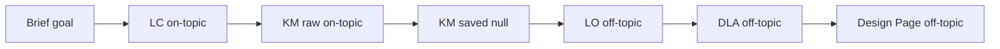

# Slice 42-4A — Live Run Topic Fidelity Investigation

**Date:** 2026-06-11  
**Scope:** Marx self-study and Inflation workshop (clean second live run)  
**Artefact base:** `captures/sprint-42-exposition/42-4-live-runs/*-2026-06-11T16-23-03` (Marx), `*-2026-06-11T16-25-08` (Inflation)  
**Constraint:** No exposition prompt changes in this slice — harness / upstream injection only.

---

## Executive verdict

| Question | Answer |
| -------- | ------ |
| **Where does topic drift begin?** | **Define Learning Outcomes (LO)** — first persisted step with wrong domain. LC is on-brief; `knowledge-model.json` is **`null`** despite valid raw KM text; LO then invents generic outcomes; DLA and Design Page faithfully follow those LOs. |
| **Does drift begin at DLA or Design Page?** | **Neither originates drift.** DLA is the first step with wrong *activity titles*; LO is the first wrong *domain statements*. Design Page mirrors DLA (plus compose duplication). |
| **Are LC/KM/LO correctly injected into DLA?** | **No.** Harness user message passes `learning_outcomes` + `knowledge_model` only. **`knowledge_model` is `null`.** No `learning_content`, no `episode_plans`, no workflow brief block. DLA augmented prompt expects `episode_plans` (required) but snapshot contains **no** `### Upstream episode_plans` section. |
| **Are learning outcomes too generic?** | **Yes — because LO step received `null` KM** and no LC anchor. Marx → self-directed learning skills; Inflation → supply/demand intro (generic first-year economics). |
| **Is the harness using the right brief?** | **Yes** for `WORKFLOWS` definitions and LC system message (`Brief:` JSON). **No** for downstream steps — brief goal is not re-stated in LO/DLA user messages; LO/DLA rely on broken/null upstream. |
| **Stale or wrong step context?** | **Wrong context:** null KM injected as literal JSON `null`; missing Episode Plan step; empty `state.workflowRunCapturedOutputs` so browser-style upstream embedding does not run. |
| **Do Sprint 42 contracts overpower content?** | **No.** Contracts add Marx *exemplar strings* in the DLA prompt snapshot, but live DLA output ignored them and followed generic LOs. Contracts affect preamble *form*, not the observed topic drift. |
| **Browser UI same drift?** | **Unlikely for this failure mode** if the operator completes steps normally: UI embeds captured upstream via input bindings; Episode Plan is auto-derived from LO; KM is validated on paste. Drift seen here is **primarily harness-specific**. |

**Live validation after repair:** **Yes** — fix harness upstream fidelity first (KM parse, LO anchors, episode_plans injection). No change to 42-2/42-3 exposition contracts required for this defect class.

---

## 1. Step-by-step topic trace

### Marx self-study (`marx-self-study-2026-06-11T16-23-03`)

| Step | On brief? | Evidence |
| ---- | --------- | -------- |
| **LC** | **Yes** | Title: *Self-Directed Study on Karl Marx: Life, Theory, and Application*. Sections: life phases, experience→theory, Manifesto vs Kapital, factory scenario. |
| **KM (raw)** | **Yes** | `knowledge-model-raw-attempt-1.txt`: Historical Materialism, Class Struggle, Surplus Value, Manifesto vs Kapital misconception, factory application process. |
| **KM (saved)** | **Lost** | `knowledge-model.json` = **`null`** |
| **LO** | **No** | Outcomes: evaluate self-directed learning strategies; design learning plan; apply self-assessment. `related_concepts`: `self-directed learning`, `goal setting` — **no Marx**. |
| **DLA** | **No** | A1: *Explore and Compare Self-Directed Learning Strategies*; materials spec: *comparison of three self-directed learning strategies*. |
| **Design Page** | **No** | Title: *Self-Directed Undergraduate Learner Guide*; Overview on autonomous learning skills; Study Tips section — **no Marx**. |

### Inflation workshop (`inflation-workshop-2026-06-11T16-25-08`)

| Step | On brief? | Evidence |
| ---- | --------- | -------- |
| **LC** | **Yes** | Inflation, price level, CPI, GDP deflator, household impacts, CPI vs deflator table, small-group discussion prompt. |
| **KM (raw)** | **Yes** | Concepts: Inflation, CPI, GDP Deflator, Purchasing Power, CPI/GDP deflator misconception. |
| **KM (saved)** | **Lost** | `knowledge-model.json` = **`null`** |
| **LO** | **No** | Outcomes: supply/demand equilibrium; curve shifts; calculate equilibrium. **No inflation, CPI, or household impacts.** |
| **DLA** | **No** | A1: *Foundations of Supply and Demand*; M1 spec: *graphical illustration of supply and demand curves*. |
| **Design Page** | **No** | Title: *First-Year Economics Workshop: Supply and Demand Fundamentals*; Workshop Overview on S&D only. |

### Drift onset diagram



---

## 2. Evidence excerpts

### LC — Marx (on-topic)

```json
"title": "Self-Directed Study on Karl Marx: Life, Theory, and Application",
"sections": [
  { "title": "1. Introduction to Karl Marx and His Life Phases", ... },
  { "title": "3. Comparing The Communist Manifesto and Das Kapital", ... },
  { "title": "4. Applying Marx's Core Concepts to a Factory Scenario", ... }
]
```

### KM raw — Marx (on-topic, not persisted)

```json
{ "name": "Historical Materialism", "definition": "The idea that material conditions and economic activities drive historical change." },
{ "name": "Surplus Value", "definition": "The value produced by workers in excess of their wages..." }
```

### KM saved — both workflows

```json
null
```

### LO — Marx (drift starts)

```json
"statement": "Evaluate various strategies for self-directed learning and select appropriate methods for different academic contexts.",
"related_concepts": ["self-directed learning", "learning strategies", "academic contexts"]
```

### LO — Inflation (drift starts)

```json
"statement": "Explain the basic principles of supply and demand and how they determine market equilibrium.",
"related_concepts": ["supply", "demand", "market equilibrium"]
```

### DLA — Marx (follows LO)

```json
"title": "Explore and Compare Self-Directed Learning Strategies",
"activity_preamble": "Understanding the variety of self-directed learning strategies is crucial...",
"required_materials": [{ "specification": "depth_floor: L3; a detailed comparison of three self-directed learning strategies..." }]
```

### DLA — Inflation (follows LO)

```json
"title": "Foundations of Supply and Demand",
"mapped_learning_outcomes": ["Explain the basic principles of supply and demand and how they determine market equilibrium."]
```

### Design Page — Inflation (mirrors DLA)

```json
"title": "First-Year Economics Workshop: Supply and Demand Fundamentals",
"heading": "Workshop Overview",
"content": "This workshop introduces you to the fundamental economic concepts of supply and demand..."
```

---

## 3. Harness vs browser workflow

### What the harness does (`tools/sprint-42-4-live-capture.mjs`)

| Aspect | Harness | Browser run mode (`buildWorkflowRunStepCopyPrompt` / `resolveStepPromptText`) |
| ------ | ------- | ------------------------------------------------------------------------------- |
| Prompt augmentations | `applyWorkflowStepRuntimePromptAugmentations` — **same function** as UI | Same |
| Upstream in **user** API message | Manual prefixes per step | UI embeds full captures from `workflowRunCapturedOutputs` via **input bindings** |
| LC → LO | **Not passed** | Typically available from KM/LC binding or prior captures |
| KM → LO | Passed as `null` | Parsed validated KM JSON |
| Episode Plan step | **Skipped** | Auto-derived (`deriveEpisodePlansFromLearningOutcomes`) and embedded |
| DLA upstream | LO + null KM only | `learning_outcomes`, `episode_plans`, optional KM/LC per bindings |
| Brief goal in LO/DLA user message | **Absent** (only in LC user message) | Workflow summary + goal in copy prompt header |
| `state.workflowRunCapturedOutputs` | **Never populated** | Populated on each step paste |

### DLA prompt snapshot — missing authoritative upstream

Factory text (present):

> You are provided with learning_outcomes, **episode_plans (required — authoritative...)**, and optionally knowledge_model or learning_content.

Missing from snapshot (grep: no `Upstream episode`):

- `### Upstream episode_plans (authoritative — populate only...)`
- Any embedded LO/KM/LC capture blocks

Cause: `applyEpisodePlanDlaPopulationPromptBlockToDraft` reads `state.workflowRunCapturedOutputs`; harness VM never writes captures to state before augmenting.

### LO user message shape (harness)

```javascript
ctxHeader + "\nUpstream knowledge_model:\n" + JSON.stringify(knowledge_model, null, 2) + "\n\n---\n\n" + loAug.augmented
```

When `knowledge_model === null`, the model sees:

```
Upstream knowledge_model:
null
```

Reference 38-H harness (`ev-38h-inflation-pipeline-capture-once.mjs`) also passes **LC excerpt** to LO — Sprint 42-4 harness does not.

---

## 4. Root cause analysis

### Primary: KM not persisted (`knowledge-model.json` = `null`)

1. Raw KM text in `knowledge-model-raw-attempt-1.txt` is valid and on-topic.
2. Strict parse may fail on live API responses (`prose_after_fence` when trailing content follows closing fence).
3. Fallback path calls `sanitizePrismRunCapturedOutput(parsedObject)` — that function expects a **string**; on objects it returns `"[object Object]"`, and `normalizeKnowledgeModelShape` returns **`null`**.
4. Loop **breaks** even when `knowledge_model` is null — no hard fail.

Reproduction:

```
sanitizePrismRunCapturedOutput({concepts:[1]}) → "[object Object]"
normalizeKnowledgeModelShape("[object Object]") → null
```

### Secondary: LO step lacks topic anchors

With `null` KM and no LC excerpt, `gpt-4.1-mini` infers generic “appropriate” undergraduate outcomes:

- Marx brief mentions *self-directed* → SDL meta-skills outcomes.
- Inflation brief mentions *first-year economics workshop* → intro S&D outcomes (stereotype), ignoring inflation/CPI in LC.

### Tertiary: DLA missing Episode Plan pipeline

Domain pack dependency:

> `Design Learning Activities`: **requires** `learning_outcomes`, **`episode_plans`**

Harness pipeline: LC → KM → LO → **DLA** (no Design Episode Plan). DLA prompt contract says populate from `episode_plans`; without them, the model improvises from LO alone.

### Design Page — not a drift source

Design Page receives off-topic DLA + GAM and preserves fields verbatim (`constraints_applied`: *Preserved all activity_preamble...*). Title/overview rewrite follows DLA/session framing — no recovery of Marx/inflation from LC.

### Sprint 42 exposition contracts

- `LD-ACTIVITY-PREAMBLE-EXPOSITION-CONTRACT` includes **Marx exemplars** in the DLA snapshot — could bias wording but **did not** produce Marx activities; LO domain won.
- Contract blocks are large but do not instruct the model to ignore upstream — upstream was empty/wrong.

---

## 5. Answers to investigation questions (summary)

| # | Question | Short answer |
| - | -------- | ------------ |
| 1 | Drift at DLA or DP? | **LO** originates; DLA propagates; DP mirrors. |
| 2 | LC/KM/LO injected into DLA? | **Partially and broken** — LO yes (wrong), KM null, LC no, episode_plans no. |
| 3 | LO too generic? | **Yes** — consequence of null KM + missing LC/brief in LO call. |
| 4 | Right brief? | **Yes in config; no in downstream API messages.** |
| 5 | Stale/wrong context? | **Wrong** — literal `null` KM, missing episode plan. |
| 6 | 42 contracts overpower? | **No** for topic; yes for preamble style. |
| 7 | Browser same drift? | **Harness-specific** under normal UI completion. |

---

## 6. Recommended minimal fix (harness only)

**Do not change exposition prompts.** Patch `tools/sprint-42-4-live-capture.mjs`:

1. **KM capture** — On fallback, use `normalizeKnowledgeModelShape(JSON.parse(fenced))` **without** `sanitizePrismRunCapturedOutput` on parsed objects. Fail the run if KM is null after retries. Optionally trim trailing whitespace after closing fence before strict parse.

2. **LO user message** — Match 38-H: add `Upstream learning_content:` excerpt + `Workflow brief goal:` string from `brief.goal`.

3. **Episode plans** — After LO, call `deriveEpisodePlansFromLearningOutcomes` (via episode-plan lib already loaded in app) and inject `### Upstream episode_plans` into DLA user message; optionally seed `state.workflowRunCapturedOutputs` before `augment()` so `applyEpisodePlanDlaPopulationPromptBlockToDraft` matches UI.

4. **DLA user message** — Include: brief goal, `learning_content` (summary), `knowledge_model`, `learning_outcomes`, `episode_plans`.

5. **Validation gate** — Before DLA, assert `knowledge_model.concepts.length > 0` and LO `related_concepts` overlap KM concept names or brief keywords; abort with diagnostic if not.

Estimated scope: **~40–60 lines** in the capture script; no `app.js` or contract changes.

---

## 7. Can live validation continue after repair?

**Yes.**

| Check | After harness fix |
| ----- | ----------------- |
| Post–42-3 preamble evidence | Still measurable once topic chain is intact |
| Brief fidelity | Testable — LC/KM/LO/DLA should share concept vocabulary |
| Browser parity | Closer — still not identical until harness copies input-binding embed pattern fully |
| Regression guard | Add assertion: `knowledge-model.json` ≠ null; LO statements mention ≥1 KM concept name |

Re-run:

```bash
node tools/sprint-42-4-live-capture.mjs marx-self-study
node tools/sprint-42-4-live-capture.mjs inflation-workshop
```

Compare new `dla-learning-activities.json` activity titles against brief keywords (Marx, Manifesto, inflation, CPI) before re-running narrative audit.

---

## 8. Related files

| File | Role |
| ---- | ---- |
| `tools/sprint-42-4-live-capture.mjs` | Defective upstream injection + KM fallback |
| `docs/.../ev-38h-inflation-pipeline-capture-once.mjs` | Reference: LC in LO message, KM validation |
| `app.js` `buildWorkflowRunStepCopyPrompt` (~23980) | Browser upstream embed pattern |
| `app.js` `applyEpisodePlanDlaPopulationPromptBlockToDraft` (~8313) | Episode plan block requires state captures |
| `domains/learning-design/domain-learning-design-step-patterns.md` | DLA requires `episode_plans` |
