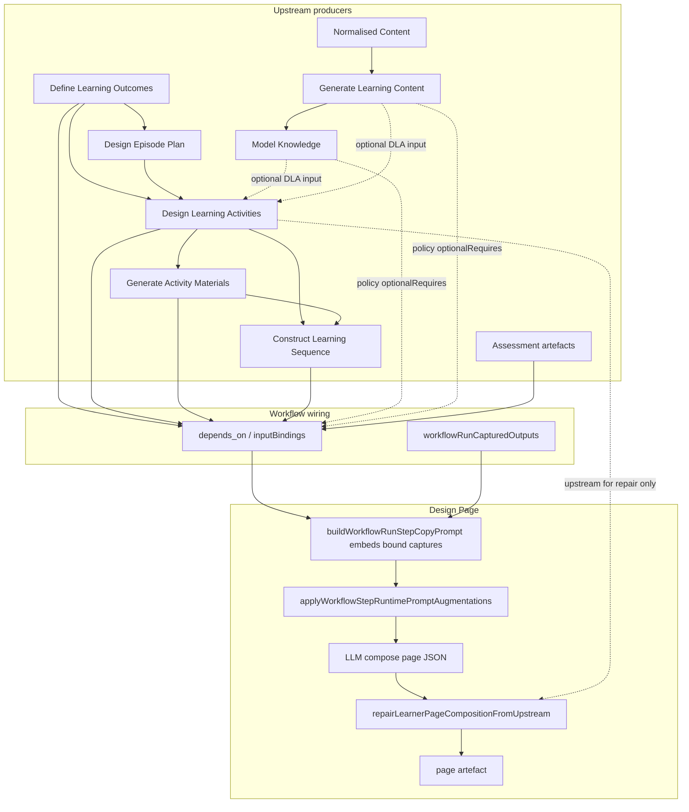

# Sprint 42-5 — Design Page Journey Context Investigation

**Date:** 2026-06-11  
**Type:** Code and contract analysis only (no workflow runs, no implementation changes)  
**Evidence:** Domain pack §13, `app.js` prompt/embed/repair paths, LD runtime modules, Sprint 30 Marx live artefacts, hand-edited page fixture, prior hotfix/42-4B audits (code citations primary; no Sprint 42-4 harness captures used as evidence)

---

## Required verdict

**The learner journey is not missing from the workflow.** Upstream stages (Generate Learning Content, Knowledge Model, DLA, GAM, and optionally Learning Sequence) can carry central inquiry, progression, bridges, judgement structures, and synthesis/transfer materials.

**The journey is available upstream but weakly expressed at Design Page composition.** Design Page is architected as read-only assembly with hard materials fidelity. Its canonical prompt context, runtime repair, and precedence rules prioritise **DLA + GAM** (activity shells and verbatim materials) over journey-bearing artefacts (LC/KM narrative, episode-plan beats, LS `transition_to_next`). Wrapper prose guidance exists (LD-SELF-DIRECTED-RHETORIC, LD-AUTHORIAL-EXPOSITION, EQF) but competes with — and often loses to — the dominant “task stack + materials preserve” contract.

---

## 1. Data-flow map into Design Page

**Mechanism (runtime):**

1. **Step inclusion** — `workflowPolicy.dependencies["Design Page"]` requires at least one of `knowledge_model`, `activity_materials`, `assessment_items`, `learning_sequence`, or `learning_content` (`domains/learning-design/domain-learning-design-step-patterns.md` line 82).
2. **Bindings** — Saved workflows derive `inputBindings` from `depends_on` (producer step `outputName` per binding). `buildWorkflowRunStepCopyPrompt` embeds capture text only for bound internal artefacts (`app.js` ~23975–24020).
3. **Augmentations** — `applyWorkflowStepRuntimePromptAugmentations` appends EQF, compose contract, rhetoric, authorial exposition, materials/table/math contracts (`app.js` ~10316–10332).
4. **Post-compose repair** — `applyPedagogicCognitionSemanticsToComposedPage` → `repairLearnerPageCompositionFromUpstream` uses **DLA `learning_activities` only** (`resolveUpstreamLearningActivitiesForPageStep`, `app.js` ~36451–36466).

**Composition stance (domain pack):** “read-only composition step; do not redesign pedagogy” — assembly of sections, headings, ordering, and wrapper prose; materials bodies copied verbatim.

---

## 2. Upstream artefacts available to Design Page

| Artefact | In workflow policy for DP? | In canonical §13 Input list? | Typically bound when step present? | Journey-bearing content |
| -------- | -------------------------- | ---------------------------- | ---------------------------------- | ------------------------ |
| **learning_outcomes** | `optionalRequires` | Yes | Yes | Outcome statements; weak narrative arc unless LO author wrote progression |
| **learning_activities** | `optionalRequires` | Yes | Yes | `study_orientation`, `intellectual_frame`, `intellectual_coherence_bridge`, preambles, reasoning fields, `transfer_or_application_task` |
| **activity_materials** | `optionalRequires` + `requiresAnyOf` | Yes | Yes | Worked examples, closure/debrief, prompt sets, consolidation, judgement scaffolds |
| **learning_sequence** | `optionalRequires` + `requiresAnyOf` | Optional | If CLS step in workflow | `timeline[]`, `phase_type`, `transition_to_next`, duration/order |
| **assessment_items** / blueprint / rubric / feedback | `optionalRequires` | Optional | If assessment path included | Formative check items |
| **learning_content** | `requiresAnyOf` + `optionalRequires` | **No** | If GLC step present | Central inquiry, section progression, explanatory prose (Sprint 30 Marx §1–4 arc) |
| **knowledge_model** | `requiresAnyOf` + `optionalRequires` | **No** | If KM step present | Concepts, relationships, processes, misconceptions — structured journey graph |
| **normalized_content** | Indirect (KM/GLC input) | **No** | Rarely bound to DP | Source fidelity; not a DP input |
| **episode_plans** | **No** | **No** | **No** (DLA-only via `ensureDlaEpisodePlanInputBindingsForSteps`) | Authoritative beat order / instructional functions |

**Manual Marx inspection (Sprint 30 live artefacts, not 42-4 harness):**

- `marx-learning-activities.json` — A1 carries full-page `study_orientation` and `intellectual_frame`; A2–A4 carry `intellectual_coherence_bridge` and judgement-oriented fields.
- `marx-page.json` — Composed page opens with integrative “Introduction and Study Orientation” prose naming biography → works → application progression.
- `tests/fixtures/page-render/marx-self-study-page.json` — Benchmark shows `knowledge_summary` with `use_in_activities` linking concepts to later comparison/application moves.

These confirm journey signals exist in DLA and can surface in composed pages when upstream domain and compose quality align.

---

## 3. Upstream artefacts actually used in the Design Page prompt

### 3.1 Canonical prompt template (`step_design_page`)

**Declared Context** (§13 `promptTemplate`):

> learning_outcomes, learning_activities, activity_materials, and may also receive learning_sequence, assessment_items, feedback_pack, marking_rubric, assessment_blueprint

**Not named in Context:** `learning_content`, `knowledge_model`, `normalized_content`, `episode_plans`.

**Explicit learning_sequence use:** “If learning_sequence is present, use for **order/timing only**” — not for `transition_to_next`, phase narrative, or journey prose.

**Grounding rule:** “Ground all sections in provided upstream artefacts only.”

### 3.2 Runtime prompt assembly (`buildWorkflowRunStepCopyPrompt`)

| Source | What reaches the model |
| ------ | ---------------------- |
| **inputBindings** | Only listed artefacts; full capture text embedded per binding |
| **Core prompt template** | As above |
| **EQF** (`lib/educational-quality-framework-prompt.js`) | Journey-as-primary-design-unit; DP rider: preserve journey across overview, preambles, tasks, study tips |
| **LD-DESIGN-PAGE-COMPOSE-CONTRACT** | Activity membership, field preservation list, materials verbatim |
| **LD-SELF-DIRECTED-RHETORIC** (`design_page` rider) | Compose overview/learning_purpose from “upstream orientation substance”; preserve bridges/closure |
| **LD-AUTHORIAL-EXPOSITION** (42-2, when learner-page framing applies) | Arc target Explanation → … → Synthesis; transition quality; anti-redundancy |
| **LD-MATERIALS-COPY / LD-TABLE-FIDELITY** (`preserve` / `design_page` roles) | **PREC-02:** materials fidelity overrides overview thinning |
| **PEL orientation/reasoning blocks** | **Not** on Design Page (tests: `workflow-pel-reasoning.test.js` “omits reasoning PEC block”) |
| **Episode-plan block** | DLA only (`applyEpisodePlanDlaPopulationPromptBlockToDraft`) |

**If LC/KM are bound** via workflow `depends_on`, their JSON **can** appear in the copy prompt — but the template gives **no instruction** to build `knowledge_summary` from KM, to lift central inquiry from LC, or to use KM `relationships` for wrapper prose. Older sprint snapshots of `defaultPromptNotes` required `knowledge_summary` when KM/LC exist; the **current** §13 `promptTemplate` does not restate that rule (only `defaultPromptNotes` lists `knowledge_summary` among canonical `section_id`s).

### 3.3 Post-LLM repair / normalisation

| Function | Upstream used |
| -------- | ------------- |
| `repairLearnerPageCompositionFromUpstream` | `learning_activities` only — restore omitted activities, merge framing fields |
| `mergeUpstreamCognitionFieldsIntoPageActivities` | DLA cognition field IDs |
| Sequencing metadata merge | `learning_activities` + optional sequence hints — not LC/KM/LS transitions |

**Net:** Prompt **references and prioritises** LO + DLA + GAM (+ optional LS for order/timing, assessment when present). LC/KM are **policy-optional wiring** without compose instructions. Episode plans **never** reach Design Page.

---

## 4. Journey-bearing signals: unused or weakly used at Design Page

| Signal | Where it exists upstream | Design Page treatment | Gap severity |
| ------ | ------------------------ | --------------------- | ------------ |
| **Central inquiry / governing question** | LC title and sections; KM concept groupings; DLA `study_orientation` / `intellectual_frame` on A1 | Rhetoric says compose overview from “orientation substance” but does not require assimilating LC/KM; repair does not inject LC | **High** when LO/domain drifts; **Medium** when DLA A1 orientation is strong |
| **Phase progression** | LS `timeline[].phase_type`; DLA activity order; episode-plan beats (DLA input only) | LS: order/timing only; episode beats invisible to DP | **High** for LS phase narrative |
| **transition_to_next** | LS each `timeline` block | Not referenced in DP prompt or repair | **High** |
| **Activity sequence rationale** | DLA `intellectual_coherence_bridge`; LS transitions; KM `relationships` | Bridges **preserved verbatim** on activity rows if DLA populated them; not synthesised into overview | **Medium** — field-level preserve, not page-level journey |
| **Judgement / evaluation structures** | DLA reasoning fields; GAM worked examples, prompt sets, closure sections | Strong **preserve** path via GAM → `activity.materials.*`; appears as task stack unless wrapper prose connects moves | **Low–Medium** (materials present; journey framing weak) |
| **Synthesis / consolidation / transfer** | GAM closure/debrief/transfer materials; DLA `transfer_or_application_task`; rhetoric study_tips rules | Preserved in materials + study_tips when upstream specifies; overview often does not integrate | **Medium** |
| **knowledge_summary** | KM concepts/relationships; LC key ideas | Canonical `section_id` in notes; **not** mandated in current prompt body when KM/LC bound | **Medium–High** |
| **EQF journey principle** | Runtime on DP | Competes with L4 materials PREC-02 (“overview thinning” forbidden for materials, not required for rich overview) | **Weak** — guidance without structural pull from LC/KM/LS |

**Dominant compose behaviour:** Merge GAM into DLA activity shells → long `learning_activities` section → thin or generic `overview` / `learning_purpose`. Matches manual inspection and `hotfix-marx-self-study-design-quality-investigation.md`: Design Page “faithful passthrough,” not primary pedagogy owner.

**Sprint 42-2/42-3 (uncommitted):** `LD-AUTHORIAL-EXPOSITION` and DLA preamble exposition improve **how** preserved fields read; they do not add LC/KM/LS/EP to the compose context.

---

## 5. Is Design Page composing from full journey context or mainly DLA + GAM?

**Mainly DLA + GAM**, with optional LO and LS (timing only).

| Layer | Role in practice |
| ----- | ---------------- |
| **DLA** | Activity order, framing fields, obligation specs — primary semantic source for compose + repair |
| **GAM** | Dominates token budget and learner-visible substance (materials bodies) |
| **LO** | Listed in overview/outcome framing when present; no structural journey contract |
| **LS** | Reorder/duration if bound; **discards** `transition_to_next` and facilitation narrative |
| **LC / KM** | May be embedded if wired; **no prompt role** for journey synthesis |
| **Episode plans** | Not in DP pipeline |

When CLS is omitted (common in self-study page workflows), phase progression and transitions exist only if DLA bridges and GAM closure materials were populated — not from a sequence artefact.

---

## 6. Minimal recommended intervention

**Scope:** Prompt/composition guidance and stronger use of **already-bound** artefacts. No new workflow stages, schemas, renderer changes, or EQF dimension expansion.

### 6.1 Design Page prompt template (domain pack §13)

Add a short **Journey assimilation** block (after Context, before Task):

1. **Overview / learning_purpose** — Assimilate, do not invent: (a) first-activity `study_orientation` + `intellectual_frame` when present; (b) LO outcome arc as intellectual stakes; (c) when `learning_content` or `knowledge_model` captures are provided, derive `knowledge_summary` and central inquiry from them (concepts + `relationships` / section progression), not from activity titles alone.
2. **learning_sequence** — When bound, use `transition_to_next` and `phase_type` to inform overview closure and `study_tips` synthesis; still use timeline for activity **order/timing**; do not drop activities.
3. **Anti-workbook** — Explicitly: wrapper sections carry the intellectual arc; `learning_activities` carry tasks and materials — avoid repeating the same run-sheet in overview and each preamble (aligns with LD-AUTHORIAL-EXPOSITION anti-redundancy).

### 6.2 Runtime module riders (no schema change)

- **LD-SELF-DIRECTED-RHETORIC `design_page` rider** — One line: when upstream capture includes `learning_content` or `knowledge_model`, `knowledge_summary` must preview concepts and name how activities apply them (fixture pattern: `use_in_activities`).
- **LD-AUTHORIAL-EXPOSITION** — One line: overview must state the governing inquiry in topic-specific prose drawn from bound LC/KM/DLA A1 orientation before any activity listing.

### 6.3 Optional low-risk embed helper (still no schema change)

If LC/KM bindings exist but full capture is huge, prompt could request a **bounded excerpt** (title + first section + relationships/misconceptions from KM) via copy-prompt formatting only — not a new artefact type.

### 6.4 Explicitly defer

- Wiring `episode_plans` into Design Page (schema/workflow change).
- Repair logic pulling LC/KM (behavioural change beyond prompt; higher regression risk).
- Renderer or EQF evaluator changes.

---

## 7. Risks to preservation, accessibility, and Sprint 41 guarantees

| Risk | Mitigation |
| ---- | ---------- |
| **Materials fidelity (L4 PREC-02)** | Journey guidance must apply to `overview`, `learning_purpose`, `knowledge_summary`, `study_tips` only — never paraphrase `activity.materials.*` |
| **Activity membership (L3)** | Keep existing compose-contract membership rules; LS-informed ordering must not drop activities |
| **Field preservation** | Continue verbatim copy of DLA framing fields; journey assimilation is additive wrapper prose, not rewriting preambles |
| **Accessibility / cognitive load** | Richer overview must not duplicate full glossary already in `knowledge_summary` or materials (LD-AUTHORIAL-EXPOSITION anti-redundancy) |
| **Sprint 41 EQF** | EQF already on DP; stronger journey assimilation **implements** EQF compose rider rather than replacing it |
| **Topic fidelity** | Journey prompts must say “from bound upstream captures” — does not fix LO/KM null bugs (separate pipeline issue per 42-4A) |

---

## 8. Cross-reference summary

| Question | Answer |
| -------- | ------ |
| Does DP receive Generate Content / KM? | **Can** via bindings/policy; **not** in canonical Input list or prompt Context |
| Does DP receive episode plans? | **No** |
| Does DP receive LS transitions? | **Can** receive full JSON; prompt uses **order/timing only** |
| Are journey fields in DLA used? | **Preserved** on activity rows; **weakly synthesised** into page-level narrative |
| Workbook/task-stack feel — wiring or compose? | **Compose emphasis** (materials + tasks dominate; wrapper under-fed from LC/KM/LS) |
| Journey missing from workflow? | **No** |
| Journey weak at Design Page? | **Yes** — primary finding |

---

## 9. Key code / contract references

- Design Page §13 Input and prompt: `domains/learning-design/domain-learning-design-step-patterns.md` (~3378–3452)
- Workflow policy `Design Page` dependencies: same file (~82)
- Copy prompt embed: `app.js` `buildWorkflowRunStepCopyPrompt` (~23975–24020)
- Runtime augmentations: `app.js` `applyWorkflowStepRuntimePromptAugmentations` (~10316–10332)
- Compose contract: `lib/ld-design-page-compose-contract.js`
- Rhetoric design_page rider: `lib/ld-self-directed-rhetoric.js` (~45–48)
- Authorial exposition: `lib/ld-authorial-exposition.js`
- EQF DP manifestation: `lib/educational-quality-framework-prompt.js` (~64–68)
- Repair upstream scope: `app.js` `resolveUpstreamLearningActivitiesForPageStep` (~36451–36466)
- LS `transition_to_next` schema: §10 Construct Learning Sequence prompt (~3305)

---

**Investigation complete.** No workflows run. No implementation changes made.
