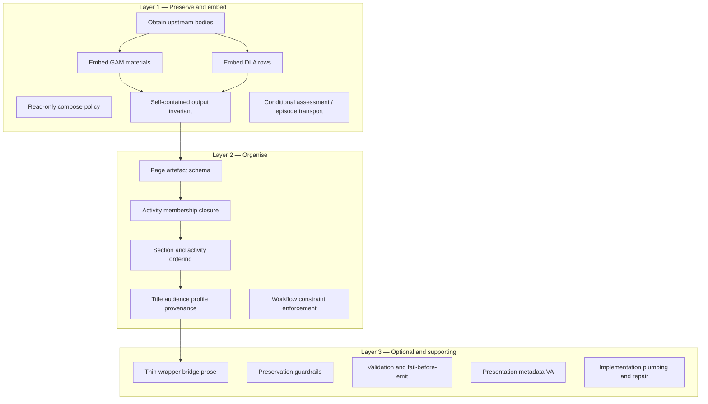

# Design Page — Target Architecture Derivation

**Sprint:** 56A — Design Page Simplification Planning  
**Status:** Planning artefact — synthesis from accepted evidence  
**Date:** 2026-07-06  
**Type:** Derivation exercise (not redesign)

**Inputs (accepted evidence):**

| Artefact | Role |
| -------- | ---- |
| [DESIGN-PAGE-ARCHITECTURE-AUDIT.md](../2026-07-01-sprint-56-prompt-rationalisation-contract-consolidation/DESIGN-PAGE-ARCHITECTURE-AUDIT.md) | Working diagnosis |
| [DESIGN-PAGE-FAILURE-MODES.md](DESIGN-PAGE-FAILURE-MODES.md) | Failure catalogue A–G |
| [DESIGN-PAGE-RESPONSIBILITY-ANALYSIS.md](DESIGN-PAGE-RESPONSIBILITY-ANALYSIS.md) | Responsibility typing |
| [DESIGN-PAGE-RESPONSIBILITY-MATRIX.md](DESIGN-PAGE-RESPONSIBILITY-MATRIX.md) | Authoritative inventory (R-01–R-86) |
| [DESIGN-PAGE-CORE-REDUCTION-ANALYSIS.md](DESIGN-PAGE-CORE-REDUCTION-ANALYSIS.md) | Fundamental vs inflated Core |
| [SPRINT-57-ARCHITECTURE-STATE.md](../2026-07-01-sprint-57-learner-experience-product-quality/SPRINT-57-ARCHITECTURE-STATE.md) | Stage ownership (reference) |
| [SPRINT-57-LEARNER-PIPELINE-REFERENCE.md](../2026-07-01-sprint-57-learner-experience-product-quality/SPRINT-57-LEARNER-PIPELINE-REFERENCE.md) | Pipeline verbs |
| [SPRINT-57-ARCHITECTURE-DECISIONS.md](../2026-07-01-sprint-57-learner-experience-product-quality/SPRINT-57-ARCHITECTURE-DECISIONS.md) | ADR-01–11 (reference) |

**Purpose:** Answer — *If Design Page were designed today using only its fundamental responsibilities, what architectural shape would naturally emerge?*

**This document does not modify prompts, code, workflows, migration plans, or the implementation plan.**

---

## Executive summary

| Field | Derived value |
| ----- | ------------- |
| **Architectural identity** | Read-only **transport-and-organisation** step that produces a **self-contained final learner-facing page** by preserving and arranging upstream content |
| **Architectural layers** | Layer 1 — Preserve & embed · Layer 2 — Organise · Layer 3 — Optional bridge & supporting concerns |
| **Principles identified** | 6 (see Phase 6) |
| **Unresolved questions** | 12 (see end) |
| **Confidence** | **High** on identity and Layer 1–2 · **Medium** on Layer 3 scope and coexistence with Sprint 57 GREEN classification |

---

## Phase 1 — Evidence summary

### 1.1 Architecture audit findings

**Evidence source:** [DESIGN-PAGE-ARCHITECTURE-AUDIT.md](../2026-07-01-sprint-56-prompt-rationalisation-contract-consolidation/DESIGN-PAGE-ARCHITECTURE-AUDIT.md)

| Finding | Evidence |
| ------- | -------- |
| Design Page currently combines **at least five jobs** on one step: payload transport, page schema assembly, wrapper narrative authoring, renderer metadata specification, and cross-cutting quality enforcement | Audit §1 inventory across sections A–M |
| The **clearest aligned cluster** is GAM/DLA material and activity transport (audit §C, §D) — described as “clearest expression of what Design Page should be” | Classification **E** (Essential) on transport rows |
| **Highest-risk mechanisms** for content loss are triple wrapper stack, knowledge summary authoring, brevity params, and visual affordance specification | Audit §2 severity table |
| Accepted working diagnosis: Design Page should primarily be a **transport-and-organisation layer** | Executive summary; audit §3 |
| Judgement criterion already stated in evidence: *Can a learner complete the journey using only this JSON, with no dereferencing and no upstream recovery?* | Audit §6 |
| Remediation patches improved hygiene but **failures persisted** in live Copilot runs | Referenced via failure modes catalogue |

### 1.2 Failure mode findings

**Evidence source:** [DESIGN-PAGE-FAILURE-MODES.md](DESIGN-PAGE-FAILURE-MODES.md)

| Finding | Evidence |
| ------- | -------- |
| Modes A–G share a **common responsibility-conflict pattern**, not independent defects | Common pattern conclusion |
| Dynamics: page-as-optimiser (A,B,C,D), page-as-index (E), page-as-narrator (A,G), page-as-assembler without context model (F) | Shared dynamics table |
| Summarisation is a **symptom of author/optimiser responsibilities** on the same step as transport | Mode A architectural implications |
| Metadata substitution reflects **payload vs metadata confusion** when step also asks for catalogue-style assembly | Mode B |
| Multi-material failure indicates **transport logic** treated as page-shape optimisation | Mode C |
| Placeholder substitution signals **wrong mental model** — page as index not final output | Mode E |
| Context denial is **access failure**, not generation failure | Mode F |
| Material elision is **membership without transport** — structurally valid, learner-invalid | Mode G |

### 1.3 Responsibility inventory findings

**Evidence source:** [DESIGN-PAGE-RESPONSIBILITY-ANALYSIS.md](DESIGN-PAGE-RESPONSIBILITY-ANALYSIS.md), [DESIGN-PAGE-RESPONSIBILITY-MATRIX.md](DESIGN-PAGE-RESPONSIBILITY-MATRIX.md)

| Finding | Evidence |
| ------- | -------- |
| **86 responsibilities** inventoried; classified Core (40 table rows / 44 summary), Secondary (24), External Candidate (18) | Matrix classification summary |
| Five functional types: transport, organisational, authoring, presentation, workflow | Responsibility analysis §types |
| **Hard transport + organise + consume** clearly belong on Design Page | Cross-type analysis |
| **Authoring, presentation (VA), knowledge summary, brevity params** are disputed or External Candidate | Analysis §3–4; matrix R-39, R-55–R-59, R-78–R-80 |
| Sprint 57 pipeline model **DLA specifies → GAM realises → Design Page assembles** remains valid at **stage level**; problem is internal scope of “assemble” | Analysis alignment section |
| **Competition table** documents direct conflicts: complete payload vs readable page; embed vs cite paths; transport vs author on same step | Matrix §2 |

### 1.4 Core reduction findings

**Evidence source:** [DESIGN-PAGE-CORE-REDUCTION-ANALYSIS.md](DESIGN-PAGE-CORE-REDUCTION-ANALYSIS.md)

| Finding | Evidence |
| ------- | -------- |
| Only **11 responsibilities** are independently fundamental; Core set **overstates identity ~3.6×** | Phase 1 count; executive summary |
| **12 guardrails** exist because Secondary/External modules on the emit path create transformation risk — not because guardrails define identity | Phase 3 exclusion table; Cluster F |
| **Cluster B** fragments one GAM embed operation into 9 Core IDs | Phase 2 Cluster B; Phase 4 fragmentation |
| Failures correlate with **non-Core authoring/VA** and violation of fundamentals, not absence of individual guardrail IDs | Phase 5 |
| Minimum identity reducible to **~10 atomic obligations** | Phase 3 consolidation note |
| Six responsibilities remain **ambiguous** after reduction (R-03, R-06, R-61, R-66, R-72, R-83) | Ambiguous table |

### 1.5 Sprint 57 reference context (evidence constraint)

**Evidence source:** Sprint 57 architecture state, pipeline reference, ADRs

| Finding | Relevance to derivation |
| ------- | ---------------------- |
| Orchestration classified **GREEN** — no high-severity cross-stage authority leaks | Confirms stage ownership map is sound; does not disprove internal Design Page scope inflation |
| Design Page verb = **assemble**; read-only composition required (ADR-06, ADR-02) | Supports derived identity |
| ADR-08: capture-side repair is **quality layer**, not compose identity | Separates Layer 1 from PRISM plumbing |
| Sprint 57 state still lists wrapper prose and VA as Design Page responsibilities | **Tension** with 56A reduction — derivation narrows *target* identity; current state describes *as-built* |

---

## Phase 2 — Minimum architectural identity

Derived from Core Reduction Phase 3 fundamentals (R-01, R-03, R-05, R-09, R-12, R-16, R-17, R-23, R-27, R-28, R-66†) plus organisation facets evidenced as necessary (R-02, R-06, R-31, R-61†).

### Identity statement

> **Design Page is the terminal assembly stage that produces a self-contained, learner-usable page artefact by locating upstream outputs, embedding learner-facing payloads without redesign, and organising them into a coherent page structure — without authoring material bodies, replanning pedagogy, or substituting references for content.**

**Evidence chain:** Audit §3 primary responsibility → Pipeline reference “read-only composition” → Core reduction obligations 1–8 → Failure mode E/G (self-contained requirement) → ADR-06 compose SSOT as assembly authority.

### Primary responsibilities

| # | Responsibility (obligation) | Matrix anchors | Distinction from upstream |
| - | --------------------------- | -------------- | ------------------------- |
| 1 | **Emit page artefact** — structured page object as workflow deliverable | R-01 | DLA/GAM emit activity/material artefacts, not pages |
| 2 | **Identify page** — title, audience, profile variant | R-03, R-05 | Upstream steps do not produce page-level metadata |
| 3 | **Obtain upstream content** — access full prior-step bodies from workflow context | R-12 | DLA/GAM produce content; they do not consume cross-step conversation |
| 4 | **Compose read-only** — assemble without replan, respecify, or summarise away upstream | R-16 | DLA specifies; GAM authors bodies; neither assembles page |
| 5 | **Embed GAM materials** — merge every Material `Content:` into matching activity row fields | R-17 | GAM realises bodies; Design Page **positions** them on page |
| 6 | **Embed DLA activity content** — copy scaffold and task fields verbatim | R-28 | DLA authors scaffolds; Design Page **preserves** on page rows |
| 7 | **Close activity membership** — include every upstream activity unless authorised | R-27 | DLA defines set; Design Page **commits** set to page |
| 8 | **Produce self-contained final output** — no dereferenceable learner content | R-23 | GAM/DLA are upstream sources, not final deliverables |
| 9 | **Honour workflow constraints** — preserve requested components and quantities | R-09 | Workflow brief constraint, enforced at assembly |
| 10 | **Transport conditional payloads** — assessment items and episode plans when bound | R-66, R-61 | Verbatim copy only; design belongs on upstream steps |
| 11 | **Organise** — section shell, activity order, provenance | R-02, R-31, R-06 | Organisation without body transformation |

### Explicit non-responsibilities

Derived from audit §3 “should not be”, responsibility analysis “belongs elsewhere”, and matrix External Candidate classifications.

| Non-responsibility | Why excluded from identity | Evidence |
| ------------------ | -------------------------- | -------- |
| **Author material bodies** | GAM realises `Content:` bodies (pipeline; ADR-03) | Audit §C verdict; GAM role |
| **Author activity scaffolds** | DLA owns scaffold generation (ADR-01) | Pipeline reference DLA |
| **Replan pedagogy or episode beats** | DEP owns design; compose is read-only (R-16, R-63) | Audit §J; ADR-06 |
| **Re-model knowledge** | LC/KM upstream; knowledge summary authoring is structural conflict | Audit §L; R-39 External |
| **Specify visual affordances** | Presentation/metadata specification competes with transport | Audit §I; R-55–R-59 External |
| **Apply brevity/density optimisation** | Directly opposes preservation (R-22 vs R-80) | Audit §2; matrix competition table |
| **Regenerate from brief/spec alone** | Anti-specification (R-14); failure mode F | Failure mode F |
| **Serve as renderer contract or index** | Final output invariant (R-23); failure mode E | Failure mode E |
| **Teach pedagogic quality principles at emit** | EQF belongs upstream (R-74 External; ADR-05) | Audit §M |
| **Post-compose repair** | Quality layer, not identity (ADR-08; R-26 Secondary) | Sprint 57 state |

### Distinction from DLA and GAM

| Stage | Verb (pipeline) | Owns learner content **creation** | Design Page relationship |
| ----- | --------------- | --------------------------------- | ------------------------ |
| **DLA** | Specifies | Activity obligations, scaffold field **prose**, `required_materials` specs | Design Page **copies** DLA rows verbatim — does not specify |
| **GAM** | Realises | Material **bodies**, instructional shapes, table content | Design Page **embeds** GAM `Content:` — does not author |
| **Design Page** | Assembles | Page structure, **placement** of upstream payloads, optional thin wrapper | Neither specifies nor realises bodies — **preserves and organises** |

**Evidence:** Sprint 57 pipeline reference rule of thumb; architecture state ownership map; core reduction fundamentals 5–6 vs non-responsibilities table.

---

## Phase 3 — Architectural layers

The three-layer shape **emerges independently** from: audit §4 proposed model, responsibility analysis transport/organise split, and core reduction clusters A–H. Layers describe **architectural concern separation**, not implementation modules or workflow redesign.

### Layer 1 — Preserve and embed (must always occur)

**Definition:** Obligations without which the step is not Design Page — it would be fabrication, index-building, or another stage.

| Concern | Member responsibilities | Why this layer exists |
| ------- | ---------------------- | --------------------- |
| Upstream access | R-12 (+ guardrail R-13) | Failure mode F; Cluster A |
| Read-only compose | R-16 (+ guardrail R-14) | Audit north star; ADR-06 |
| GAM payload embed | R-17 (+ derived R-20, R-25) | Audit §C “core job”; failure modes B,C,D |
| DLA row embed | R-28 (+ derived R-29) | Audit §D; pipeline preservation |
| Self-contained deliverable | R-23 | Failure mode E; audit §6 question |
| Conditional payloads | R-66, R-61 (when bound) | Matrix Cluster E; audit §J, §K |

**Evidence:** Core reduction 11 fundamentals; matrix minimum viable set items 1–4; failure modes B,D,E as fundamental violations.

**Overlap note:** Layer 1 guardrails (R-18, R-19, R-22) are **defensive elaborations** of R-17/R-23 — evidence shows they are not separate architectural jobs (core reduction Phase 4 fragmentation).

### Layer 2 — Organise (must occur for a structured page, non-authoring)

**Definition:** Structure, membership, ordering, and metadata that arrange Layer 1 payloads without transforming bodies.

| Concern | Member responsibilities | Why this layer exists |
| ------- | ---------------------- | --------------------- |
| Page schema emission | R-01 | Defines deliverable type |
| Section ordering | R-02 | Audit §A organisation rows |
| Activity membership | R-27 | Journey integrity; failure mode G partial |
| Sequence order/timing | R-31 | Organisation not replanning (audit §D) |
| Page identity metadata | R-03, R-05, R-06 | Usable page object |
| Workflow constraints | R-09 | Brief contract enforcement |

**Evidence:** Responsibility analysis §2 organisational type; core reduction Cluster D; audit Layer 2 “Organise” table.

**Overlap note:** R-31 and R-02 both concern ordering at different schema levels (core reduction Cluster D) — same layer, different facets.

### Layer 3 — Optional and supporting (not minimum identity)

**Definition:** Capabilities that may add value or operational safety but are not required to define what Design Page **is**. Their presence creates risks that Layer 1 guardrails compensate for.

| Sub-layer | Members | Why separated from Layers 1–2 |
| --------- | ------- | ----------------------------- |
| **Optional bridge** | R-35–R-51 (Secondary/External wrapper stack), R-04 headings | Audit §E–G; adds authoring surface — driver of failure modes A, G |
| **Presentation metadata** | R-55–R-59 (External VA) | Audit §I “largest non-transport load”; failure mode G |
| **Guardrails** | R-13, R-14, R-18–R-19, R-22, R-24, R-30, R-46, R-50, R-64, R-72, R-83 | Exist because Layer 3 + Secondary modules create risk (core reduction Cluster F) |
| **Validation** | R-21, R-86, R-76 (Secondary PRISM) | Enforcement of Layer 1 — not deliverable behaviour |
| **Implementation plumbing** | R-10, R-73, R-75, R-26, R-34 | ADR-06/08; runtime delivery and repair — not learner-facing architecture |
| **Workflow pressure params** | R-78–R-80 (External) | Audit §2 high severity brevity conflict |
| **Knowledge summary authoring** | R-39, R-71 (External) | Audit §L clearest structural conflict |

**Evidence:** Core reduction “what does not survive minimum identity”; matrix External Candidate set; audit demoted/relocated table §4.

**Critical derivation:** Layer 3 is **architecturally subordinate**. When Layer 3 authoring or presentation runs on the same emit path as Layer 1, evidence shows systematic failure (failure modes common pattern; matrix competition table). The derived architecture therefore treats Layer 3 as **strictly bounded optional** — not co-equal with transport.

---

## Phase 4 — Responsibility placement assessment

Assessment of each **candidate type** from core reduction — fit with derived identity, architectural importance, preservation implications. **No reassignment or new owners.**

### Fundamental (11 IDs)

| Fit with identity | Architectural importance | Preservation implications |
| ----------------- | ------------------------ | ------------------------- |
| **Definitional** — these ARE the derived identity | **Highest** — removing any redefines the stage | **Positive** when obeyed — failures B,D,E are fundamental violations |
| R-01, R-03, R-05, R-09, R-12, R-16, R-17, R-23, R-27, R-28, R-66† | Layer 1–2 core | R-17/R-28/R-23 directly protect learner payload completeness |

### Derived (12 IDs)

| Fit with identity | Architectural importance | Preservation implications |
| ----------------- | ------------------------ | ------------------------- |
| **Necessary elaboration** of fundamentals — belong in Layer 1–2 specification, not separate architectural jobs | **High operational** importance; **medium identity** importance | **Positive** — R-20/R-25 prevent high-loss surfaces (mode C, tables); R-61–R-63 elaborate conditional transport |
| R-02, R-06, R-11, R-15, R-20, R-25, R-29, R-31, R-52, R-61, R-62, R-63 | Layer 2 or Layer 1 detail | Fragmentation risk if each treated as independent architecture (core reduction Cluster B,C,E) |

### Guardrail (12 IDs)

| Fit with identity | Architectural importance | Preservation implications |
| ----------------- | ------------------------ | ------------------------- |
| **Not identity** — boundary rules mitigating Layer 3 and Secondary module risk | **High in current system**; **low in target identity** (would shrink if Layer 3 narrowed) | **Defensive** — R-46/R-50 protect against R-43/R-49; R-83 ambiguity weakens protection (mode A) |
| R-13, R-14, R-18, R-19, R-22, R-24, R-30, R-46, R-50, R-64, R-72, R-83 | Layer 3 sub-layer | Elevating guardrails to Core inflated identity count (core reduction Phase 4) |

### Validation (2 Core + Secondary validators)

| Fit with identity | Architectural importance | Preservation implications |
| ----------------- | ------------------------ | ------------------------- |
| **Quality gates** on Layer 1 — not deliverable behaviours | **Operational** — compensates for LLM variance (ADR-08) | R-21/R-86 enforce copy completeness; insufficient alone when authoring conflicts persist (core reduction Phase 5) |
| R-21, R-86 (prompt); R-76, R-26, R-34 (PRISM Secondary) | Adjacent to Layer 1 | Validation-as-Core signals architectural conflict, not maturity |

### Implementation detail (3 Core IDs + plumbing Secondary)

| Fit with identity | Architectural importance | Preservation implications |
| ----------------- | ------------------------ | ------------------------- |
| **Delivery mechanism** — how rules reach the model, not what the page contains | **Critical for PRISM operation**; **not domain architecture** | R-75 order affects precedence perception; misclassified as identity distorts planning |
| R-10, R-73, R-75; R-65, R-69, R-60 | Outside Layers 1–3 learner concerns | ADR-06: R-73 is governance SSOT, correctly important but not a page responsibility |

### Secondary and External Candidate (42 IDs) — aggregate fit

| Category | Identity fit | Preservation risk (matrix) |
| -------- | ------------ | --------------------------- |
| **Secondary wrapper** (R-35–R-42, R-47–R-48, R-53, R-70) | Layer 3 optional bridge — **disputed value**, not identity | Medium–High when synthesising |
| **External authoring** (R-39, R-43–R-45, R-49, R-51, R-71) | **Outside** derived identity | High — modes A, G |
| **External VA** (R-55–R-59, R-74, R-78–R-82) | **Outside** derived identity | High — modes G, E (cite paths) |
| **Secondary repair** (R-26, R-34, R-60, R-76) | ADR-08 quality layer | Guardrail — not compose identity |

---

## Phase 5 — Failure mode alignment

Assessment of whether **derived architecture** (Layers 1–2 identity, bounded Layer 3) would naturally reduce exposure. No fixes proposed.

| Mode | Reduced exposure under derived architecture? | Identity confusion? | Responsibility overlap? |
| ---- | --------------------------------------------- | ------------------- | ----------------------- |
| **A** Summarisation | **Yes, if** Layer 3 authoring/brevity removed or strictly bounded — identity makes transport primary | **Partial** — model treats page as optimiser when wrapper is co-mandated | **Strong** — R-37–R-41 vs R-17/R-22 (matrix competition) |
| **B** Metadata substitution | **Yes** — Layer 1 embed obligation clarifies payload vs metadata (R-17, R-19) | **Yes** — catalogue/spec mental model vs transport | **Moderate** — R-14 anti-reconstruction vs wrapper catalogue language |
| **C** Multi-material omission | **Yes** — enumeration is derived facet of single embed (R-20), not optional | **Low** — enumeration logic clear in identity | **Strong** — token budget vs R-20 (R-80, R-08) |
| **D** Truncation | **Yes, if** optimisation pressure removed from step | **Low** — excerpt heuristic, not wrong stage identity | **Strong** — same as A (optimiser vs transport) |
| **E** Placeholder substitution | **Yes** — self-contained output is Layer 1 invariant (R-23) | **Strong** — page-as-index is identity confusion | **Moderate** — R-59 cite paths reinforce index model |
| **F** Context denial | **Partially** — obtain-upstream is Layer 1 (R-12); Copilot context model is consumption policy | **Yes** — assembler without context model | **Low** — distinct from authoring overlap |
| **G** Material elision | **Yes, if** VA and wrapper cannot substitute for embed | **Partial** — membership without transport | **Strong** — R-37/R-41/R-59 vs R-17/R-23 |

### Cross-mode conclusion

| Question | Assessment | Evidence |
| -------- | ---------- | -------- |
| Would derived architecture reduce exposure? | **Yes for B,C,D,E** (identity clarifies transport); **conditional for A,G,F** (depends on Layer 3 scope and context model) | Failure modes + core reduction Phase 5 |
| Are failures related to identity confusion? | **E and F strongly**; **B partially** | Modes E, F, B descriptions |
| Are failures related to responsibility overlap? | **A,C,D,G strongly**; **all modes** per common pattern | Failure modes common pattern; matrix §2 competitions |

Responsibility inflation **contributes** to overlap failures by burying the small fundamental set under defensive duplication (core reduction Phase 5) — derived architecture exposes Layer 1 as primary, which addresses the confusion but does not alone remove Layer 3 risks.

---

## Phase 6 — Architectural principles

Six principles — each traceable to prior findings only.

### P1 — Preservation before optimisation

| | |
| - | - |
| **Statement** | When transport completeness and page brevity/readability conflict, transport wins. |
| **Rationale** | Failure modes A,D; audit §2 brevity params as high severity; R-22 guardrail exists because R-80 competes |
| **Evidence** | Failure modes A,D; matrix competition R-22 vs R-80; audit §2 |

### P2 — Transport before narration

| | |
| - | - |
| **Statement** | Learner-facing payloads from DLA and GAM must be embedded before any wrapper prose is considered complete. |
| **Rationale** | Audit primary responsibility; failure modes A,G (narration at expense of payload) |
| **Evidence** | Audit §3; failure modes common pattern “page-as-narrator”; core reduction obligation 5–6 |

### P3 — Final output, not index

| | |
| - | - |
| **Statement** | The page artefact is the terminal learner deliverable — no dereferenceable content or upstream recovery assumed. |
| **Rationale** | R-23 fundamental; failure mode E is wrong mental model |
| **Evidence** | Failure mode E; audit §6 judgement question; core reduction obligation 8 |

### P4 — Read-only assembly

| | |
| - | - |
| **Statement** | Design Page assembles; it does not specify (DLA), realise bodies (GAM), or replan (DEP). |
| **Rationale** | Pipeline verbs; ADR-01, ADR-02, ADR-06; R-16 fundamental |
| **Evidence** | Sprint 57 pipeline reference; ADR-02/06; responsibility analysis alignment |

### P5 — Archival vs authorable fields

| | |
| - | - |
| **Statement** | Activity rows and `materials.*` are archival — verbatim upstream copy; wrapper sections are the only authorable surface in the derived model. |
| **Rationale** | R-24 guardrail; audit authorable vs archival split; failure modes when boundary blurred |
| **Evidence** | Audit §C; matrix R-24; failure modes A,G |

### P6 — Upstream authority for bodies

| | |
| - | - |
| **Statement** | Material bodies and scaffold prose are authored only on GAM and DLA respectively; Design Page never regenerates them from specs or brief. |
| **Rationale** | Pipeline ownership map; failure modes B,F; R-14 anti-reconstruction |
| **Evidence** | Sprint 57 architecture state; failure modes B,F; ADR-01/03 |

---

## Phase 7 — Architecture summary

### One-paragraph architecture statement

Design Page is the **terminal read-only assembly stage** in the learner pipeline: it **locates** upstream artefacts from workflow context, **embeds** full DLA activity content and GAM material bodies into a page JSON structure, **organises** activities and sections without replanning, and **emits** a self-contained learner-facing page that requires no upstream recovery. Authoring of material bodies and scaffolds belongs to GAM and DLA; pedagogy design belongs to DEP; knowledge modelling belongs to LC/KM. Optional thin wrapper prose, visual affordance metadata, and quality validation may surround this core but are **not** definitional — when they compete with transport, evidence shows systematic fidelity failure.

### Responsibility boundary summary

| Boundary | Inside derived Design Page | Outside derived Design Page |
| -------- | -------------------------- | --------------------------- |
| **Layer 1** | Access, read-only embed, self-contained output, conditional transport | GAM body authoring, DLA scaffold authoring, DEP beat design |
| **Layer 2** | Schema, membership, order, metadata, brief constraints | Workflow brief authoring, elicitation |
| **Layer 3 (optional)** | Bounded wrapper bridge (disputed), guardrails, validation, VA (disputed) | EQF teaching, instructional patterns, PEL on emit, renderer HTML |
| **Quality layer** | — (not identity) | PRISM repair and capture validation (ADR-08) |

### Key architectural risks

| Risk | Source | Nature |
| ---- | ------ | ------ |
| **Layer 3 co-mandated with Layer 1** | Matrix 42 non-fundamental responsibilities on emit path | Optimiser/author conflicts — modes A,G |
| **Guardrail inflation mistaken for identity** | 40 Core vs 11 fundamental | Planning optimises prompts not scope |
| **Sprint 57 GREEN vs live Copilot failures** | Architecture state vs failure catalogue | Stage map sound; internal DP scope still contested |
| **Dual-path divergence** | Copilot conversation vs PRISM capture/repair | Identity must hold on both; repair is backstop not identity |
| **Conditional transport treated as always-on** | R-61, R-66 ambiguity | Minimum page definition may over-specify |
| **R-83 readable assembly ambiguity** | Core reduction ambiguous | Boundary delimiter vs optimise licence — mode A |

### Areas requiring migration planning (needs only — no plans)

| Area | Why future planning needed | Evidence |
| ---- | -------------------------- | -------- |
| **Wrapper stack scope** | Layer 3 bridge — merge, bound, or remove | OQ-02, OQ-09; audit §E–G |
| **Visual affordances placement** | Largest non-transport load | OQ-13, OQ-14; audit §I |
| **Knowledge summary policy** | Transport vs author vs omit | OQ-07, OQ-17–OQ-19; audit §L |
| **Brevity params on Design Page** | Direct preservation conflict | OQ-12; R-78–R-80 |
| **Guardrail consolidation** | Cluster B fragmentation | Core reduction Cluster B; OQ dependency |
| **Matrix classification revision** | Identity / Derived / Guardrail layers | Core reduction Phase 6; charter exit criteria |
| **Acceptance fixtures and validation** | Prove identity on live Copilot path | OQ-25–OQ-27; ADR-08 |
| **Sprint 57 sequencing** | Product work vs DP scope narrowing | OQ-23; charter scope |

---

## Unresolved questions

Carried from [SPRINT-56A-OPEN-QUESTIONS.md](SPRINT-56A-OPEN-QUESTIONS.md) and core reduction ambiguity — **not resolved by this derivation**:

| ID | Question | Blocks |
| -- | -------- | ------ |
| OQ-01 | Minimum responsibility set for valid learner page | Migration scope floor |
| OQ-02 | Author new prose vs organise only | Layer 3 existence |
| OQ-03 | Overview / learning_purpose essential? | Layer 3 section schema |
| OQ-09 | Merge triple wrapper stack? | Layer 3 shape |
| OQ-13 | VA on Design Page at all? | Layer 3 presentation |
| OQ-17 | Knowledge summary transport vs author vs omit | Layer 3 + mode A |
| OQ-20 | Migration sequencing order | Planning only — out of scope here |
| R-03 | Profile fundamental vs variant behaviour | Layer 2 metadata |
| R-06 | Provenance in minimum identity | Layer 2 |
| R-72 | Guardrail contingent on knowledge_summary | Layer 3 dependency |
| R-83 | Scope delimiter vs optimise licence | Principle P1/P5 boundary |
| Sprint 57 tension | GREEN orchestration vs 56A fidelity findings | Stakeholder reconciliation |

---

## Confidence assessment

| Conclusion | Confidence | Basis |
| ---------- | ---------- | ----- |
| **Transport-and-organisation identity** | **High** | Convergent audit, pipeline, core reduction, ADR-06 |
| **Three-layer model (preserve → organise → optional)** | **High** | Audit §4, responsibility types, core reduction clusters |
| **11 fundamentals as minimum identity** | **High** | Core reduction Phase 3; matrix minimum set overlap |
| **Layer 3 as subordinate / optional** | **Medium–High** | Strong failure evidence; product value of wrapper not fully assessed (OQ-02, OQ-03) |
| **VA and knowledge summary outside identity** | **Medium** | Audit and matrix External classification; renderer/product dependency unresolved (OQ-13, OQ-17) |
| **Derived architecture reduces failure exposure** | **Medium** | Logical alignment strong; live validation not yet run against target identity (OQ-25) |
| **Compatibility with Sprint 57 GREEN** | **Medium** | Stage ownership unchanged; internal DP scope narrowing is refinement not reversal |

---

## Document control

| Field | Value |
| ----- | ----- |
| File | `DESIGN-PAGE-TARGET-ARCHITECTURE-DERIVATION.md` |
| Derived architectural identity | Read-only transport-and-organisation; self-contained final page |
| Architectural layers | Layer 1 Preserve & embed · Layer 2 Organise · Layer 3 Optional & supporting |
| Principles | P1–P6 (preservation before optimisation; transport before narration; final output not index; read-only assembly; archival vs authorable; upstream authority) |
| Next consumer | Sprint 56A open questions triage; implementation plan §1 (when authorised) |
| Does not | Redesign workflows · rewrite prompts · propose implementation · create migration steps · update implementation plan |

**Derivation only. Every major conclusion traces to audit, failure modes, responsibility matrix, or core reduction analysis.**
