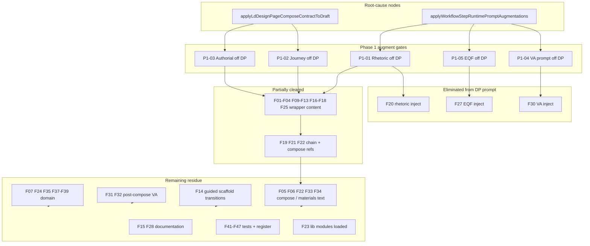

# Sprint 56C — Wave 1 Phase-1 Impact Analysis

**Sprint:** 56C — Design Page Migration Execution  
**Type:** Dependency and impact analysis — **no implementation**  
**Date:** 2026-07-06  
**Reference:** [SPRINT-56C-WAVE-1-ARCHITECTURE-CLEANUP-ANALYSIS.md](SPRINT-56C-WAVE-1-ARCHITECTURE-CLEANUP-ANALYSIS.md)

**Question addressed:** How much architecture residue would disappear **automatically** if the proposed Phase 1 augment-chain gates were executed—without Phase 2–4 contract, domain, schema, or test work?

---

## Executive summary

Phase 1 targets the **root-cause injection layer** (`applyWorkflowStepRuntimePromptAugmentations` and `applyLdDesignPageComposeContractToDraft` sub-calls). It is the correct first cut for **runtime multi-author stack removal** on the Design Page emit path.

It is **not** a complete Wave 1 cleanup by itself.

| Metric (47 findings F01–F47) | Count | % |
| ---------------------------- | ----- | - |
| **A — Eliminated** (DP augment path; no further edit needed for this finding) | 3 | 6.4% |
| **B — Partially addressed** (DP prompt improved; residue persists in libs/domain/compose text/tests) | 19 | 40.4% |
| **C — Unaffected** (Phase 1 does not touch) | 25 | 53.2% |

**Runtime-oriented view** (DP prompt **violations delivered** by gated modules only): **17 findings** (~36.2%) cease to reach the Design Page prompt; **4** partially improve; **26** unchanged (including F40 retain).

**Recommendation:** **A — Phase 1 should proceed unchanged** as the augment-chain root-cause layer, with mandatory Phase 2–4 follow-through before Wave 1 exit criteria are met. Do not expand Phase 1 scope into contract/domain edits—those are sequenced deliberately to avoid partial triple-stack state.

---

## 1. Phase 1 change set inventory

Phase 1 executes removal candidates **RC-01 through RC-05** only (augment-chain gating). No lib file deletion, no domain pack edits, no post-compose changes, no test updates.

| ID | Component | Responsibility removed (DP path) | Ownership rationale | CP-4 decision | Implementation location(s) |
| -- | --------- | ------------------------------ | ------------------- | ------------- | -------------------------- |
| **P1-01** | `applyLdSelfDirectedRhetoricContractToDraft` | Self-directed wrapper rhetoric (overview/knowledge_summary/study_tips shaping, progression vocabulary) | R-49, R-51 — rhetoric not DP identity | D6 wrapper collapse | `app.js` — gate when `isWorkflowStepDesignPage(context)` in `applySelfDirectedLearnerPageStepScaffoldsToDraft` (~11418–11419) |
| **P1-02** | `applyLdJourneyAssimilationContractToDraft` | Upstream journey assimilation into wrapper prose; knowledge_summary derivation; study_tips synthesis | R-35 — generative wrapper assimilation | D6; OQ-17 | `app.js` — remove call from `applyLdDesignPageComposeContractToDraft` (~10422–10423) |
| **P1-03** | Authorial embed in compose | Authorial exposition block on wrapper sections | R-43 — authorial exposition mandate | D6 | `app.js` — `applyLdDesignPageComposeContractToDraft`: `includeAuthorialExposition: false`; remove `applyLdAuthorialExpositionContractToDraft` fallback (~10407–10420) |
| **P1-04** | `applySprint38VisualAffordanceContractToDraft` | Generative VA specification prompt (schema 38.4, activities_visual_review, source_basis authoring) | R-56–R-59 — VA off DP | OQ-13–16 | `app.js` — gate in `applyWorkflowStepRuntimePromptAugmentations` (~11327) or inside `applySprint38VisualAffordanceContractToDraft` (~10672–10681) |
| **P1-05** | `applyEducationalQualityFrameworkPromptBlockToDraft` | EQF compose guidance on Design Page | R-53 — EQF not on DP emit | 56A demotion; W1.6 | `app.js` — gate in augment chain (~11319) and/or `lib/educational-quality-framework-prompt.js` — remove `step_design_page` from `TARGET_CANONICAL_STEP_IDS` |

**Explicitly out of Phase 1 scope:** RC-06–RC-08 (contract text), RC-07 (brevity params), RC-09–RC-14 (post-compose, domain, materials-copy authorable list), RC-15–RC-18 (stakeholder), Phase 4 tests (F41–F47).

---

## 2. Residue mapping table

**Classification key**

| Class | Meaning |
| ----- | ------- |
| **A — Eliminated** | Finding’s **Design Page runtime augment manifestation** removed by Phase 1 alone |
| **B — Partial** | Injection stopped or reduced, but finding persists in libs, compose **text**, domain, post-compose, tests, or secondary paths |
| **C — Unaffected** | Phase 1 does not change this finding |
| **C† — Intentional retain** | F40 — preservation override; not in removal scope |

| ID | Finding (summary) | Phase 1 class | Notes |
| -- | ----------------- | ------------- | ----- |
| W1-F01 | Journey assimilation — knowledge_summary synthesis lines | **B** | Module not injected; lib text remains |
| W1-F02 | Authorial exposition — knowledge_summary role | **B** | Embed/call removed; lib remains |
| W1-F03 | Self-directed rhetoric — knowledge_summary preview | **B** | DP gate stops injection; lib remains |
| W1-F04 | Inline rhetoric bootstrap — knowledge_summary | **B** | Unused on DP if P1-01; bypass code remains |
| W1-F05 | Materials-copy — knowledge_summary authorable | **C** | Still embedded via compose L4 preserve |
| W1-F06 | Compose contract — knowledge_summary authorable | **C** | Compose still runs; text not edited |
| W1-F07 | Domain §13 template — knowledge_summary when bound | **C** | Domain not in Phase 1 |
| W1-F08 | Domain artefacts — knowledge_summary slot | **C** | R-70 slot retained by design |
| W1-F09 | Journey assimilation — study_tips synthesis | **B** | Injection stopped |
| W1-F10 | Journey assimilation — study_tips reference without embed guard | **B** | Injection stopped |
| W1-F11 | Authorial exposition — study_tips synthesis | **B** | Injection stopped |
| W1-F12 | Self-directed rhetoric — closure synthesis | **B** | Injection stopped |
| W1-F13 | Inline rhetoric — study_tips synthesis | **B** | Injection stopped |
| W1-F14 | Guided learning scaffold — wrapper transitions to study_tips | **C** | Scaffold still on DP (`applyLdGuidedLearningScaffoldContractToDraft`) |
| W1-F15 | Domain prompt-rules — study_tips on Design Page | **C** | Documentation |
| W1-F16 | Authorial exposition module (R-43) | **B** | Not on DP prompt; module + scripts remain |
| W1-F17 | Journey assimilation module (R-35) | **B** | Not on DP prompt; module remains |
| W1-F18 | Self-directed rhetoric design_page rider (R-49, R-51) | **B** | Not on DP prompt; module remains |
| W1-F19 | Compose injects authorial + journey + guided scaffold | **B** | Authorial/journey removed; **guided scaffold remains** |
| W1-F20 | Step scaffolds → rhetoric on Design Page | **A** | Direct P1-01 target |
| W1-F21 | Augment chain ordering (rhetoric → compose → VA) | **B** | Three gates change chain; compose refs + scaffold remain |
| W1-F22 | Compose contract sibling mandates (AUTHORIAL, JOURNEY, RHETORIC) | **B** | Blocks not appended; **CORE_LINES still cite siblings** |
| W1-F23 | index.html script tags for wrapper modules | **C** | No script removal in Phase 1 |
| W1-F24 | Domain defaultPromptNotes mandate JOURNEY + RHETORIC | **C** | Domain not in Phase 1 |
| W1-F25 | Wrapper instructional overview / inquiry arc (R-36, R-37) | **B** | Not injected on DP; domain/compose may still imply |
| W1-F26 | EQF lib — step_design_page lines | **B** | Not injected; lib text remains |
| W1-F27 | EQF in augment chain for Design Page | **A** | Direct P1-05 target |
| W1-F28 | Domain prompt-rules — session rhetoric on Design Page | **C** | Documentation |
| W1-F29 | `buildSprint38VisualAffordanceDesignPagePromptBlock` | **B** | Function remains; not called for DP if P1-04 |
| W1-F30 | `applySprint38VisualAffordanceContractToDraft` on DP | **A** | Direct P1-04 target |
| W1-F31 | Post-compose `applySprint38VisualAffordancesToComposedPage` | **C** | Phase 3 (RC-09) |
| W1-F32 | `lib/sprint38-visual-affordances.js` schema 38.4 / source_basis | **C** | Phase 3 |
| W1-F33 | Compose contract — Sprint 38 VA additive metadata | **C** | Text in compose CORE_LINES; not injection gate |
| W1-F34 | Materials-copy — VA authorable / source_basis | **C** | Via compose embed; Phase 2 (RC-12) |
| W1-F35 | Domain §13 — mandatory 38.4 output keys | **C** | Phase 3 (RC-11) |
| W1-F36 | Table-fidelity L6 VA precedence | **C** | Shared GAM/compose; Phase 2/3 (RC-14) |
| W1-F37 | Domain — tone_style on step_design_page | **C** | Phase 2 (RC-07) |
| W1-F38 | Domain — brief mapping to step_design_page params | **C** | Phase 2 (RC-07) |
| W1-F39 | `resolveDesignPageRefinementProfile` | **C** | Phase 2 (RC-13) |
| W1-F40 | Materials preservation brevity **override** (R-22) | **C†** | Intentional retain — see §7 |
| W1-F41 | Test — journey assimilation on DP | **C** | Phase 4 — will **fail** after Phase 1 until updated |
| W1-F42 | Test — authorial exposition on DP | **C** | Phase 4 |
| W1-F43 | Test — rhetoric design_page rider | **C** | Phase 4 |
| W1-F44 | Test — compose requires sibling references | **C** | Phase 4 |
| W1-F45 | Test — mandatory 38.4 normalization | **C** | Phase 3–4 |
| W1-F46 | Test — VA coexistence fixture | **C** | Phase 3–4 |
| W1-F47 | DEPRECATION-REGISTER — DP rhetoric unchanged | **C** | Phase 4 |

---

## 3. Impact quantification

### 3.1 Strict classification (finding persistence in codebase)

| Category | Count | % of 47 |
| -------- | ----- | ------- |
| **A — Eliminated** | 3 | 6.4% |
| **B — Partially addressed** | 19 | 40.4% |
| **C — Unaffected** | 24 | 51.1% |
| **C† — Intentional retain (F40)** | 1 | 2.1% |
| **Total** | 47 | 100% |

*Excluding F40 from removal math: 3/46 eliminated (6.5%), 19/46 partial (41.3%), 24/46 unaffected (52.2%).*

### 3.2 Runtime DP prompt impact (violations delivered only via gated injectors)

Findings whose **primary** DP prompt delivery is through P1-01–P1-05 (wrapper modules, EQF augment, VA prompt block):

| Category | IDs | Count | % of 47 |
| -------- | --- | ----- | ------- |
| **Cease on DP prompt** | F01–F04, F09–F13, F16–F18, F20, F25, F27, F29–F30 | 17 | 36.2% |
| **Partial** (other paths still deliver related text) | F19, F21, F22, F26 | 4 | 8.5% |
| **Unchanged on DP prompt** | F05–F08, F14–F15, F23–F24, F28, F31–F39, F40, F41–F47 | 26 | 55.3% |

Phase 1 removes **~36%** of residue **from the live Design Page prompt** but only **~6%** of findings **fully** from the repository.

### 3.3 Work package impact after Phase 1

| W1 package | Pre-Phase-1 | After Phase-1 alone |
| ---------- | ----------- | ------------------- |
| W1.2 Wrapper demotion | Non-compliant | **Partial** — injection stopped; compose refs + scaffold remain |
| W1.3 Study tips | Non-compliant | **Partial** — wrapper synthesis off prompt; F14 scaffold + F05/F06 remain |
| W1.1 Knowledge synthesis | Non-compliant | **Partial** — wrapper synthesis off; materials-copy/compose/domain remain |
| W1.4 VA generative | Non-compliant | **Partial** — prompt block off; post-compose + domain + compose text remain |
| W1.6 EQF | Non-compliant | **Compliant on augment path** — lib/domain residue remains |
| W1.5 Brevity | Non-compliant | **Unchanged** |

---

## 4. Dependency graph

### Node characterisation

| Node type | Items |
| --------- | ----- |
| **Root-cause** | `applyWorkflowStepRuntimePromptAugmentations`; `applyLdDesignPageComposeContractToDraft` (authorial/journey sub-calls) |
| **High-coupling** | F19, F21, F22 — triple stack + compose sibling references; must move P1-01–P1-03 together |
| **Isolated (Phase 1)** | P1-05 EQF — independent of wrapper stack |
| **Isolated (unaffected)** | F37–F39 brevity; F31–F32 post-compose; F41–F47 tests |
| **Bypass risk** | `bootstrapLdSelfDirectedRhetoricInlineIfMissing` (F04, F13); domain template (F07, F24) without runtime block |

---

## 5. Remaining work forecast (after successful Phase 1)

### Phase 2 — Contract text cleanup (RC-06, RC-07, RC-08)

| Findings addressed | RC |
| ------------------ | -- |
| F05, F06, F34 — authorable narrative / transport-or-omit | RC-06, RC-12 |
| F14 — guided scaffold wrapper transitions on DP compose | RC-08 |
| F37, F38, F39 — brevity/refinement params | RC-07, RC-13 |
| F22, F33 — compose sibling references and VA mention | RC-10 (partial) |
| F36 — table-fidelity L6 precedence (if scoped to DP) | RC-14 |

**Count:** ~12 findings require Phase 2 for text-level compliance.

### Phase 3 — Schema and post-compose (RC-09, RC-11, RC-10)

| Findings addressed | RC |
| ------------------ | -- |
| F31, F32 — post-compose VA normalization | RC-09 |
| F35 — domain mandatory 38.4 keys | RC-11 |
| F07, F24 — domain template mandates | RC-11 |
| F22, F33 — compose output obligations | RC-10 |
| F46 — VA coexistence test expectations | RC-09 |

**Count:** ~8 findings.

### Phase 4 — Governance (tests, register, exit review)

| Findings addressed | RC |
| ------------------ | -- |
| F41, F42, F43, F44, F45, F46 — tests | Phase 4 |
| F47 — DEPRECATION-REGISTER | Phase 4 |
| F15, F28 — documentation alignment (optional hygiene) | Phase 4 |
| F23 — script tags (optional; modules may remain for GAM/DLA) | RC-15 stakeholder |

**Count:** ~7 findings (+ optional F23).

### Intentionally deferred / Wave 2

| Finding | Reason |
| ------- | ------ |
| F08 | R-70 organisational slot — transport-or-omit wording only |
| F25 (structural slice) | R-36/R-37 structural framing — Wave 2 thin bridge |

---

## 6. Risk assessment

### 6.1 Risk of overestimating Phase 1 impact

| Risk | Assessment |
| ---- | ------------ |
| Treating Phase 1 as Wave 1 complete | **High** — only 3/47 findings fully eliminated; 53% untouched |
| Assuming lib deletion | Phase 1 does not delete modules — **latent residue** in F16–F18, F29 |
| Ignoring compose **text** | F22 CORE_LINES still instruct model to obey removed siblings — **partial compliance risk** in Copilot |

### 6.2 Hidden dependencies

| Dependency | Impact |
| ---------- | ------ |
| Phase 1 without Phase 4 | Tests F41–F42 **will fail** immediately |
| P1-04 without RC-09 | Model may omit VA prompt but capture path may still normalize/mandate 38.4 |
| P1-01–P1-03 without RC-10 | Compose contract contradicts runtime (obey modules not appended) |

### 6.3 Bypass paths

| Bypass | Finding | Mitigation |
| ------ | ------- | ---------- |
| `bootstrapLdSelfDirectedRhetoricInlineIfMissing` | F04, F13 | P1-01 must gate **before** `buildLdSelfDirectedRhetoricPromptBlock`; audit all call sites |
| Domain `promptTemplate` / `defaultPromptNotes` | F07, F24 | Copilot may follow domain text without PRISM blocks — Phase 3 RC-11 |
| `bootstrapLdDesignPageComposeInlineIfMissing` | — | Minimal stub only; full contract from lib — F22 persists in lib |
| Direct API / test calls to `buildLd*PromptBlock` | F16–F18 | Tests and `prismTestApi` exports — Phase 4 |

### 6.4 Post-compose reintroduction

| Path | Finding | Phase |
| ---- | ------- | ----- |
| `applySprint38VisualAffordancesToComposedPage` | F31 | 3 |
| Page capture normalisation pipeline | F31, F32 | 3 |
| Strict JSON / artefact contracts | F35 | 3 |

### 6.5 Materials-copy authorable narrative

| Risk | Detail |
| ---- | ------ |
| F05, F34 | L4 preserve embed **still appends** materials-copy to Design Page compose block |
| Synthesis reintroduction | “Authorable: knowledge_summary… coherent learner journey may be authored only here” **conflicts with OQ-17** even when wrapper modules gated |
| Phase required | RC-12 (Phase 2) — **not optional** for W1.1 exit criterion 9 |

---

## 7. F40 preservation review

**Finding W1-F40:** Multiple `lib/*` references to “brevity” as **materials preservation override** (R-22), not R-78–R-80 compose optimisation.

| Check | Result |
| ----- | ------ |
| F40 excluded from Phase 1 change set? | **Yes** — P1-01–P1-05 do not touch materials-copy preservation precedence |
| F40 classified as removal candidate? | **No** — Wave 1 analysis explicitly excludes |
| Confusion with R-78–R-80? | **Possible in execution** — F37–F39 are **different** findings (workflow brief params on `step_design_page`) |
| Phase 1 impact on F40? | **None** — preservation lines remain in `ld-materials-copy.js`, `ld-table-fidelity.js`, compose embed |

**Verdict:** F40 is **correctly excluded**. Phase 2 RC-07 must target **only** domain/refinement mapping (F37–F39), not preservation override language in L4 modules.

---

## 8. Wave 1 recommendation

### **A — Phase 1 should proceed unchanged**

**Rationale**

1. **True root-cause layer:** The Wave 1 analysis identified the augment chain as the primary coupling point (F21). P1-01–P1-05 directly address that layer and remove **~36%** of residue from the **live Design Page prompt**—including the full triple-stack injection path (F20, wrapper module delivery F01–F13, F16–F18).

2. **Correct sequencing:** Expanding Phase 1 to include compose text (F22), materials-copy (F05), or domain (F07) would blur root-cause gating with contract rewrite and increase partial-stack risk. Those items are **Phase 2–3** by design.

3. **Split not required:** P1-01–P1-05 are already one coordinated changeset; splitting would recreate triple-stack partial states (RK-W1-01).

4. **Additional analysis not required** for Phase 1 go/no-go; impact is quantified. **Phase 2–4 remain mandatory** before Wave 1 exit (§7 of cleanup analysis).

**Conditions for execution**

| # | Condition |
| - | --------- |
| 1 | Execute P1-01–P1-05 in **one changeset** |
| 2 | Plan Phase 4 test updates in same programme increment (expect F41–F42 failures) |
| 3 | Do not treat Phase 1 as Wave 1 complete |
| 4 | Schedule RC-12 (materials-copy authorable) early in Phase 2 — highest residual synthesis risk |

**Not recommended**

| Option | Why |
| ------ | --- |
| **B — Expand Phase 1** | Scope creep; duplicates Phase 2–3; higher regression risk |
| **C — Split Phase 1** | Reintroduces wrapper re-expansion risk |
| **D — More analysis** | Sufficient evidence for proceed-with-follow-through |

---

## 9. References

| Document | Role |
| -------- | ---- |
| [SPRINT-56C-WAVE-1-ARCHITECTURE-CLEANUP-ANALYSIS.md](SPRINT-56C-WAVE-1-ARCHITECTURE-CLEANUP-ANALYSIS.md) | 47 findings; RC-01–RC-05 = Phase 1 |
| [SPRINT-56C-EXECUTION-CHECKLIST.md](SPRINT-56C-EXECUTION-CHECKLIST.md) | Wave 1 exit §B |
| [SPRINT-56C-GENERATION-VISIBILITY-CONSTRAINT.md](SPRINT-56C-GENERATION-VISIBILITY-CONSTRAINT.md) | Validation scope |

---

## Document control

| Field | Value |
| ----- | ----- |
| File | `SPRINT-56C-WAVE-1-PHASE-1-IMPACT-ANALYSIS.md` |
| Implementation | **None** |
