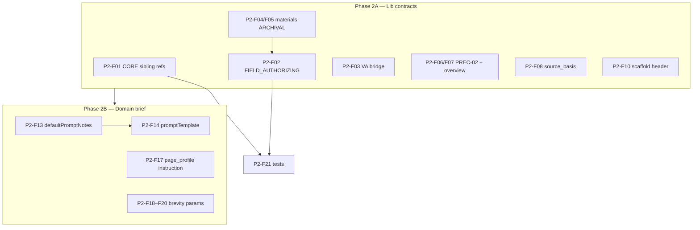

# Sprint 56C — Wave 1 Phase 2 Ownership-Residue Analysis

**Sprint:** 56C — Design Page Migration Execution  
**Wave:** 1 — Phase 2 (contract / ownership language)  
**Date:** 2026-07-06  
**Status:** Analysis only — **no implementation**

**References:** [Wave 1 Cleanup Analysis](SPRINT-56C-WAVE-1-ARCHITECTURE-CLEANUP-ANALYSIS.md) · [Phase 1 Impact Analysis](SPRINT-56C-WAVE-1-PHASE-1-IMPACT-ANALYSIS.md) · [Phase 1 Execution Report](SPRINT-56C-WAVE-1-PHASE-1-EXECUTION-REPORT.md) · [CP-4 Brief](../2026-07-06-sprint-56b-design-page-migration-planning/SPRINT-56B-CP-4-ARCHITECTURE-APPROVAL-BRIEF.md) · [Guardrails §A](../2026-07-06-sprint-56b-design-page-migration-planning/SPRINT-56B-ARCHITECTURE-GUARDRAILS.md)

---

## Executive summary

Phase 1 removed **runtime injection** of wrapper modules, VA, and EQF. Phase 2 must remove **ownership language** that still tells the model Design Page is an **authoring stage** for wrapper narrative, knowledge summaries, study tips, and VA metadata.

**Primary residue loci:** `ld-design-page-compose-contract.js` (CORE_LINES, FIELD_AUTHORIZING, MATERIALS_BRIDGE), `ld-materials-copy.js` (ARCHIVAL_FIELD_LINES, PRESERVE tail), `ld-guided-learning-scaffold.js` (composeOnly header), domain §13 `defaultPromptNotes` / `promptTemplate`, workflow brief mappings for `tone_style` / `depth_level` / `output_density`.

**Measured footprint (PRISM augment, learner DP path):** compose embed ≈ **26,525** chars + guided-scaffold compose ≈ **633** chars ≈ **27,158** chars (materials-copy + table-fidelity embedded in compose).

**Estimated Phase 2 contract shrinkage:** **~1,200–1,800 chars (~4–7%)** from lib contract edits; **larger ownership-alignment gain** from eliminating conflicting authorable mandates (qualitative).

**Recommendation:** Execute Phase 2 as **two batches** — **2A lib contracts** (compose + materials-copy + guided scaffold) then **2B domain brief surface** (defaultPromptNotes, mappingRules, learner `promptInstruction`) — before Phase 3 schema/post-compose work.

---

## 1. Phase 2 candidate inventory

| ID | Location | Wave 1 finding | Issue |
| -- | -------- | -------------- | ----- |
| **P2-F01** | `lib/ld-design-page-compose-contract.js` — `CORE_LINES` L30 | F22 | Mandates obey removed siblings: JOURNEY-ASSIMILATION, AUTHORIAL-EXPOSITION, SELF-DIRECTED-RHETORIC, Sprint 38 visual |
| **P2-F02** | `lib/ld-design-page-compose-contract.js` — `FIELD_AUTHORIZING_LINES` L69–70 | F06 | `knowledge_summary`, `study_tips`, `visual_affordance descriptions`, wrapper prose **authorable** |
| **P2-F03** | `lib/ld-design-page-compose-contract.js` — `MATERIALS_BRIDGE_LINES` L74–75 | F33 | `visual_affordances[]` additive metadata; representation_avoid on figures |
| **P2-F04** | `lib/ld-materials-copy.js` — `ARCHIVAL_FIELD_LINES` L51–61 | F05 | Full **authorable narrative** list + “coherent learner journey may be authored only here” |
| **P2-F05** | `lib/ld-materials-copy.js` — `ARCHIVAL_FIELD_LINES` L60 | F05 | “Page may interpret, connect, and explain materials in narrative fields” |
| **P2-F06** | `lib/ld-materials-copy.js` — `CORE_LINES` L30 | F05 | PREC-02: materials override “overview/**synthesis prose**” — implies DP synthesis role |
| **P2-F07** | `lib/ld-materials-copy.js` — `PRESERVE_LINES` L157 | F05 | “substantive session **overview** in overview/learning_purpose” — authoring mandate |
| **P2-F08** | `lib/ld-materials-copy.js` — `PRESERVE_LINES` L159 | F34 | `source_basis` paths in `visual_affordances` |
| **P2-F09** | `lib/ld-materials-copy.js` — `PRESERVE_LINES` L144 | F40 adjacent | “Readable page assembly applies to section structure… **wrapper prose only**” — retain but clarify transport |
| **P2-F10** | `lib/ld-guided-learning-scaffold.js` — composeOnly L224 | F22 | References `LD-AUTHORIAL-EXPOSITION PRESERVATION BOUNDARY` (removed module) |
| **P2-F11** | `lib/ld-guided-learning-scaffold.js` — `TRANSITION_LINES` L148–151 | F14 | Wrapper transition synthesis into overview/study_tips — **not on DP composeOnly path**; retain for DLA |
| **P2-F12** | `lib/ld-table-fidelity.js` — `CORE_LINES` L25 | F36 | L6 “visual affordance metadata” in precedence stack on DP embed |
| **P2-F13** | `domains/.../domain-learning-design-step-patterns.md` §13 `defaultPromptNotes` | F24 | Mandates LD-JOURNEY-ASSIMILATION, LD-SELF-DIRECTED-RHETORIC, Sprint 38 schema 38.4 |
| **P2-F14** | Domain §13 `promptTemplate` | F07 | `knowledge_summary when LC/KM bound`; runtime obey JOURNEY/RHETORIC/VA contract |
| **P2-F15** | Domain §13 `runnerInstructions.what_to_check` | F35 | Mandatory `visual_affordance_schema_version` 38.4, VA arrays |
| **P2-F16** | Domain §13 `defaultOutputStructure.keys` | F35 | VA root keys in required structure |
| **P2-F17** | Domain §13 `userOptions.page_profile` learner `promptInstruction` | F07 | “substantive session **overview**” — authoring pressure |
| **P2-F18** | Domain `workflowBriefConfig` — `stepParameterControls` `tone_style`, `depth_level` on `step_design_page` | F37, F38 | R-78, R-79 brevity-shaping params |
| **P2-F19** | Domain `mappingRules` — `tone_style`, `depth_level`, `output_density` → `stepParams.step_design_page.*` | F37–F39 | R-80 conflicts with R-22 |
| **P2-F20** | `app.js` — `resolveDesignPageRefinementProfile` | F39 | Elicitation path for design_page refinement |
| **P2-F21** | `tests/ld-design-page-compose-contract.test.js` | F44 | Asserts sibling references and authorable pointer |

**Explicitly retain (not Phase 2 removal):**

| ID | Item | Rationale |
| -- | ---- | --------- |
| **R-01** | Materials preservation blocks (F40) | R-22; guardrails Preservation First |
| **R-02** | Field preservation list | Layer 1–2 transport |
| **R-03** | Membership / activities_omitted | Layer 2 organisation |
| **R-04** | Episode plans portable schema | Layer 2 transport |
| **R-05** | Guided-scaffold `COMPOSE_LINES` (verbatim copy) | Activity-row preservation |
| **R-06** | `knowledge_summary` section slot (organisational) | R-70 — transport-or-omit |

---

## 2. Ownership assessment

| ID | Original responsibility | Current behaviour | Target behaviour | CP-4 | Guardrail |
| -- | ---------------------- | ----------------- | ---------------- | ---- | --------- |
| P2-F01 | Triple stack + VA compose siblings | Compose header cites modules Phase 1 no longer appends | Cite **LD-MATERIALS-COPY**, **LD-TABLE-FIDELITY**, **LD-MATH-RENDER**, compose contract only | D6 | §A no wrapper stack |
| P2-F02 | R-39 knowledge authoring; R-41 study tips | Declares wrapper sections **authorable** | **Transport-or-omit** for `knowledge_summary`; thin assembly for overview/purpose; no study-tip synthesis | D2; OQ-17 | §A no synthesis |
| P2-F03 | R-56–R59 VA on DP | VA metadata bridge in compose | Remove generative VA obligation; passive carry only if Phase 3 allows | OQ-13–16 | §A no generative VA |
| P2-F04–F05 | R-39; meta-authoring | materials-copy defines DP as narrative author | Archival vs **transport** slots; no “journey authored only here” | OQ-17 | §A |
| P2-F06 | Competing precedence | “Synthesis prose” framing | Precedence vs **wrapper transport slots** only | D6 | Preservation First |
| P2-F07 | R-43 overview authoring | Substantive overview mandate | Overview = thin assembly-coherence or upstream transport | D6; R-40 | §A |
| P2-F08 | R-59 source_basis | VA cite-without-embed hint | Remove from materials-copy default path | OQ-15 | §A |
| P2-F09 | R-43 authorial boundary | Scaffold cites removed module | Cite compose field preservation only | D6 | §A |
| P2-F10 | R-41 wrapper transitions | On DLA full block only | No change for DLA; verify DP composeOnly excludes | Assembly-Time Test | §A |
| P2-F11–F12 | L6 VA layer | Table precedence mentions VA | Optional neutral wording (“presentation metadata”) or retain as non-DP-generative | OQ-13 | Low risk |
| P2-F13–F17 | Domain authoring | Copilot template mandates removed modules / VA / substantive overview | Align with frozen architecture; transport-first language | D6; OQ-17 | §A |
| P2-F18–F20 | R-78–R-80 | Brief params shape DP content density | Detach from `step_design_page` or remove | D7 | §A no brevity shaping |
| P2-F21 | Governance | Tests enforce pre-Phase-1 contract | Update in Phase 2 execution or Phase 4 batch | — | Checklist §B |

---

## 3. Removal classification

| Class | Meaning | Findings |
| ----- | ------- | -------- |
| **A — Remove completely** | Delete obligation; no replacement on DP | P2-F01 (sibling refs), P2-F03 (VA bridge), P2-F08 (source_basis), P2-F18–F20 (brevity params on DP), P2-F13 partial (JOURNEY/RHETORIC/38.4 mandates in notes) |
| **B — Rewrite as transport-only** | Slot may exist; substance from upstream or omit | P2-F02, P2-F04–F07, P2-F09, P2-F10, P2-F14 (knowledge_summary), P2-F17 |
| **C — Relocate upstream** | Ownership documented; not DP contract text | Knowledge substance → LC/KM; study-tip bodies → GAM (already architecture; Phase 2 text only) |
| **D — Retain** | Approved architecture | R-01–R-06; P2-F11 (DLA-only); P2-F12 (optional neutral); materials preservation lines |

---

## 4. Prompt footprint analysis

### 4.1 Current Design Page contract footprint (post–Phase 1)

| Component | Approx. size | Ownership character |
| --------- | ------------ | ------------------- |
| `LD-DESIGN-PAGE-COMPOSE-CONTRACT` + embedded L4 | **26,525** chars | Mixed: ~85% preservation/transport; ~10% authorable narrative; ~5% stale sibling/VA refs |
| `LD-GUIDED-LEARNING-SCAFFOLD` composeOnly | **633** chars | Mostly preservation; 1 stale authorial ref |
| Domain `promptTemplate` (§13) | **~4,500** chars (est.) | Copilot-visible; mandates JOURNEY/RHETORIC/VA/knowledge_summary |
| Brief param injection (`tone_style`, `depth_level`) | Variable | Content-shaping when mapped |

*Measurement: Node `buildLdDesignPageComposePromptBlock` with preserve-role materials-copy + table-fidelity embed, 2026-07-06.*

### 4.2 Largest remaining ownership contributors (by conflict severity)

| Rank | Contributor | IDs | Why it matters |
| ---- | ----------- | --- | -------------- |
| 1 | materials-copy **ARCHIVAL_FIELD_LINES** authorable list | P2-F04, F05 | Directly contradicts OQ-17 transport-or-omit |
| 2 | compose **FIELD_AUTHORIZING_LINES** | P2-F02 | Duplicates and reinforces authorable mandate |
| 3 | Domain §13 **defaultPromptNotes** + **promptTemplate** | P2-F13, F14 | Copilot may follow without PRISM blocks |
| 4 | compose **CORE_LINES** sibling mandate | P2-F01 | Contradicts Phase 1; confuses model |
| 5 | Brief **brevity params** on step_design_page | P2-F18–F20 | R-78–R-80 vs R-22 |

### 4.3 Expected reduction after Phase 2

| Layer | Current | After Phase 2 (est.) | Δ |
| ----- | ------- | -------------------- | - |
| Lib compose + materials embed | ~26,525 chars | ~24,800–25,300 chars | **~4–7%** |
| Guided scaffold compose | ~633 chars | ~580 chars | ~8% |
| **Conflicting ownership instructions** | ~15–20 distinct mandates | **~3–5** (transport slots + thin assembly) | **~70–80%** conflict reduction |
| Domain template (if 2B included) | mandates 4 removed modules/paths | transport-first wording | Qualitative alignment |

Phase 2 does **not** materially shrink preservation blocks (correct — F40 retained).

---

## 5. Dependency analysis

| Dependency | Detail |
| ---------- | ------ |
| **P2-F04 ↔ P2-F02** | Authorable narrative must be rewritten **consistently** in compose + materials-copy (RC-12 + RC-10) |
| **P2-F01 before tests** | `ld-design-page-compose-contract.test.js` fails if siblings removed without test update |
| **2A before 2B** | Lib contract is PRISM truth; domain should reference updated module list |
| **P2-F18–F20 independent** | Can ship in 2B without lib changes |
| **P2-F15–F16 deferred** | Mandatory VA keys = **Phase 3** (RC-11); note in Phase 2 doc only |
| **P2-F11 safe** | DP uses `composeOnly: true` — `TRANSITION_LINES` not appended; no DP change required |

### Safe batching

| Batch | Items | Risk |
| ----- | ----- | ---- |
| **2A** | P2-F01–F10 (lib) | Low–medium; single PR; preservation untouched |
| **2B** | P2-F13, F14, F17, F18–F20 | Medium; domain JSON edit discipline |
| **Defer 3** | P2-F15, F16, post-compose VA | High coupling |

---

## 6. Proposed Phase 2 change set

### Package 2A — Lib contract ownership alignment (RC-06, RC-08, RC-10, RC-12)

| Item | Rationale | Files | Expected impact | Validation |
| ---- | --------- | ----- | --------------- | ---------- |
| **P2-01** Rewrite `CORE_LINES` module list | Remove stale siblings; list active L4/L7 modules only | `lib/ld-design-page-compose-contract.js` | Eliminates F22 contradiction | Compose contract tests updated |
| **P2-02** Replace `FIELD_AUTHORIZING_LINES` | Transport-or-omit for `knowledge_summary`; organisational slots; no study-tip synthesis | Same | OQ-17 compliance on text | Checklist §B knowledge/study-tip |
| **P2-03** Narrow `MATERIALS_BRIDGE_LINES` | Drop VA generative bridge; materials verbatim only | Same | OQ-13 text alignment | No VA prompt regression (already off) |
| **P2-04** Rewrite `ARCHIVAL_FIELD_LINES` in materials-copy | Transport vs archival; remove “authored only here” | `lib/ld-materials-copy.js` | Highest ownership win | materials-copy / fidelity tests |
| **P2-05** Adjust PREC-02 and PRESERVE tail | Remove synthesis/overview authoring; keep F40 preservation | Same | Clarifies precedence | F40 spot-check in gate test |
| **P2-06** Remove `source_basis` / VA line from PRESERVE | R-59 default path | Same | VA text gone from L4 | — |
| **P2-07** Update guided-scaffold composeOnly header | Remove AUTHORIAL-EXPOSITION ref; cite compose preservation | `lib/ld-guided-learning-scaffold.js` | F22 spill removed | Scaffold compose test if any |
| **P2-08** Update compose contract tests | Reflect transport-first contract | `tests/ld-design-page-compose-contract.test.js` | Phase 4 partial | `node --test` |

### Package 2B — Domain brief surface (RC-07, partial RC-11)

| Item | Rationale | Files | Expected impact | Validation |
| ---- | --------- | ----- | --------------- | ---------- |
| **P2-09** Rewrite §13 `defaultPromptNotes` | Remove JOURNEY/RHETORIC/38.4 mandates; cite compose + transport | `domain-learning-design-step-patterns.md` | Copilot alignment | Domain template grep |
| **P2-10** Rewrite §13 `promptTemplate` obligations | Transport-first; knowledge_summary transport-or-omit; drop VA contract obey | Same | Reduces dual-path confusion | Manual template review |
| **P2-11** Narrow learner `page_profile` promptInstruction | De-emphasise “substantive overview” authoring | Same §13 userOptions | Less authoring pressure | — |
| **P2-12** Detach brevity params from `step_design_page` | R-78–R-80 off DP | `mappingRules`; `stepParameterControls` for tone/depth | Removes optimisation channel | Brief resolution test |
| **P2-13** Review `resolveDesignPageRefinementProfile` usage | Ensure no DP content-shaping elicitation | `app.js` (read-only scope check in 2B) | F39 | Workflow brief test |

**Not in Phase 2 scope (Phase 3):** P2-F15, P2-F16 (`defaultOutputStructure`, `what_to_check` mandatory VA keys), `applySprint38VisualAffordancesToComposedPage`.

### Suggested rewrite anchors (2A)

**FIELD_AUTHORIZING (target sketch):**

> `knowledge_summary` — transport upstream body when LC/KM provides one; **omit** section when none. `overview` / `learning_purpose` — thin assembly-coherence only (R-40). `study_tips` — transport upstream closure/debrief bodies only; no synthesis from GAM signals. `activity.materials.*` — archival verbatim copy only.

**CORE_LINES (target sketch):**

> Obey appended **LD-MATERIALS-COPY**, **LD-TABLE-FIDELITY**, **LD-MATH-RENDER**, and **LD-GUIDED-LEARNING-SCAFFOLD** compose preservation — bodies not repeated here.

---

## 7. Shrinkage assessment

| Dimension | Phase 1 effect | Phase 2 expected effect |
| --------- | -------------- | --------------------- |
| **Prompt surface area (chars)** | Large (−5 modules) | Small (−4–7% lib embed) |
| **Ownership surface area** | ~36% prompt violations removed | **~70–80%** of remaining *conflicting* mandates removed |
| **Contract complexity** | Same text, fewer injectors | **Simpler obligation graph** — single transport identity |
| **Architecture alignment** | Partial W1.2–W1.6 augment | **Text aligned** with CP-4 for wrapper/knowledge/VA/brevity |
| **Wave 1 exit** | Not met | **Partial** — checklist §B items 1–3, 6, 9 improve; §C still Phase 3 |

Phase 2 is **not** primarily a size-reduction sprint; it is an **ownership-correction** sprint. Preservation blocks intentionally remain the majority of compose bulk.

---

## 8. Execution recommendation

### **Proceed with Phase 2 in two batches (2A then 2B)**

**Rationale**

1. **2A is the highest-risk ownership residue** — materials-copy “authorable only here” actively contradicts Phase 1 and OQ-17 even when wrapper modules are gated.
2. **2A and 2B are separable** — lib changes testable in Prism; domain changes affect Copilot template parity.
3. **Do not merge Phase 3** (VA schema keys, post-compose) into Phase 2 — avoids partial VA programme.
4. **Update tests in 2A** (minimal — compose contract tests only); defer journey/EQF legacy tests to Phase 4 unless needed for CI green.

**Pre-execution checklist**

| # | Gate |
| - | ---- |
| 1 | Phase 1 gate tests green (`sprint-56c-wave1-phase1-gates.test.js`) |
| 2 | F40 preservation lines explicitly diff-reviewed (no accidental deletion) |
| 3 | 2A PR does not touch domain §13 `defaultOutputStructure` |
| 4 | Transport-or-omit wording reviewed against [OQ-17](../2026-07-06-sprint-56b-design-page-migration-planning/DESIGN-PAGE-OQ-17-KNOWLEDGE-SUMMARY-POLICY-REVIEW.md) |

**Success criteria (Phase 2 complete)**

| # | Criterion |
| - | --------- |
| 1 | No compose/materials text declares DP **authors** knowledge_summary or **synthesises** study_tips |
| 2 | No compose text mandates obeying Phase-1-removed modules |
| 3 | No brevity params mapped to `step_design_page` |
| 4 | Domain defaultPromptNotes/promptTemplate transport-first |
| 5 | F40 preservation language unchanged in substance |
| 6 | `sprint-56c-wave1-phase1-gates.test.js` still passes |

---

## 9. Phase 2 → Phase 3 handoff

| Remaining after Phase 2 | Phase |
| ----------------------- | ----- |
| Mandatory VA output keys (`defaultOutputStructure`, `what_to_check`) | 3 |
| Post-compose `applySprint38VisualAffordancesToComposedPage` | 3 |
| Legacy workflow tests (journey, authorial, EQF on DP) | 4 |
| DEPRECATION-REGISTER | 4 |

---

## Document control

| Field | Value |
| ----- | ----- |
| File | `SPRINT-56C-WAVE-1-PHASE-2-ANALYSIS.md` |
| Implementation | **None** |
