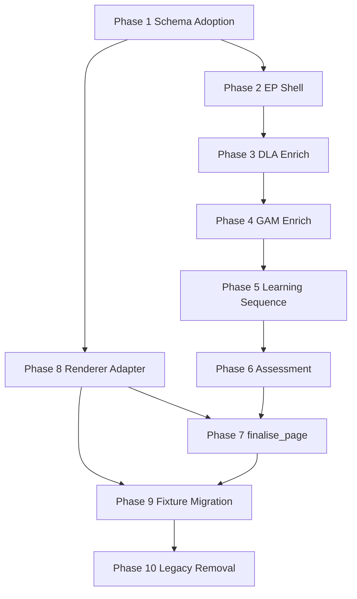

# Sprint 56F Implementation Plan

**Status:** Implementation planning (architecture and schema frozen)  
**Schema:** `design-page.schema.vNext.json` (`schema_version: "2.0.0"`)  
**Date:** 2026-07-07  
**Prerequisite docs:** [design-page-schema-freeze-signoff.md](design-page-schema-freeze-signoff.md), [ownership-matrix-vnext.md](ownership-matrix-vnext.md), [progressive-enrichment-architecture.md](progressive-enrichment-architecture.md)

---

## Executive summary

Current PRISM assembles page JSON at **Design Page** (`step_design_page`) via LLM compose, then **deterministically repairs** on capture (`applyPageCompositionValidationForCapturedPage` → GAM overlay, episode plan injection, activity closure). GAM emits **pack text**, not page JSON. Episode Plan emits **`episode_plans` only** (deterministic derive), not a page shell. **`finalise_page` does not exist** in code.

Implementation restructures the pipeline so each stage **enriches one `page` artefact in place**. Design Page merge is retired last, after renderer adapter and per-stage enrichment are proven.

### Recommended implementation order

```
1. Phase 1  — Schema adoption (loaders, validators, docs, CI hooks)
2. Phase 8  — Renderer compatibility layer (dual-read before cutover)
3. Phase 2  — Episode Plan page shell
4. Phase 3  — DLA enrichment into activities[]
5. Phase 4  — GAM enrichment into materials[]
6. Phase 5  — Learning Sequence enrichment
7. Phase 6  — Assessment enrichment
8. Phase 7  — finalise_page step
9. Phase 9  — Fixture migration
10. Phase 10 — Legacy removal (Design Page merge, sections[], object-map materials)
```

Phases 8 early placement is intentional: renderer must accept vNext pages before workflow cutover; mixed fixtures unblock incremental testing.

---

## Task index

| ID | Phase | Task | Order |
|----|-------|------|-------|
| T-01 | 1 | Promote vNext schema to runtime path | 1 |
| T-02 | 1 | Add `schema_version` detection helper | 1 |
| T-03 | 1 | Stage-subset schema stubs (EP/DLA/GAM/LS/FP) | 2 |
| T-04 | 1 | Update domain artefact docs | 2 |
| T-05 | 1 | Extend closure validators for vNext shape | 3 |
| T-06 | 8 | `normalizePageForRender()` adapter | 4 |
| T-07 | 8 | `getPageSectionsForRender` vNext synthesis | 4 |
| T-08 | 8 | `extractLearningActivityRowsFromPage` top-level path | 4 |
| T-09 | 8 | `normalizeActivityMaterialsForRender` array support | 5 |
| T-10 | 2 | `createPageShellFromEpisodePlan()` | 6 |
| T-11 | 2 | EP capture emits page + episode_plans | 6 |
| T-12 | 2 | Workflow binding: pass `page` forward | 7 |
| T-13 | 3 | DLA enrich-in-place contract + prompt | 8 |
| T-14 | 3 | DLA capture merge into `page.activities[]` | 8 |
| T-15 | 4 | GAM JSON output contract | 9 |
| T-16 | 4 | `enrichPageMaterialsFromGam()` | 9 |
| T-17 | 5 | LS enrich-in-place contract | 10 |
| T-18 | 6 | Assessment → `assessment_check` enrich | 11 |
| T-19 | 7 | `step_finalise_page` + transport/gap-fill | 12 |
| T-20 | 9 | Fixture transform scripts | 13 |
| T-21 | 10 | Retire Design Page step + compose contracts | 14 |

---

## Phase 1 — Schema Adoption

### Purpose

Wire frozen `design-page.schema.vNext.json` into the repo as the authoritative page contract; extend existing closure validators to understand vNext shape without requiring JSON Schema runtime (no Ajv today).

### Current state

| Asset | Location | Notes |
|-------|----------|-------|
| 56E schema (superseded) | `docs/.../56e-design-page-minimal-refactor/design-page.schema.json` | `sections[]` model; no `schema_version` |
| vNext schema (frozen) | `docs/.../56f-.../design-page.schema.vNext.json` | Not loaded at runtime |
| Page validation | `lib/page-gam-materials-preserve.js`, `lib/page-activity-field-preserve.js`, `lib/workflow-page-capture-normalize.js` | Contract-based; assumes `sections[]` |
| Capture normalize | `lib/workflow-page-capture-normalize.js` | Checks `artifact_type === "page"` only |
| Domain spec | `domains/learning-design/domain-learning-design-artefacts.md` §18 | Legacy `sections[]` page model |
| Step output keys | `domains/learning-design/domain-learning-design-step-patterns.md` §13 Design Page | `sections[]` in `defaultOutputStructure` |

**No CI workflow exists** (no `.github/`). Tests run via `node --test tests/*.test.js`.

### Tasks

#### T-01 — Promote vNext schema to runtime path

| | |
|---|---|
| **Purpose** | Single authoritative schema file for tooling and docs |
| **Files** | Copy or symlink `design-page.schema.vNext.json` → `lib/schemas/design-page.schema.2.0.0.json`; update `design-page-schema-freeze-signoff.md` path |
| **Dependencies** | None |
| **Migration risks** | Duplicate schema paths during transition — document 56E as archived |
| **Tests** | `tests/schema-page-vnext.test.js` (new): parse schema, assert required top-level keys |
| **Order** | 1 |

#### T-02 — `schema_version` detection helper

| | |
|---|---|
| **Purpose** | Branch renderer/validators between legacy and vNext |
| **Files** | New `lib/page-schema-version.js`: `getPageSchemaVersion(page)`, `isVNextPage(page)`, `isLegacyPage(page)` |
| **Dependencies** | T-01 |
| **Migration risks** | Pages without `schema_version` must be treated as legacy |
| **Tests** | Unit tests for version detection and missing-field fallback |
| **Order** | 1 |

#### T-03 — Per-stage subset schemas (documentation + validation stubs)

| | |
|---|---|
| **Purpose** | Enforce "structure correct at each enrichment boundary" |
| **Files** | New `lib/schemas/page-shell.schema.json`, `page-post-dla.schema.json`, `page-post-gam.schema.json`, `page-post-sequence.schema.json`, `page-post-finalise.schema.json` — JSON Schema `$ref` to vNext defs |
| **Dependencies** | T-01 |
| **Migration risks** | Over-strict stage gates block partial pages during dev — use warn-first mode |
| **Tests** | Fixture snapshots per boundary in `docs/.../56f/test-fixtures/` |
| **Order** | 2 |

#### T-04 — Update domain artefact docs

| | |
|---|---|
| **Purpose** | Align human contract with frozen schema |
| **Files** | `domains/learning-design/domain-learning-design-artefacts.md` §18 (page), §5 (learning_activities), §6 (activity_materials); `docs/development/prompt-contracts/DEPRECATION-REGISTER.md` |
| **Dependencies** | T-01 |
| **Migration risks** | Prompt authors may reference old §18 during transition |
| **Tests** | Doc review checklist only |
| **Order** | 2 |

#### T-05 — Extend closure validators for vNext shape

| | |
|---|---|
| **Purpose** | Existing fidelity validators must read top-level `activities[]` and `materials[]` |
| **Files** | `lib/page-gam-materials-preserve.js` (`findLearningActivitiesRows` → also `page.activities`); `lib/page-activity-field-preserve.js`; `lib/beat-material-registry.js`; `app.js` `validatePageActivityClosure`, `validatePageMaterialsClosureFromLib`, `validatePageEpisodePlansClosure` |
| **Dependencies** | T-02 |
| **Migration risks** | Dual-path logic until legacy removal — test both shapes |
| **Tests** | Extend `tests/page-38m-gam-preservation.test.js`, `tests/utility-page-composition-closure.test.js` with vNext-shaped inputs |
| **Order** | 3 |

#### T-06 — CI / test harness (optional but recommended)

| | |
|---|---|
| **Purpose** | Prevent schema drift |
| **Files** | `package.json` add `"test": "node --test tests/*.test.js"`; new `tests/sprint-56f-schema-adoption.test.js` |
| **Dependencies** | T-01, T-02 |
| **Migration risks** | None |
| **Tests** | Self |
| **Order** | 3 |

### Phase 1 exit criteria

- [ ] vNext schema at `lib/schemas/design-page.schema.2.0.0.json`
- [ ] `getPageSchemaVersion()` used by at least renderer adapter stub
- [ ] Domain artefact §18 describes vNext model
- [ ] Closure validators accept top-level `activities[]`

---

## Phase 2 — Episode Plan Shell

### Purpose

Episode Plan becomes the **first writer** of the `page` artefact: shell with `activity_id` slots, `episode_plans[]`, `assembly_state`, and provenance.

### Current page creation path

```
Profile metadata (workflow brief)
  → Design Episode Plan: deriveEpisodePlansFromLearningOutcomes() only
      app.js:8443 deriveDesignEpisodePlanCaptureJson()
      lib/episode-plan-dla-integration.js
      Output: { episode_plans: [...] } — NOT a page
  → DLA: { activities: [...] } separate artefact
  → GAM: pack text separate artefact
  → ... → Design Page: first page JSON
```

### Required shell structure (post-EP)

```json
{
  "artifact_type": "page",
  "schema_version": "2.0.0",
  "title": "",
  "audience": "<from profile>",
  "page_profile": { "profile_type": "learner" },
  "assembly_state": { "enriched_by": ["episode_plan"], "current_stage": "episode_plan" },
  "page_synthesis": {},
  "activities": [
    {
      "activity_id": "A1",
      "title": "<shell>",
      "episode_plan": { "archetype": "...", "beats": [{ "function": "..." }] },
      "required_materials": [],
      "materials": [],
      "learner_task": "",
      "expected_output": "",
      "activity_preamble": ""
    }
  ],
  "episode_plans": [{ "activity_id": "A1", "episode_plan": { ... } }],
  "learning_outcomes": [],
  "source_artefacts": [{ "artefact_type": "episode_plans", "role": "structural" }],
  "generation_notes": { "validation": { ... } }
}
```

Shell activities may carry empty DLA-required strings until DLA runs; stage-subset schema (T-03) validates EP boundary.

### Tasks

#### T-10 — `createPageShellFromEpisodePlan()`

| | |
|---|---|
| **Purpose** | Deterministic page shell from derived episode plans + profile |
| **Files** | New `lib/page-shell-create.js`; call from `lib/episode-plan-dla-integration.js` or `app.js` |
| **Dependencies** | T-01, T-02 |
| **Migration risks** | `activity_id` assignment must match existing derive logic (`A1`..`An`) — no LO remapping |
| **Tests** | `tests/page-shell-create.test.js`; compare against `deriveDesignEpisodePlanCaptureJson` output |
| **Order** | 6 |

#### T-11 — EP capture emits page

| | |
|---|---|
| **Purpose** | Episode Plan step output becomes `page` (or `page` + retains `episode_plans` top-level per OD-06) |
| **Files** | `app.js` `deriveDesignEpisodePlanCaptureJson`, `maybeAutoPopulateDesignEpisodePlanRunCapture`, `applyEpisodePlanCaptureCanonicalEnforcement` |
| **Dependencies** | T-10 |
| **Migration risks** | Downstream steps expect `episode_plans` artefact key — dual-key period or binding alias |
| **Tests** | Workflow integration test: EP capture parses as vNext page |
| **Order** | 6 |

#### T-12 — Workflow binding: pass `page` forward

| | |
|---|---|
| **Purpose** | DLA/GAM/LS bind to `page` not separate parallel artefacts |
| **Files** | `app.js` `ensureEpisodePlanInputBindingsForSteps`, `ensureDesignPageUpstreamBindingsForSteps`, `resolveEffectiveInputBindingsForPromptStep`; `domains/learning-design/domain-learning-design-step-patterns.md` binding definitions |
| **Dependencies** | T-11 |
| **Migration risks** | Existing workflows reference `learning_activities` outputName — feature flag per workflow template |
| **Tests** | Binding resolution test: DLA receives page when flag on |
| **Order** | 7 |

### Phase 2 exit criteria

- [ ] EP run produces valid vNext page shell JSON
- [ ] `assembly_state.enriched_by` includes `"episode_plan"`
- [ ] `activity_id` slots stable and match `episode_plans[]`

---

## Phase 3 — DLA Enrichment

### Purpose

DLA writes pedagogy and `required_materials[]` into `page.activities[]` — no separate `learning_activities` artefact in vNext path.

### Current DLA outputs

| Field | Current location | vNext location |
|-------|------------------|----------------|
| `activities[]` / `content[]` | `learning_activities` artefact | `page.activities[]` |
| `activity_id`, `title` | DLA row | `page.activities[]` (title overwrite allowed until GAM) |
| `learner_task`, `expected_output` | DLA row | `page.activities[]` |
| `activity_preamble` | DLA row | `page.activities[]` |
| PEL orientation fields | DLA row | `page.activities[]` flat keys |
| Cognition fields | DLA row | `page.activities[]` flat keys |
| Cognition packs (conditional) | DLA row | flat: `misconception_claim`, `reconciliation_prompt`, `evidence_contrast`, `reasoning_revision_prompt`, `initial_position_prompt`, `revision_trigger`, `transformation_activity`, `source_to_application_prompt` |
| `required_materials[]` | DLA row | `page.activities[].required_materials[]` |
| `duration_minutes`, `grouping` | DLA row | `page.activities[]` |
| `mapped_learning_outcomes` / `learning_outcome_ids` | DLA row | `page.activities[].learning_outcome_ids` |
| `support_note` | DLA row | `page.activities[].support_note` (singular) |
| `episode_plan` on row | From EP upstream | Preserve from shell — DLA must not replan |

### Deprecated field mappings (reject on new emit)

| Legacy field | Action | Replacement |
|--------------|--------|-------------|
| `orienting_preamble` | Reject | `activity_preamble` |
| `activity_framing` | Reject | `activity_preamble` |
| `support_notes` (plural) | Reject | `support_note` |
| `facilitator_moves` | Reject | Not on page (facilitator profile only) |
| `pel_links` | Reject | PEL flat fields |
| `metacognition_checks[]` | Reject | `self_explanation_prompt` + materials |
| `confidence_checks[]` | Reject | checklist materials |
| `transfer_prompts[]` | Reject | `transfer_or_application_task` + `materials[].transfer_prompt` |
| `consolidation_prompts[]` | Reject | `materials[].consolidation_summary` |
| `reflection_prompts[]` | Reject | `materials[].reflection_prompt` |
| `journey_extensions` | Reject | Removed |
| `evidence_of_learning`, `feedback_guidance`, `success_criteria` on activity row | Reject | `assessment_check` |

### Tasks

#### T-13 — DLA enrich-in-place contract

| | |
|---|---|
| **Purpose** | Prompt instructs: read `page`, write owned fields only, return full `page` |
| **Files** | `domains/learning-design/domain-learning-design-step-patterns.md` DLA `promptTemplate`; `app.js` `applyEpisodePlanDlaPopulationPromptBlockToDraft`, `applyLdGuidedLearningScaffoldContractToDraft`; new `lib/ld-dla-page-enrich-contract.js` |
| **Dependencies** | T-12, T-04 |
| **Migration risks** | LLM may still emit separate `learning_activities` — capture normalizer must merge |
| **Tests** | Prompt contract test; external audit per 56F test strategy |
| **Order** | 8 |

#### T-14 — DLA capture merge into page

| | |
|---|---|
| **Purpose** | Deterministic post-capture: merge DLA output into `page.activities[]` by `activity_id` |
| **Files** | New `lib/page-dla-enrich.js`; `app.js` capture handler for DLA step (parallel to `applyPageCompositionValidationForCapturedPage` for DP) |
| **Dependencies** | T-13 |
| **Migration risks** | Must not overwrite EP `activity_id` or `episode_plan` |
| **Tests** | `tests/page-dla-enrich.test.js` using `tests/fixtures/dla/*.json` |
| **Order** | 8 |

### Phase 3 exit criteria

- [ ] DLA enriches `page.activities[]` with pedagogy + `required_materials[]`
- [ ] `assembly_state.enriched_by` appends `"dla"`
- [ ] No deprecated fields in vNext emit
- [ ] Field preservation tests pass (`lib/page-activity-field-preserve.js`)

---

## Phase 4 — GAM Enrichment

### Purpose

GAM writes `activities[].materials[]` with full `body` by exact `material_id` — write-once, no Design Page re-parse.

### Current material generation path

```
GAM step (step_generate_activity_materials)
  → Pack text: Activity ID / Material: / Content: blocks
  → lib/gam-output-format.js validates pack text (38S-GAM1)
  → Design Page LLM copies to activity.materials.<field_key> object-map
  → lib/page-gam-materials-preserve.js overlays on capture (applyComposedPageGamMaterialsPreserve)
```

### Object-map → array migration

| Legacy (`materials.text`, etc.) | vNext |
|----------------------------------|-------|
| Object key = role slug (`text`, `worked_example`, `checklist`) | Array entry with `material_id`, `material_type`, `title`, `body` |
| `pageFieldKeyForMaterial()` in preserve lib | `material_type` + `material_id` from DLA `required_materials` |
| Multiple keys per activity | Multiple array entries |

### `material_id` preservation requirements

1. `material_id` originates in DLA `required_materials[]` — immutable after DLA
2. GAM must emit one record per required material — exact ID match
3. Missing ID → structured failure (no inference from type/purpose)
4. `body` is full GAM content — no summarisation
5. After GAM stage, `materials[].body` is immutable

### Tasks

#### T-15 — GAM JSON output contract

| | |
|---|---|
| **Purpose** | GAM emits structured JSON enrichable into `page.activities[].materials[]` |
| **Files** | `lib/gam-output-format.js` (extend or v2 module); `domains/learning-design/domain-learning-design-step-patterns.md` GAM `promptTemplate`, `defaultOutputStructure`; `lib/ld-materials-copy.js` |
| **Dependencies** | T-14 |
| **Migration risks** | Pack text parsers still needed during transition for legacy workflows |
| **Tests** | Extend `tests/gam-output-format.test.js`; `tests/page-gam-materials-projection.test.js` |
| **Order** | 9 |

#### T-16 — `enrichPageMaterialsFromGam()`

| | |
|---|---|
| **Purpose** | Deterministic merge: GAM JSON → `page.activities[].materials[]` by `material_id` |
| **Files** | Refactor `lib/page-gam-materials-preserve.js` → split legacy overlay (`applyGamMaterialsToComposedPage`) from vNext `enrichPageMaterialsFromGam(page, gamMaterials)`; `app.js` GAM capture handler |
| **Dependencies** | T-15, T-05 |
| **Migration risks** | `pageFieldKeyForMaterial` slug logic must not replace `material_id` matching |
| **Tests** | `tests/page-gam-vnext-enrich.test.js`; HR Essentials path A1-M1..A6-M7 audit |
| **Order** | 9 |

### Phase 4 exit criteria

- [ ] GAM produces JSON material records with non-empty `body`
- [ ] `page.activities[].materials[]` populated by ID match
- [ ] `assembly_state.enriched_by` appends `"gam"`
- [ ] No object-map `materials.text` in vNext pages

---

## Phase 5 — Learning Sequence

### Purpose

Learning Sequence writes top-level `page.learning_sequence` — order, timeline, transitions.

### Current sequence generation

| Item | Current | vNext |
|------|---------|-------|
| Output artefact | `learning_sequence` standalone | Merge into `page.learning_sequence` |
| Producer | `step_construct_learning_sequence` | Same step, enrich-in-place |
| Key fields | `sequence_title`, `total_duration_minutes`, `timeline[]`, `ordered_activity_ids` (sometimes) | Top-level on page |
| Timeline ownership | LS step | `learning_sequence.timeline[]` — owner: LS |
| Transitions | `timeline[].transition_to_next` | Same — owner: LS |
| Activity membership | Must not add/remove activities | Unchanged |

### Tasks

#### T-17 — LS enrich-in-place

| | |
|---|---|
| **Purpose** | LS reads `page`, writes `learning_sequence`, returns `page` |
| **Files** | `domains/learning-design/domain-learning-design-step-patterns.md` LS prompt; new `lib/page-learning-sequence-enrich.js`; `app.js` LS capture handler |
| **Dependencies** | T-16 |
| **Migration risks** | LS prompt currently references separate `learning_activities` — bind to `page.activities` |
| **Tests** | `tests/sequencing-renderer-policy.test.js` with vNext page input; timeline round-trip |
| **Order** | 10 |

### Phase 5 exit criteria

- [ ] `page.learning_sequence.ordered_activity_ids` aligns with `page.activities[].activity_id`
- [ ] `timeline[].transition_to_next` owned by LS only
- [ ] `assembly_state.enriched_by` appends `"learning_sequence"`

---

## Phase 6 — Assessment

### Purpose

Assessment writes top-level `page.assessment_check` when assessment steps run.

### Current assessment path

```
step_design_assessment → assessment_blueprint (not on page)
step_generate_assessment_items → assessment_items { items[] }
Design Page → sections[].assessment_check.content { items[], feedback_guidance[] }
```

### vNext mapping

| Source | vNext target |
|--------|--------------|
| `assessment_items.items[]` | `page.assessment_check.items[]` |
| `item_id`, `prompt`, `options`, `expected_evidence`, `success_criteria` | Direct map |
| `feedback_guidance` | `page.assessment_check.feedback_guidance[]` |

### Tasks

#### T-18 — Assessment enrich-in-place

| | |
|---|---|
| **Purpose** | Assessment step writes `page.assessment_check` |
| **Files** | `domains/learning-design/domain-learning-design-step-patterns.md` assessment steps; new `lib/page-assessment-enrich.js`; `app.js` assessment capture handler |
| **Dependencies** | T-17 (or parallel if assessment branch independent) |
| **Migration risks** | Workflows without assessment must leave `assessment_check` absent |
| **Tests** | `tests/fixtures/page-render/ld-rna-hcv-assessment-page.json` migrated to vNext; render test |
| **Order** | 11 |

### Phase 6 exit criteria

- [ ] `assessment_check` at page top-level when items upstream exist
- [ ] No assessment content in `sections[]`
- [ ] `assembly_state.enriched_by` appends `"assessment"` when run

---

## Phase 7 — finalise_page

### Purpose

New workflow step — sole writer of `page_synthesis` and title gap-fill. **Not a merge step.**

### Current implementation (to retire from this responsibility)

| Current owner | Location | vNext disposition |
|---------------|----------|-------------------|
| Wrapper prose (overview, learning_purpose, study_tips) | Design Page LLM + `lib/ld-thin-assembly-coherence.js` | **Move to finalise_page** |
| knowledge_summary projection | Design Page transport | **Move to finalise_page** |
| GAM body copy | Design Page + `page-gam-materials-preserve.js` | **Already GAM** — remove from DP |
| Title derivation | Design Page | **finalise_page** if empty |
| Provenance append | Design Page | **finalise_page** per stage slice |

### Responsibilities to retain (from finalise-page-responsibility-definition.md)

- `page_synthesis.*` transport-first; capped gap-fill when absent
- `title` if empty after Profile/EP
- `source_artefacts` append
- `generation_notes` stage slice

### Responsibilities to remove (must not do)

- `activities[].materials[].body`
- DLA pedagogy fields
- `learning_sequence` facts
- `assessment_check.items[]`
- Activity membership / ID remapping
- Material body summarisation in wrapper slots

### Immutability verification

Implement `lib/finalise-page-guard.js`:

```javascript
// Before/after diff — hard fail if any of these paths mutate:
const IMMUTABLE_PREFIXES = [
  'activities',
  'learning_sequence',
  'assessment_check'
];
// materials[].body hash compare per material_id
```

Wire into capture handler and tests.

### Tasks

#### T-19 — `step_finalise_page`

| | |
|---|---|
| **Purpose** | Optional bounded step for page_synthesis |
| **Files** | New `lib/ld-finalise-page-contract.js`, `lib/finalise-page-enrich.js`, `lib/finalise-page-guard.js`; `domains/learning-design/domain-learning-design-step-patterns.md` new step; `app.js` step detection + augmentation |
| **Dependencies** | T-06 (renderer reads `page_synthesis`), T-16 |
| **Migration risks** | Overlap with DP during transition — run finalise only on vNext path |
| **Tests** | `tests/finalise-page-guard.test.js` — assert no mutation of activities/materials/sequence/assessment; transport verbatim test |
| **Order** | 12 |

### Phase 7 exit criteria

- [ ] `page_synthesis` populated by finalise_page only
- [ ] Guard tests pass: zero mutation of locked fields
- [ ] `assembly_state.enriched_by` appends `"finalise_page"` when run
- [ ] Valid to skip finalise when all synthesis slots pre-transported (OD-01)

---

## Phase 8 — Renderer Compatibility Layer

### Purpose

Temporary adapter so renderer accepts legacy `sections[]` + object-map materials **and** vNext `page_synthesis` + top-level `activities[]` + `materials[]` array.

### Design: `normalizePageForRender(page)`

New function in `app.js` (or `lib/page-render-normalize.js`):

```
normalizePageForRender(parsed)
  1. If isVNextPage(parsed):
       a. Synthesize sections[] from page_synthesis + activities + learning_sequence + assessment_check
       b. Convert activities[].materials[] arrays to object-map for existing render path (or branch array renderer)
  2. Else: legacy path unchanged
  3. Return normalized view (non-mutating clone)
```

### Affected renderer paths

| Function | Lines (app.js) | Change |
|----------|----------------|--------|
| `getPageSectionsForRender` | 30422–30449 | Prefer vNext synthesis from `page_synthesis` when `schema_version === "2.0.0"` |
| `utilityFindPageSectionContent` | 39730–39747 | Resolve `page_synthesis.*` before section scan |
| `extractLearningActivityRowsFromPage` | 39749–39760 | Read `parsed.activities` first when vNext |
| `buildJourneyCompassFromPage` | 39788–39869 | Overview from `page_synthesis.overview` |
| `normalizeActivityMaterialsForRender` | 31288–31385 | Accept `materials[]` array input |
| `collectActivityMaterialsByActivityId` | 31395–31447 | Skip `activity_materials` section when vNext |
| `resolveLearningActivityRowsForRender` | 34967–35039 | Top-level `activities[]` order |
| `applyPageCompositionValidationForUtilitiesPage` | 39627+ | Skip DP repair when vNext complete |
| `runUtilityPageExportPipeline` | 40070+ | Call `normalizePageForRender` at entry |

### Tasks

#### T-06–T-09 — Renderer adapter (see task index)

| | |
|---|---|
| **Purpose** | Dual-read without forking HTML render logic |
| **Files** | `app.js` renderer section; optional `lib/page-render-normalize.js` |
| **Dependencies** | T-02 |
| **Migration risks** | Double synthesis if both `sections[]` and `page_synthesis` present — vNext wins |
| **Tests** | All `tests/utility-*-page-render.test.js` pass on legacy; new `tests/page-render-vnext-adapter.test.js` with synthetic vNext fixture |
| **Order** | 4–5 (before workflow cutover) |

### Phase 8 exit criteria

- [ ] vNext page renders identically to equivalent legacy page (visual diff on migrated fixture)
- [ ] Mixed fixture (legacy sections + vNext activities) handled predictably
- [ ] Journey compass works from `page_synthesis.overview`

---

## Phase 9 — Fixture Migration

### Fixture categories

| Category | Path | Count | Migration |
|----------|------|-------|-----------|
| Page render regression | `tests/fixtures/page-render/*.json` | 38 | High priority |
| DLA captures | `tests/fixtures/dla/*.json` | 14 | Merge into page shell for enrich tests |
| Sprint GAM artefacts | `docs/.../artefacts/*-gam.json` | Many | Reference for GAM enrich tests |
| Sprint design-page artefacts | `docs/.../artefacts/*-design-page.json` | Many | Source for legacy→vNext transforms |
| 56F boundary fixtures | `docs/.../56f/test-fixtures/` | 0 (placeholder) | Create per enrichment boundary |

### Migration order

1. **Golden renders** — `marx-self-study-page.json`, `ld-inflation-workshop-page-full.json`
2. **Shape matrix** — `shape-*.json` (15 files)
3. **LD workshop pages** — inflation, climate, RNA
4. **Assessment pages** — `ld-rna-hcv-assessment-page.json`
5. **DLA-only fixtures** — wrap in page shell for unit tests
6. **Sprint doc artefacts** — batch transform for audit corpus

### Automated transforms

New `scripts/migrate-page-fixture-to-vnext.js`:

| Transform | Rule |
|-----------|------|
| `sections[].overview` etc. | → `page_synthesis.*` |
| `sections[].learning_activities.content` | → `activities[]` |
| `sections[].assessment_check` | → `assessment_check` |
| `sections[].learning_sequence` | → `learning_sequence` |
| `activity.materials` object-map | → `materials[]` via role registry inverse map |
| Add `schema_version: "2.0.0"` | Required |
| Add `assembly_state.enriched_by` | `["migrated_from_legacy"]` |
| Remove `sections[]` | After adapter verified |

### Manual review requirements

- Material body fidelity after object-map → array conversion
- `material_id` assignment where only slug keys existed
- Assessment item shape differences
- Pages with `visual_affordance_schema_version` (orthogonal — retain at root)
- Journey compass visual regression (screenshot/manual)

### Tasks

#### T-20 — Fixture migration

| | |
|---|---|
| **Purpose** | Test suite runs against vNext fixtures |
| **Files** | `scripts/migrate-page-fixture-to-vnext.js`; `docs/.../56f/test-fixtures/`; update test imports |
| **Dependencies** | T-06–T-09 |
| **Migration risks** | Automated transform may mis-assign `material_id` — manual review on golden fixtures |
| **Tests** | Pre/post render HTML diff; schema validation against vNext JSON Schema |
| **Order** | 13 |

---

## Phase 10 — Legacy Removal

### Purpose

Remove Design Page merge path and deprecated persistence once vNext pipeline passes full audit.

### Removal targets

| Asset | Location | Safe when |
|-------|----------|-----------|
| Design Page LLM step | `step_design_page` in domain pack + workflows | T-19 + full workflow green without DP |
| `applyLdDesignPageComposeContractToDraft` | `app.js` | No workflow uses DP |
| `lib/ld-design-page-compose-contract.js` | lib | Archived to docs |
| `lib/ld-thin-assembly-coherence.js` | lib | Logic absorbed into `ld-finalise-page-contract.js` |
| `applyPageCompositionValidationForCapturedPage` DP repair | `app.js` ~39525 | Replaced by per-stage enrich handlers |
| `applyComposedPageGamMaterialsPreserve` legacy overlay | `lib/page-gam-materials-preserve.js` | GAM writes directly to page |
| `repairLearnerPageCompositionFromUpstream` | `app.js` ~38499 | DLA enrich replaces |
| `sections[]` new writes | Prompts | finalise_page + adapter read-only for legacy |
| Object-map `materials.<slug>` | Prompts, preserve lib | GAM array only |
| GAM pack text canonical format | `lib/gam-output-format.js` | JSON canonical; pack text parser secondary |
| `scripts/thin-design-page-pack-template.js` | scripts | Retired |
| 56E schema | docs only | Already superseded |

### Tasks

#### T-21 — Legacy removal

| | |
|---|---|
| **Purpose** | Eliminate merge path |
| **Files** | See table above; `docs/development/prompt-contracts/DEPRECATION-REGISTER.md` |
| **Dependencies** | T-19, T-20, all prior phases green |
| **Migration risks** | Premature removal breaks legacy workflow templates — gate on workflow profile flag |
| **Tests** | Full `node --test tests/*.test.js`; external HR Essentials audit |
| **Order** | 14 |

### Phase 10 exit criteria

- [ ] No `step_design_page` in default LD workflow
- [ ] No LLM merge prompts in runtime augmentation chain
- [ ] New pages emit vNext only (no `sections[]` writes)
- [ ] Deprecation register updated

---

## Cross-cutting concerns

### Feature flag

Introduce `workflow.pageEnrichmentV2` (or per-template flag) to run vNext path alongside legacy until Phase 10.

### External validation (56F test strategy)

At each boundary, export page JSON and run audit checklist — PRISM does not post-validate workflow outputs. Commit boundary snapshots to `docs/.../56f/test-fixtures/`.

### ID policy (hard)

No `A*` ↔ `LO*` remapping at any stage. Validators fail closed.

### `visual_affordance_schema_version`

Orthogonal to page schema 2.0.0 — retain at page root; not part of vNext freeze but must not break.

---

## Dependency graph



---

## Risk register (implementation)

| Risk | Phase | Mitigation |
|------|-------|------------|
| LLM emits parallel artefacts instead of enriching page | 3–7 | Deterministic capture merge handlers per stage |
| `material_id` mismatch GAM vs DLA | 4 | Fail closed; pre-flight ID checklist in GAM prompt |
| Renderer regression on legacy fixtures | 8 | Adapter non-mutating; legacy path unchanged |
| Dual workflow maintenance fatigue | All | Feature flag; single template cutover |
| Incomplete finalise_page guard | 7 | Hash diff on immutable paths in tests |
| Pack text → JSON GAM transition | 4 | Parallel validation during transition |

---

## Related documents

- [design-page.schema.vNext.json](design-page.schema.vNext.json)
- [design-page-schema-vnext-freeze-proposal.md](design-page-schema-vnext-freeze-proposal.md)
- [finalise-page-responsibility-definition.md](finalise-page-responsibility-definition.md)
- [migration-plan.md](migration-plan.md)
- [test-strategy.md](test-strategy.md)
