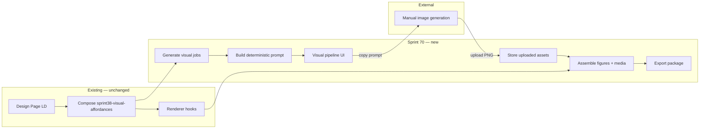

# Sprint 70 — Visual Affordance Pipeline Architecture

**Related:** [HANDOVER.md](HANDOVER.md) · [CONTEXT.md](CONTEXT.md) · Sprint 38 [ARCHITECTURE.md](../2026-06-03-sprint-38-pedagogical-visual-affordance-enrichment/ARCHITECTURE.md)

---

## Ownership split

```text
┌─────────────────────────────────────────────────────────────┐
│ PRISM (Sprint 70)                                           │
│  • affordance consumption (Sprint 38 schema)                │
│  • visual job generation                                    │
│  • deterministic prompt composition                         │
│  • filename assignment + asset tracking                     │
│  • figure insertion at renderer hooks                       │
│  • package assembly + export                                │
└─────────────────────────────────────────────────────────────┘
                              │
                              │ prompt (copy)     image (upload)
                              ▼                   ▲
┌─────────────────────────────────────────────────────────────┐
│ EXTERNAL (manual — Copilot, designer, etc.)                 │
│  • pixel generation only                                    │
└─────────────────────────────────────────────────────────────┘
```

---

## Pipeline diagram



---

## Visual job schema (proposed)

```json
{
  "affordance_id": "va-a2-mechanism-01",
  "activity_id": "A2",
  "visual_slot": "activity-after-header",
  "filename": "va-a2-mechanism-01.png",
  "prompt": "…deterministic text from affordance fields…",
  "caption": "…from caption_intent…",
  "alt": "…from must_show / must_not_show summary…",
  "visual_status": "pending | uploaded | removed",
  "requires_exact_data_match": false
}
```

One job per `visual_decision: generate` row that passes activity gate (`activities_visual_review` not `none` for that activity).

---

## Prompt builder inputs (from Sprint 38 generate contract)

Consume without LLM inference:

- `purpose`, `preferred_representation`, `reasoning_supported`
- `must_show`, `must_not_show`, `allowed_claims`, `disallowed_claims`
- `representation_avoid[]`, `source_basis`
- `caption_intent`, `anti_spoiler`, `spoiler_boundary`
- `requires_exact_data_match`, `tier`
- `pedagogical_added_value` (when present — 38-6)

Reference implementation target: extract logic from VEU v1.2.1 prompt patches (`scripts/build-veu-v121-json.js`, Sprint 38-5 §11).

**Deprecate:** “Illustrate the topic of {activity title}”.

---

## Figure insertion contract

Match existing VEU / renderer DOM rules:

```html
<figure class="util-figure util-figure--pedagogic" data-affordance-id="va-…">
  
  <figcaption>…caption_intent…</figcaption>
</figure>
```

- Insert at hook location replacing or adjacent to `.util-visual-affordance` hidden anchor.
- Do **not** place figures inside `.util-activity-header` (VEU embed rule — preserve).
- Use `media/` folder (Sprint 70 convention); VEU historically used `images/` — document migration in DECISIONS.

---

## Export package layout

```text
export-package/
├── index.html          # learner page with figures inserted
├── media/
│   ├── va-a2-mechanism-01.png
│   └── …
└── visual-manifest.json
```

### visual-manifest.json (proposed)

```json
{
  "schema_version": "70.1",
  "generated_at": "ISO-8601",
  "handover_mode": "authoritative",
  "jobs": [ "…visual job records…" ],
  "deferred_affordances": [],
  "rejected_affordances": [],
  "export_status": "complete | partial"
}
```

---

## Module layout (suggested)

| Module | Responsibility |
| ------ | -------------- |
| `lib/visual-affordance-pipeline/visual-job.js` | Job model, status transitions |
| `lib/visual-affordance-pipeline/build-visual-jobs.js` | Filter affordances → jobs |
| `lib/visual-affordance-pipeline/build-visual-prompt.js` | Deterministic prompt text |
| `lib/visual-affordance-pipeline/assign-filename.js` | Filename convention |
| `lib/visual-affordance-pipeline/assemble-visual-package.js` | HTML mutation + media copy |
| `lib/visual-affordance-pipeline/build-visual-manifest.js` | Manifest JSON |
| `app.js` (UI section) | Job list, copy/upload/replace/remove |

Node tests mirror each module. Browser bundle exposure TBD (follow existing `PRISM_*` pattern if UI needs in-browser assembly).

---

## Relationship to VEU

VEU v1.2.1 remains the **reference behaviour** for Step 1/2 semantics during Sprint 70 development. Sprint 70 **does not** patch or redesign the VEU bundle.

Long-term: Prism pipeline may supersede VEU for authors who work entirely in-app; VEU can remain for legacy/HTML-only workflows.

---

## Non-goals (architecture)

- No base64 `` in export.
- No provider abstraction layer.
- No automatic Copilot session orchestration.
- No changes to Sprint 38 affordance validation rules or renderer hook placement enum.
