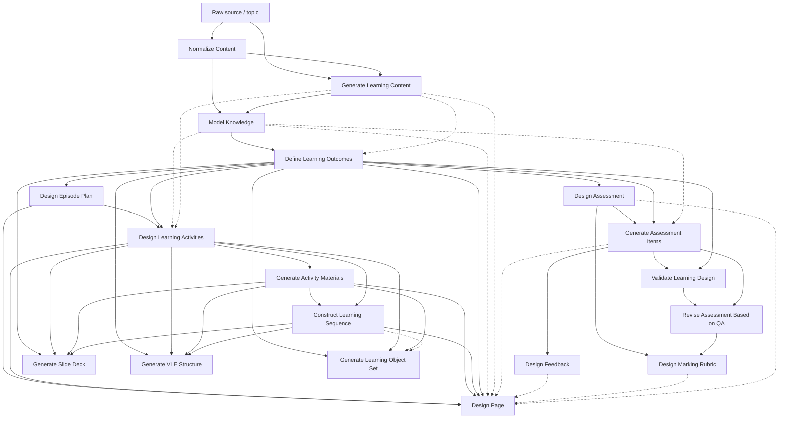

# Learning Design Pipeline — Attribution Map

**Preferred Sprint 71 artefact path:** `learning-design-pipeline-attribution-map.md`  
**Purpose:** Attribute QA findings to the correct canonical Learning Design stage.  
**Source authority:** Domain Pack — `domains/domain-manifest.json` · `domains/learning-design/domain-learning-design-step-patterns.md` · `domains/learning-design/domain-learning-design-artefacts.md`  
**Sprint:** Formal Sprint 71 artefact (populated from Sprint 70 close architecture summary, 2026-07-30)  
**Scope:** Learning Design generation pipeline only (not Research pack; not prompt wording critique)

**Also see:** [CONTEXT.md](CONTEXT.md) for Design Page vs assembly/renderer attribution rules.

---

## Canonical learner-page spine

```text
Generate Learning Content
→ Model Knowledge
→ Define Learning Outcomes
→ Design Episode Plan
→ Design Learning Activities
→ Generate Activity Materials
→ Construct Learning Sequence
→ Design Page
```

---

## Pipeline diagram



Solid = primary/required path. Dotted = optional or alternate inputs.

---

## Stage summary (for attribution)

| Prompt | Output class | Primary downstream |
| ------ | ------------ | ------------------ |
| Normalize Content | Intermediate | GLC; Model Knowledge |
| Generate Learning Content | Intermediate (+ learner when reused) | Model Knowledge; Design Page; optionally LO/DLA/Assessment |
| Model Knowledge | Planning | Define LO; Design Page; optionally DLA/Assessment/Items/Feedback |
| Define Learning Outcomes | Planning | Episode Plan; DLA; Assessment; Items; Design Page; Slide/VLE/LOS; Validate |
| Design Episode Plan | Planning (+ page shell) | DLA; Design Page |
| Design Learning Activities | Intermediate (+ learner scaffold copy) | GAM; Learning Sequence; Design Page; Slide/VLE/LOS |
| Generate Activity Materials | Learner (material bodies) | Learning Sequence; Design Page; Slide/VLE/LOS |
| Construct Learning Sequence | Intermediate / orchestration | Design Page; Slide; VLE; optionally LOS |
| Design Page | Learner (title, orientation/`page_synthesis`, visual-planning metadata — **not** automatic ownership of all assembly losses) | Terminal prompt for wrapper fields; deterministic assembly is a separate responsibility |
| Design Assessment | Planning | Generate Assessment Items; Marking Rubric |
| Generate Assessment Items | Learner (+ intermediate keys) | Feedback; Validate; Revise; optionally Design Page |
| Design Feedback | Intermediate (+ learner when surfaced) | Design Page (optional) |
| Validate Learning Design | Planning | Revise Assessment |
| Revise Assessment Based on QA | Intermediate | Marking Rubric; optionally Design Page |
| Design Marking Rubric | Intermediate (tutor) | Design Page (optional) |
| Generate Slide Deck / VLE Structure / Learning Object Set | Learner delivery surfaces | Terminal (parallel) |

---

## Sprint 71 focus

**Primary:** Design Episode Plan · Design Learning Activities · Generate Activity Materials · Construct Learning Sequence · Design Page  

**Supporting:** Generate Learning Content · Model Knowledge · Define Learning Outcomes  

**Assessment branch:** tracked separately when the resource includes assessment  

---

## Multi-consumer artefacts (high fan-out)

- `knowledge_model` → LO, Design Page, optionally DLA / Assessment / Items / Feedback  
- `learning_outcomes` → Episode Plan, DLA, Assessment, Items, Design Page, Slide/VLE/LOS, Validate  
- `learning_activities` / DLA-enriched page → GAM, Learning Sequence, Design Page, Slide/VLE/LOS  
- `activity_materials` / GAM-enriched page → Learning Sequence, Design Page, Slide/VLE/LOS  
- `learning_sequence` → Design Page, Slide, VLE, optionally LOS  
- `assessment_items` → Feedback, Validate, Revise, optionally Design Page  

---

## Transform / enrich / assemble (not invent pedagogy)

Normalize Content · Model Knowledge · Design Episode Plan (deterministic derive) · Design Learning Activities (populate) · Generate Activity Materials (realise specs) · Construct Learning Sequence · Design Page (**wrapper / visual-plan prompt**) · **deterministic page assembly** (PRISM merge of partials — not the Design Page prompt) · Slide/VLE/LOS assembly · Revise Assessment · Validate Learning Design  

---

## Design Page vs technical assembly (attribution)

The Design Page **prompt** owns: title · orientation / `page_synthesis` · visual-planning metadata.

It does **not** automatically own all losses visible on the final page. Distinguish:

| Situation | Investigate |
| --------- | ----------- |
| Required wrapper / orientation / visual-plan content absent from Design Page output | **Design Page** (prompt omission / capability) |
| Correct upstream artefact exists but missing from assembled page data | **Assembly**, **stage handoff**, or **artefact contract** |
| Correct content in assembled page data but not in rendered output | **Renderer** |
| Design Page received incomplete upstream inputs | Primary cause **upstream**; record Design Page only if it contributed |

Full rules: [CONTEXT.md](CONTEXT.md).

---

## Related Sprint 71 docs

- [CONTEXT.md](CONTEXT.md) — classification rules and attribution guide  
- [improvement-register.md](improvement-register.md) — findings SoT  
- [SPRINT-71-CHARTER.md](SPRINT-71-CHARTER.md) — scope and completion criteria  
